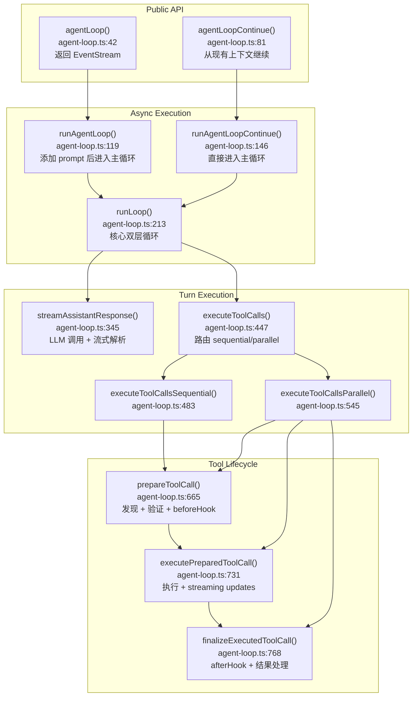
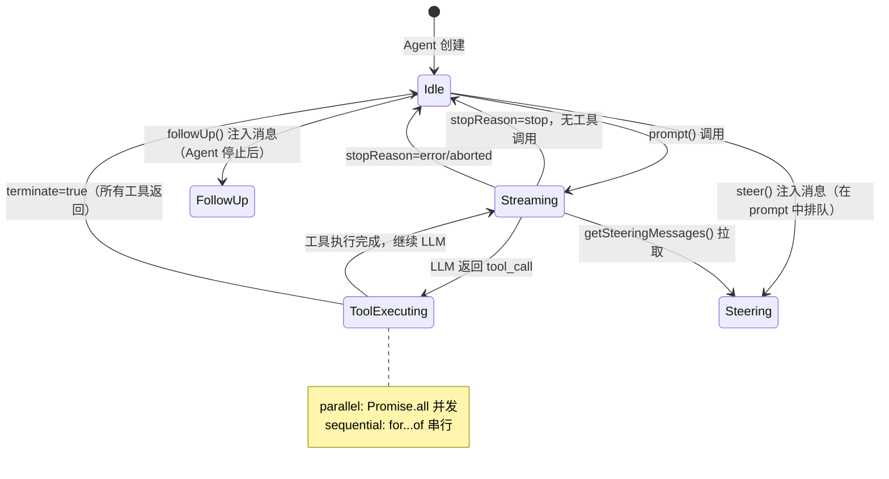

# Chapter 01 — Agent Runtime 主循环

> **核心文件**：`packages/agent-core/src/agent-loop.ts`（852 行）  
> **入口函数**：`runLoop()` → `agentLoop()` / `agentLoopContinue()`

---

## 设计动机

### 为什么要有独立的 agent-loop 包？

OpenClaw 的核心挑战是：**同一个 Agent 业务逻辑，需要在 10+ 不同通道（CLI、Telegram、Slack 等）中复用**，但每个通道的事件处理、会话持久化逻辑不同。

解决方案：将"和 LLM 交互 + 工具执行"这个无状态的循环提取到 `packages/agent-core`，通过函数式接口（回调）让上层注入差异化逻辑。

### Pain Point

- LLM 流式响应和工具调用是天然异步的，需要精确的事件顺序
- 用户可能在 Agent 运行中途注入修正（Steering），需要安全的中途插入机制
- 工具调用可能并发执行，但结果必须按原始顺序返回给 LLM
- Agent 必须能被优雅中止（AbortSignal）

---

## Runtime 架构



---

## 主循环源码分析

主循环位于 `agent-loop.ts:213` 的 `runLoop()` 函数，结构如下：

```typescript
// agent-loop.ts:222-338（简化版）
async function runLoop(initialContext, newMessages, initialConfig, signal, emit, streamFn) {
  let currentContext = initialContext;
  let config = initialConfig;
  let pendingMessages = await config.getSteeringMessages?.() || [];

  // 外层循环：处理 follow-up 消息（Agent 停止后追加）
  while (true) {
    let hasMoreToolCalls = true;

    // 内层循环：处理 tool calls + steering 消息
    while (hasMoreToolCalls || pendingMessages.length > 0) {
      // 1. 注入 steering messages（用户实时干预）
      if (pendingMessages.length > 0) {
        for (const message of pendingMessages) {
          await emit({ type: "message_start", message });
          await emit({ type: "message_end", message });
          currentContext.messages.push(message);
        }
      }

      // 2. LLM 调用（流式）
      const message = await streamAssistantResponse(currentContext, config, signal, emit);

      // 3. 处理错误/中止
      if (message.stopReason === "error" || message.stopReason === "aborted") {
        await emit({ type: "turn_end", ... });
        await emit({ type: "agent_end", messages: newMessages });
        return;
      }

      // 4. 执行工具调用
      const toolCalls = message.content.filter(c => c.type === "toolCall");
      if (toolCalls.length > 0) {
        const batch = await executeToolCalls(currentContext, message, config, signal, emit);
        toolResults.push(...batch.messages);
        hasMoreToolCalls = !batch.terminate;  // terminate=true 时停止
        // 工具结果追加到上下文
        for (const result of toolResults) {
          currentContext.messages.push(result);
        }
      } else {
        hasMoreToolCalls = false;  // 无工具调用，结束内层循环
      }

      // 5. turn_end → prepareNextTurn（可修改 model/context）
      await emit({ type: "turn_end", message, toolResults });
      const nextTurnSnapshot = await config.prepareNextTurn?.(nextTurnContext);

      // 6. 检查是否提前停止
      if (await config.shouldStopAfterTurn?.(...)) {
        await emit({ type: "agent_end", messages: newMessages });
        return;
      }

      // 7. 拉取 steering 消息
      pendingMessages = await config.getSteeringMessages?.() || [];
    }

    // 8. 拉取 follow-up 消息（外层循环入口）
    const followUps = await config.getFollowUpMessages?.() || [];
    if (followUps.length > 0) {
      pendingMessages = followUps;
      continue;  // 外层循环继续
    }
    break;  // 无更多消息，退出
  }

  await emit({ type: "agent_end", messages: newMessages });
}
```

### 关键变量名

| 变量 | 含义 |
|---|---|
| `hasMoreToolCalls` | 内层循环继续条件，有工具调用且未触发 terminate 时为 true |
| `pendingMessages` | 待注入的 steering/follow-up 消息队列 |
| `currentContext` | 当前 Agent 上下文（可被 prepareNextTurn 替换） |
| `config` | 循环配置（可被 prepareNextTurn 修改 model/reasoning） |
| `batch.terminate` | 工具返回 `terminate: true` 时提前退出循环 |

---

## 生命周期状态机



### 状态转移条件

| 当前状态 | 触发条件 | 目标状态 |
|---|---|---|
| `idle` | `prompt()` / `continue()` 调用 | `streaming` |
| `streaming` | LLM stopReason = `stop` + 无 toolCall | `idle` |
| `streaming` | LLM 返回 `toolCall` 内容块 | `toolExecuting` |
| `toolExecuting` | 所有工具执行完毕 | `streaming`（继续 LLM） |
| `toolExecuting` | 所有工具返回 `terminate: true` | `idle` |
| `streaming` | `signal.aborted` 或 LLM 错误 | `idle`（带 errorMessage） |

---

## 执行时序图

```mermaid
sequenceDiagram
    participant App as 应用层
    participant Harness as CoreAgentHarness
    participant Loop as runLoop()
    participant LLM as streamAssistantResponse()
    participant Tool as executeToolCalls()
    participant Emit as EventStream (emit)

    App->>Harness: prompt("用户消息")
    Harness->>Harness: createTurnState()
    Harness->>Loop: runAgentLoop(messages, context, config)
    Loop->>Emit: agent_start
    Loop->>Emit: turn_start
    Loop->>Emit: message_start (user)
    Loop->>Emit: message_end (user)

    loop 内层循环
        Loop->>LLM: streamAssistantResponse()
        LLM->>Emit: message_start (assistant partial)
        loop SSE 流
            LLM->>Emit: message_update (text_delta/toolcall_delta)
        end
        LLM->>Emit: message_end (assistant final)
        LLM-->>Loop: AssistantMessage

        alt 有 toolCalls
            Loop->>Tool: executeToolCalls() [parallel]
            par 并发执行
                Tool->>Emit: tool_execution_start
                Tool->>Tool: tool.execute()
                Tool->>Emit: tool_execution_update (progress)
                Tool->>Emit: tool_execution_end
                Tool-->>Loop: ToolResultMessage
            end
            Loop->>Emit: message_start (toolResult)
            Loop->>Emit: message_end (toolResult)
        end

        Loop->>Emit: turn_end
        Loop->>Harness: prepareNextTurn() callback
        Harness->>Harness: flushPendingSessionWrites()
        Loop->>Loop: shouldStopAfterTurn?
    end

    Loop->>Emit: agent_end
    Harness-->>App: AssistantMessage
```

---

## 并发与会话隔离

### 多会话隔离机制

`CoreAgentHarness` 是**每个会话独立实例**，携带独立的 `Session` 对象（JSONL 文件或数据库行）。会话间通过以下机制隔离：

1. **消息历史**：每个 Harness 维护独立的 `pendingSessionWrites: PendingSessionWrite[]`
2. **上下文快照**：`createContextSnapshot()` 在每次 `runLoop` 前拍快照，避免并发修改
3. **AbortController**：每次 `prompt()` 创建独立的 `AbortController`，只影响当前 run

### 单会话内的并发控制

```typescript
// agent.ts:375-381
async prompt(input: ...) {
  if (this.activeRun) {
    throw new Error("Agent is already processing...");  // 单 Agent 不允许并发 prompt
  }
  // ...
}
```

单个 `Agent` 实例**禁止并发 prompt**，但允许：
- `steer()`：向 steering 队列追加消息（线程安全）
- `followUp()`：向 follow-up 队列追加消息（线程安全）
- `abort()`：触发 AbortSignal（线程安全）

### 工具并发执行

```typescript
// agent-loop.ts:602-613
const orderedFinalizedCalls = await Promise.all(
  finalizedCalls.map(entry =>
    typeof entry === "function" ? entry() : Promise.resolve(entry)
  )
);
// 结果按原始 toolCall 顺序排列，保证 LLM 上下文一致性
```

并发执行工具，但**结果按 LLM 原始顺序排列**（非完成顺序），确保 LLM 的上下文一致。

---

## 与四大框架对比

| 维度 | **OpenClaw** | **Claude Code** | **OpenAI Codex** | **OpenHands** | **Archon** |
|---|---|---|---|---|---|
| **主循环位置** | `packages/agent-core/src/agent-loop.ts:213` | 内部 CLI 引擎 | 内部 Task Engine | `openhands/runtime/` | LangGraph 状态图 |
| **循环类型** | 双层 while + 事件驱动 | 单层 ReAct | Task 分解 + 子任务 | CodeAct + 工具循环 | Graph 节点跳转 |
| **流式支持** | 原生 SSE/WS 流，delta 事件 | 原生流式 | 原生流式 | 部分流式 | LangChain 流式 |
| **中途干预** | steering queue（实时注入） | 无（需中断重启） | 无 | 无 | 无 |
| **工具并发** | parallel（默认）/ sequential | sequential | sequential | sequential | sequential |
| **中止机制** | AbortSignal 全链路传播 | Ctrl+C | 任务取消 | SIGTERM | LangGraph cancel |
| **状态存储** | 事件 emit + Session 持久化 | 文件系统 | 云端状态 | Docker 容器 | LangGraph 状态 |
| **Terminate hint** | `tool.result.terminate` | N/A | N/A | N/A | graph 边条件 |

---

## 扩展点

1. **`beforeToolCall` hook**（`agent-loop.ts:684`）：拦截任何工具调用，可以实现权限检查、参数替换、干运行模式。
2. **`afterToolCall` hook**（`agent-loop.ts:777`）：修改工具结果，可以实现结果过滤、日志、敏感信息脱敏。
3. **`shouldStopAfterTurn` callback**（`types.ts:207`）：自定义停止条件，可以实现 token budget、最大轮次、外部信号等。
4. **`prepareNextTurn` callback**（`types.ts:214`）：每轮结束前修改 model/context，可以实现自适应模型选择、上下文压缩。
5. **`getSteeringMessages` / `getFollowUpMessages`**：注入外部消息队列，可以对接 pub/sub 系统。
6. **`transformContext`**（`types.ts:184`）：每次 LLM 调用前转换消息列表，可以实现 context window 管理。

---

## 企业实践建议

### Token Budget 控制

```typescript
const config: AgentLoopConfig = {
  // ...
  shouldStopAfterTurn: async ({ newMessages }) => {
    const totalTokens = sumTokens(newMessages);
    return totalTokens > MAX_BUDGET_TOKENS;
  }
};
```

### 审计日志

```typescript
const config: AgentLoopConfig = {
  beforeToolCall: async ({ toolCall, args }) => {
    await auditLog.write({ type: "tool_call", tool: toolCall.name, args });
    return undefined;  // 不阻止执行
  },
  afterToolCall: async ({ toolCall, result }) => {
    await auditLog.write({ type: "tool_result", tool: toolCall.name, result });
    return undefined;
  }
};
```

### 模型路由（动态切换）

```typescript
const config: AgentLoopConfig = {
  prepareNextTurn: async ({ message, context }) => {
    const complexity = estimateComplexity(message);
    return {
      model: complexity > THRESHOLD ? premiumModel : economyModel
    };
  }
};
```

---

## 面试题

**Q1：runLoop 中的"双层 while"分别处理什么情况？如果去掉外层循环会有什么影响？**

> **参考答案**：内层循环处理"一次完整的 LLM 调用轮次"，只要有工具调用或 steering 消息就继续。外层循环处理 follow-up 消息（用户在 Agent 完全停止后追加的新问题）。去掉外层循环后，follow-up 消息会被丢弃或需要用户重新调用 `prompt()`，无法实现对话的自然连续性。

**Q2：parallel 工具执行模式中，为什么最终结果要按 toolCall 原始顺序排列而非完成顺序？**

> **参考答案**：LLM 在下一轮看到工具结果时，会将其与上轮生成的 toolCall 对应匹配（通过 toolCallId）。如果结果顺序与 toolCall 顺序不一致，可能导致语义混乱（例如 tool_A 的结果被当作 tool_B 的结果）。`agent-loop.ts:602` 用 `Promise.all` 保持原始顺序：并发执行但按位置等待。

**Q3：`terminate: true` 的作用是什么？什么场景下工具应该返回 terminate？**

> **参考答案**：`terminate: true`（`types.ts:79`）是工具向 Agent 发出"我已完成所有工作，停止吧"的信号。只有当批次中**所有**工具都返回 `terminate: true` 时，Agent 才停止内层循环（`agent-loop.ts:644`）。典型场景：用户确认工具（"是否继续？"）在用户选择"否"时返回 terminate，或最终输出工具（如 `finish()`）在任务完成时返回 terminate。

**Q4：steering 消息和 follow-up 消息有什么区别？实现上如何区分？**

> **参考答案**：steering 消息（`steer()`）在 Agent 运行中注入，在当前轮次的工具调用执行完后、下一次 LLM 调用前插入上下文，用于实时纠偏。follow-up 消息（`followUp()`）在 Agent 完全停止后才生效，触发新的外层循环迭代，用于追问。实现上，`getSteeringMessages` 在内层循环末尾轮询（`agent-loop.ts:323`），`getFollowUpMessages` 在外层循环末尾轮询（`agent-loop.ts:326`）。

**Q5：如何实现一个"最多执行 N 轮工具调用"的限制？**

> **参考答案**：通过 `shouldStopAfterTurn` 回调计数：
> ```typescript
> let turnCount = 0;
> config.shouldStopAfterTurn = async () => { return ++turnCount >= MAX_TURNS; }
> ```
> 或者通过 `afterToolCall` 在第 N 个工具后返回 `{ terminate: true }`。前者在 turn 级别控制，后者在工具批次级别控制。
