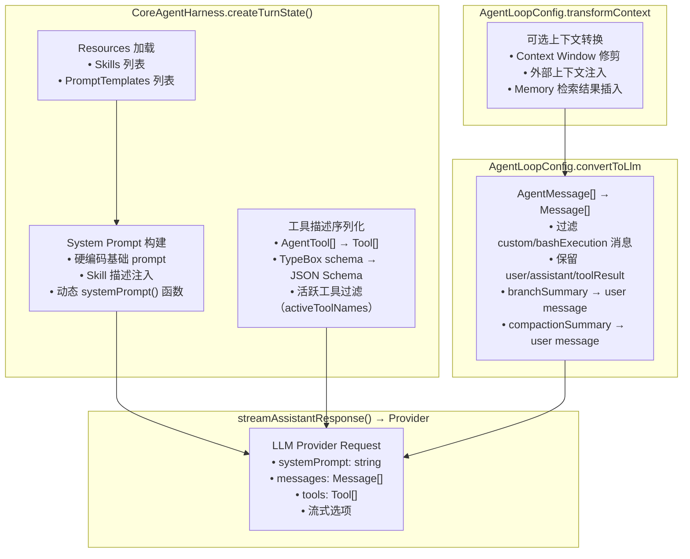
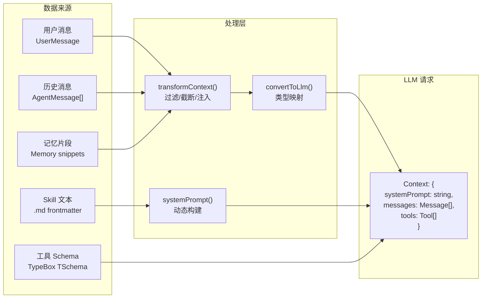

# Chapter 02 — Context & Prompt 组装

> **核心文件**：  
> - `packages/agent-core/src/harness/messages.ts` — `convertToLlm()`  
> - `packages/agent-core/src/harness/system-prompt.ts` — System Prompt 构建  
> - `packages/agent-core/src/harness/skills.ts` — Skill 注入  
> - `packages/agent-core/src/types.ts:184` — `transformContext` 接口

---

## 设计动机

OpenClaw 支持 20+ 通道和 100+ LLM Provider，每种 Provider 对消息格式、token 上限、缓存策略的要求不同。Prompt 组装层的核心任务是：**将通道无关的 `AgentMessage[]` 转换为 Provider 可理解的 `Message[]`，同时在有限 Context Window 内最大化信息密度**。

### Pain Point

1. `AgentMessage` 是 OpenClaw 内部类型（包含 custom、bashExecution、branchSummary 等），LLM Provider 不理解这些自定义类型
2. Skills / PromptTemplates 需要动态注入 System Prompt 或用户消息
3. Context Window 有限，长对话需要截断/压缩策略
4. 记忆检索结果需要在正确位置注入上下文

---

## Prompt Pipeline

### 完整流水线（从原始消息到 LLM Payload）



### 各来源合并策略

| 来源 | 注入位置 | 动态/静态 | 优先级 |
|---|---|---|---|
| System Prompt（基础） | `context.systemPrompt` | 可静态字符串或动态函数 | 最高 |
| Skill 描述 | System Prompt 末尾 | 动态，每轮刷新 | 高 |
| Memory 检索片段 | System Prompt 或早期 user message | 动态，RAG | 中 |
| Tool 描述（JSON Schema） | `context.tools[]` | 动态，Provider 负责序列化 | 中 |
| 历史消息 | `context.messages[]` | 动态，可截断 | 中 |
| User Query | `context.messages[]` 末尾 | 每次新建 | 最低（位置） |

---

## System Prompt 构建

```typescript
// agent-harness.ts:392-403
let systemPrompt = "You are a helpful assistant.";
if (typeof this.systemPrompt === "string") {
  systemPrompt = this.systemPrompt;
} else if (this.systemPrompt) {
  // 动态 systemPrompt 函数，每轮调用
  systemPrompt = await this.systemPrompt({
    env: this.env,
    session: this.session,
    model: this.model,
    thinkingLevel: this.thinkingLevel,
    activeTools,
    resources,   // 包含 Skills 列表
  });
}
```

**设计要点**：System Prompt 接受函数形式，在每轮 `createTurnState()` 时重新计算。这允许：
- 根据当前活跃 Tools 动态描述可用能力
- 根据检索到的 Skills 注入特定行为指令
- 根据 thinkingLevel 调整推理风格

---

## convertToLlm() — 消息类型转换

```typescript
// packages/agent-core/src/harness/messages.ts（核心逻辑）
function convertToLlm(messages: AgentMessage[]): Message[] {
  return messages.flatMap(message => {
    switch (message.role) {
      case "user":
      case "assistant":
      case "toolResult":
        return [message];  // 直接传递给 LLM

      case "compactionSummary":
        // 压缩摘要转换为 user message
        return [{ role: "user", content: [{ type: "text", text: message.summary }] }];

      case "branchSummary":
        // 分支摘要转换为 user message
        return [{ role: "user", content: [{ type: "text", text: message.summary }] }];

      case "bashExecution":
      case "custom":
        // 根据 excludeFromContext / display 决定是否包含
        if (message.role === "custom" && message.content) {
          return [{ role: "user", content: message.content }];
        }
        return [];  // 过滤掉不需要发送给 LLM 的消息

      default:
        return [];
    }
  });
}
```

### 消息类型映射表

| AgentMessage.role | LLM Message | 说明 |
|---|---|---|
| `user` | `UserMessage` | 直接传递 |
| `assistant` | `AssistantMessage` | 包含 text + toolCall 内容块 |
| `toolResult` | `ToolResultMessage` | 工具执行结果 |
| `compactionSummary` | `UserMessage`（注入摘要文本） | 替代被压缩的历史 |
| `branchSummary` | `UserMessage`（注入分支摘要） | 分支导航时的上下文 |
| `bashExecution` | 过滤（默认） | UI 展示，不进入 LLM |
| `custom` | 视 `content` 决定 | 应用自定义类型 |

---

## Context Window 管理

### Token Budget 计算

OpenClaw 不在核心层强制 token 计算，而是通过 `transformContext` 钩子让上层实现：

```typescript
// AgentLoopConfig.transformContext（types.ts:184）
transformContext?: (messages: AgentMessage[], signal?: AbortSignal) => Promise<AgentMessage[]>;

// 使用示例（上层实现）
transformContext: async (messages) => {
  const estimated = estimateTokens(messages);
  if (estimated > MAX_CONTEXT_TOKENS * 0.9) {
    return pruneOldMessages(messages);  // 删除最旧的消息
  }
  return messages;
}
```

### Context Window 优先级策略（建议）

```
[System Prompt]           ← 永远保留（最重要）
[Memory Snippets]         ← 高优先级
[Recent Messages (N)]     ← 保留最近 N 轮
[Compaction Summary]      ← 替代已压缩历史
[工具 Schema 描述]         ← Provider 自动注入
[当前用户消息]             ← 永远保留（本次请求）
```

---

## 长上下文优化

### 1. 压缩（Compaction）

当 Agent 运行时间过长，`CoreAgentHarness.compact()` 触发：

```typescript
// agent-harness.ts:806-883
async compact(customInstructions?: string): Promise<{...}> {
  const branchEntries = await this.session.getBranch();
  const preparation = prepareCompaction(branchEntries, DEFAULT_COMPACTION_SETTINGS);
  
  // 使用 LLM 生成摘要（非规则压缩！）
  const compactResult = await compact(preparation, model, apiKey, ...);
  
  // 将摘要写入会话，替代旧消息
  await this.session.appendCompaction(result.summary, firstKeptEntryId, ...);
}
```

**压缩策略**：调用 LLM 对历史对话生成摘要（而非简单截断），保留关键决策路径，以 `compactionSummary` 消息写入会话。

### 2. 分支摘要（Branch Summary）

`navigateTree()` 切换对话分支时，对离开的分支生成摘要：

```typescript
// agent-harness.ts:936-963
const branchSummary = await generateBranchSummary(entries, {
  model, apiKey, signal, customInstructions
});
```

### 3. 滑动窗口（上层实现）

通过 `transformContext` 实现简单滑动窗口：
- 保留系统关键消息（compactionSummary）
- 保留最后 K 轮对话
- 超出时直接截断最旧的非系统消息

---

## 工具 Schema 序列化

工具参数 Schema 基于 TypeBox（JSON Schema 的超集）：

```typescript
// agent-core/types.ts:437
interface AgentTool<TParameters extends TSchema> extends Tool<TParameters> {
  // Tool 继承自 llm-core/types.ts::Tool
  // Tool 包含: name, description, parameters (TSchema → JSON Schema)
}
```

序列化由各 Provider Adapter 负责（OpenAI 格式、Anthropic 格式等），Core 层只维护原始 TypeBox schema，不关心具体格式。

---

## Skill 注入机制

```typescript
// agent-harness.ts:394 → packages/agent-core/src/harness/skills.ts
// Skill 被格式化为自然语言指令，注入 systemPrompt
function formatSkillInvocation(skill: Skill, additionalInstructions?: string): string {
  // 将 skill.description + skill.content 渲染为 prompt 文本
}
```

Skill 注入有两种方式：
1. **System Prompt 注入**：在 `systemPrompt()` 函数中将 Skill 描述追加到 system prompt
2. **直接 prompt**：`harness.skill("skill-name")` 将 Skill 格式化为用户消息发送

---

## Prompt Injection 防御

OpenClaw 目前在 Core 层**没有**显式的 Prompt Injection 防御。防御责任分布在：

| 层级 | 防御机制 |
|---|---|
| Tool 参数验证 | TypeBox schema 验证（防止注入恶意参数） |
| beforeToolCall hook | 上层可以检查 toolCall.arguments |
| 通道层 | 各通道 extension 可以对用户消息做预处理 |
| Security Extension | `extensions/policy/` 实现内容审查 |

**与同类框架对比**：Claude Code 通过 `jailbreak-detection` 检测注入尝试；OpenHands 通过沙箱隔离减少注入影响；OpenClaw 的防御更依赖 Tool 权限模型和 beforeToolCall hook。

---

## 关键源码位置

| 功能 | 文件 | 关键函数 |
|---|---|---|
| Prompt Pipeline 入口 | `packages/agent-core/src/harness/agent-harness.ts:384` | `createTurnState()` |
| 消息类型转换 | `packages/agent-core/src/harness/messages.ts` | `convertToLlm()` |
| System Prompt 构建 | `packages/agent-core/src/harness/agent-harness.ts:392` | 动态 systemPrompt |
| Skill 格式化 | `packages/agent-core/src/harness/skills.ts` | `formatSkillInvocation()` |
| 上下文转换钩子 | `packages/agent-core/src/types.ts:184` | `AgentLoopConfig.transformContext` |
| LLM 调用前组装 | `packages/agent-core/src/agent-loop.ts:354` | `streamAssistantResponse()` |
| 压缩触发 | `packages/agent-core/src/harness/agent-harness.ts:806` | `compact()` |

---

## 数据流



---

## 与四大框架对比

| 维度 | **OpenClaw** | **Claude Code** | **OpenAI Codex** | **OpenHands** | **Archon** |
|---|---|---|---|---|---|
| **System Prompt** | 动态函数（每轮刷新） | 静态（CLAUDE.md） | 静态模板 | 静态模板 | 动态（LangChain PromptTemplate） |
| **消息转换** | `convertToLlm()` 类型映射 | 内部处理 | OpenAI 原生格式 | LiteLLM 统一转换 | LangChain Message |
| **Context 截断** | `transformContext` 钩子（上层实现） | 自动截断 | 云端管理 | 手动管理 | LangChain Memory |
| **压缩策略** | LLM 生成摘要（Agent-native） | 自动压缩 | 无 | 无 | LangChain SummaryMemory |
| **Tool Schema** | TypeBox → Provider 各自序列化 | 内置工具，无 Schema | JSON Schema | OpenAPI | Pydantic / JSON Schema |
| **Prompt Injection 防御** | 工具参数验证 + Policy extension | 内置检测 | 无 | 沙箱隔离 | 无 |
| **Skill 注入** | Markdown frontmatter → Prompt | Slash commands | 无 | 无 | 无 |

---

## 企业实践建议

1. **实现 Token 监控**：在 `transformContext` 中计算并上报 token 使用，提前触发压缩而非等待 Provider 报错。
2. **记忆注入位置**：建议将记忆片段注入 System Prompt 末尾（而非 user message），避免影响对话历史的完整性。
3. **多语言 System Prompt**：通过动态 `systemPrompt()` 函数根据用户语言偏好返回不同语言的 prompt。
4. **PII 过滤**：在 `transformContext` 中扫描并脱敏个人信息（邮箱、手机号）后再发送给 LLM。

---

## 面试题

**Q1：OpenClaw 为什么不在 Core 层做 token 计数和截断？**

> **参考答案**：不同 Provider 的 tokenizer 不同（tiktoken vs SentencePiece vs Claude tokenizer），Core 层保持 Provider 无关，不引入任何 tokenizer 依赖。通过 `transformContext` 钩子让上层实现 token 计数和截断，上层可以选择精确 tokenizer 或粗略估算（chars/4）。

**Q2：`compactionSummary` 和 `branchSummary` 有什么区别？**

> **参考答案**：`compactionSummary` 是对**当前分支历史对话**的压缩摘要，替代旧消息降低 token 使用；`branchSummary` 是**切换对话分支**时对离开分支的摘要，让 LLM 了解"另一条路上发生了什么"。前者是纵向时间压缩，后者是横向分支感知。

**Q3：如果要在每次 LLM 调用前自动注入用户的工作目录信息，应该在哪个扩展点实现？**

> **参考答案**：`transformContext`（每次 LLM 调用前触发，可以往 messages 数组前插入 system 级别的上下文信息）；或者在动态 `systemPrompt()` 函数中追加工作目录信息（每轮都会重新计算）。前者更灵活，可以插入多条消息；后者更简单，只修改 System Prompt。
