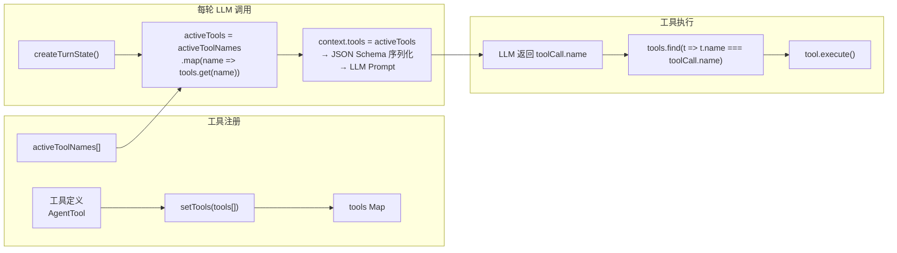
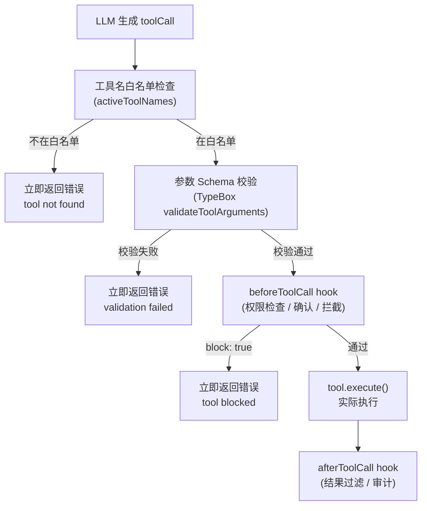

# Chapter 04 — 工具注册与调用

> **核心文件**：  
> - `packages/agent-core/src/types.ts:437` — `AgentTool` 接口  
> - `packages/agent-core/src/agent-loop.ts:447` — `executeToolCalls()`  
> - `packages/agent-core/src/validation.ts` — 参数校验  
> - `src/agents/mcp-stdio.ts` — MCP 工具集成

---

## 设计动机

工具系统是 Agent 能力的核心扩展机制。OpenClaw 的设计目标：**类型安全（TypeBox schema）+ 并发执行（parallel/sequential）+ 钩子拦截（before/after）+ MCP 标准兼容**，形成从声明到执行的完整链路。

### Pain Point

1. LLM 生成的 tool_call 参数可能类型错误，需要强类型校验
2. 多工具并发执行时，必须保证结果顺序对应 toolCall 顺序
3. 危险操作（文件删除、shell 执行）需要拦截和权限确认
4. MCP（Model Context Protocol）标准化工具接口，需要兼容接入

---

## Tool 注册机制

### AgentTool 接口定义

```typescript
// packages/agent-core/src/types.ts:437
interface AgentTool<TParameters extends TSchema = TSchema, TDetails = unknown>
  extends Tool<TParameters> {
  // 继承自 llm-core/types.ts::Tool
  // Tool: { name, description, parameters: TSchema }

  label: string;  // UI 展示标签

  // 可选：在 schema 验证前预处理原始参数（兼容旧格式）
  prepareArguments?: (args: unknown) => Static<TParameters>;

  // 核心执行函数
  execute: (
    toolCallId: string,
    params: Static<TParameters>,   // TypeBox 推断的精确类型
    signal?: AbortSignal,          // 支持中止
    onUpdate?: AgentToolUpdateCallback<TDetails>,  // 流式进度回调
  ) => Promise<AgentToolResult<TDetails>>;

  // 工具级别执行模式（覆盖全局设置）
  executionMode?: "sequential" | "parallel";
}
```

### 工具注册方式

工具通过 `CoreAgentHarness.setTools()` 或 `Agent` 构造时的 `initialState.tools` 注入：

```typescript
// agent-harness.ts:1118
async setTools(tools: TTool[], activeToolNames?: string[]): Promise<void> {
  const nextTools = new Map(tools.map(tool => [tool.name, tool]));
  this.validateToolNames(nextActiveToolNames, nextTools);
  this.tools = nextTools;
  this.activeToolNames = [...nextActiveToolNames];
}
```

**工具发现**是**静态配置**（`activeToolNames`），而非运行时动态发现。Agent 通过 `activeTools` 列表决定在每轮中向 LLM 提供哪些工具描述。

---

## Tool Schema — TypeBox

```typescript
// 示例：文件读取工具定义
import { Type } from "@sinclair/typebox";

const ReadFileTool: AgentTool<typeof ReadFileSchema> = {
  name: "read_file",
  label: "Read File",
  description: "Read the contents of a file at the given path",
  parameters: Type.Object({
    path: Type.String({ description: "Absolute path to the file" }),
    encoding: Type.Optional(Type.Union([
      Type.Literal("utf-8"),
      Type.Literal("base64"),
    ])),
  }),
  execute: async (toolCallId, { path, encoding = "utf-8" }, signal) => {
    const content = await fs.readFile(path, { encoding, signal });
    return {
      content: [{ type: "text", text: content }],
      details: { path, bytes: content.length },
    };
  },
};
```

TypeBox schema 在运行时双重用途：
1. **LLM 侧**：序列化为 JSON Schema，注入 `context.tools[]`，告诉 LLM 如何调用
2. **Runtime 侧**：通过 `validateToolArguments` 校验 LLM 生成的参数

---

## Tool Discovery



**设计决策**：工具发现是**静态白名单**（activeToolNames），不是"LLM 看到哪些就执行哪些"。这提供了更强的安全性（意外的工具名不会被路由到执行）。

---

## Tool Calling 完整流程

### 流程时序图

```mermaid
sequenceDiagram
    participant LLM as LLM Provider
    participant Loop as AgentLoop
    participant PTC as prepareToolCall()
    participant Valid as validateToolArguments()
    participant BHook as beforeToolCall hook
    participant Exec as tool.execute()
    participant AHook as afterToolCall hook
    participant Emit as EventSink

    LLM-->>Loop: AssistantMessage (含 toolCall blocks)
    Loop->>Loop: filter content where type="toolCall"
    
    loop 每个 toolCall
        Loop->>Emit: tool_execution_start {toolCallId, toolName, args}
        Loop->>PTC: prepareToolCall(context, message, toolCall, config)
        PTC->>PTC: prepareArguments? (可选参数预处理)
        PTC->>Valid: validateToolArguments(tool, toolCall)
        Valid-->>PTC: validatedArgs | Error
        PTC->>BHook: config.beforeToolCall({toolCall, args})
        BHook-->>PTC: undefined | {block: true, reason: string}
        
        alt blocked
            PTC-->>Loop: {kind: "immediate", isError: true}
        else 未阻止
            PTC-->>Loop: {kind: "prepared", tool, args}
            Loop->>Exec: tool.execute(id, args, signal, onUpdate)
            Exec->>Emit: tool_execution_update (progress)
            Exec-->>Loop: AgentToolResult {content, details, terminate?}
            Loop->>AHook: config.afterToolCall({toolCall, args, result})
            AHook-->>Loop: AfterToolCallResult | undefined
        end
        
        Loop->>Emit: tool_execution_end {toolCallId, result, isError}
        Loop->>Emit: message_start (ToolResultMessage)
        Loop->>Emit: message_end (ToolResultMessage)
    end
```

### 参数校验（validateToolArguments）

```typescript
// packages/agent-core/src/validation.ts
function validateToolArguments(tool: AgentTool, toolCall: AgentToolCall): unknown {
  const schema = tool.parameters;
  if (!schema) return toolCall.arguments;

  // TypeBox Value.Check → 类型校验
  const result = Value.Check(schema, toolCall.arguments);
  if (!result) {
    const errors = [...Value.Errors(schema, toolCall.arguments)];
    throw new Error(`Tool ${tool.name} argument validation failed: ${formatErrors(errors)}`);
  }
  // TypeBox Value.Cast → 类型转换（如字符串 → 数字）
  return Value.Cast(schema, toolCall.arguments);
}
```

---

## 并行 vs 串行执行

### 路由逻辑

```typescript
// agent-loop.ts:455-476
function executeToolCalls(currentContext, assistantMessage, toolCalls, config, signal, emit) {
  // 任意一个工具标记 sequential → 整批串行
  const hasSequentialToolCall = toolCalls.some(
    tc => currentContext.tools?.find(t => t.name === tc.name)?.executionMode === "sequential"
  );

  if (config.toolExecution === "sequential" || hasSequentialToolCall) {
    return executeToolCallsSequential(...);
  }
  return executeToolCallsParallel(...);
}
```

### 并行执行细节

```typescript
// agent-loop.ts:583-613（简化）
async function executeToolCallsParallel(...): Promise<ExecutedToolCallBatch> {
  const finalizedCalls: FinalizedToolCallEntry[] = [];

  // 顺序 preflight（验证 + beforeHook），但把异步执行封装为 lazy 函数
  for (const toolCall of toolCalls) {
    const preparation = await prepareToolCall(...);  // 串行 preflight
    if (preparation.kind === "immediate") {
      finalizedCalls.push(finalized);  // 已完成（blocked/error）
    } else {
      // 封装为 lazy 函数，稍后并发执行
      finalizedCalls.push(async () => {
        const executed = await executePreparedToolCall(preparation, signal, emit);
        return await finalizeExecutedToolCall(...);
      });
    }
  }

  // 并发执行所有 lazy 工具
  const orderedFinalizedCalls = await Promise.all(
    finalizedCalls.map(entry =>
      typeof entry === "function" ? entry() : Promise.resolve(entry)
    )
  );

  // 结果按原始 toolCall 顺序排列
  return { messages: orderedFinalizedCalls.map(createToolResultMessage), terminate: ... };
}
```

**关键设计**：Preflight（验证+beforeHook）是串行的（保证顺序一致），但实际执行是并发的（`Promise.all`）。

---

## MCP 集成

MCP（Model Context Protocol）是 Anthropic 提出的工具接口标准。OpenClaw 通过以下方式集成：

```typescript
// src/agents/mcp-stdio.ts
// MCP 工具通过 stdio 协议与外部进程通信
class McpStdioClient {
  async getTools(): Promise<AgentTool[]> {
    // 从 MCP 服务器获取工具列表
    const { tools } = await this.request({ method: "tools/list" });
    return tools.map(mcpTool => adaptMcpTool(mcpTool));  // 转换为 AgentTool
  }

  async callTool(name: string, args: unknown): Promise<AgentToolResult<unknown>> {
    const result = await this.request({
      method: "tools/call",
      params: { name, arguments: args }
    });
    return adaptMcpResult(result);
  }
}

// MCP 工具 → AgentTool 适配
function adaptMcpTool(mcpTool: McpTool): AgentTool {
  return {
    name: mcpTool.name,
    label: mcpTool.name,
    description: mcpTool.description,
    parameters: mcpTool.inputSchema,  // JSON Schema 直接使用
    execute: async (id, args, signal) => {
      return client.callTool(mcpTool.name, args);
    },
  };
}
```

MCP 工具与原生工具的区别：MCP 工具的 `execute` 通过进程间通信（stdio）调用外部 MCP 服务器，延迟高于本地工具，但支持任何语言实现的工具。

---

## 安全与权限

### 工具执行的安全机制



### 沙盒隔离（子 Agent / CodeAct）

```typescript
// src/agents/sandbox-agent-config.agent-specific-sandbox-config.e2e.test.ts
// 子 Agent 可以在独立沙盒中执行工具，与主 Agent 隔离
```

Shell 执行类工具（如 `openshell` extension）支持沙盒配置，限制文件系统访问范围。

### 危险操作拦截（建议实现）

```typescript
const dangerousPatterns = [/rm -rf/, /DROP TABLE/, /DELETE FROM .* WHERE 1=1/];

const config: AgentLoopConfig = {
  beforeToolCall: async ({ toolCall, args }) => {
    if (toolCall.name === "run_shell") {
      const cmd = (args as any).command;
      if (dangerousPatterns.some(p => p.test(cmd))) {
        return { block: true, reason: "Potentially dangerous command detected" };
      }
    }
    return undefined;
  }
};
```

---

## 与四大框架对比

| 维度 | **OpenClaw** | **Claude Code** | **OpenAI Codex** | **OpenHands** | **Archon** |
|---|---|---|---|---|---|
| **Schema 格式** | TypeBox（运行时类型安全） | 内置硬编码工具 | JSON Schema | OpenAPI | Pydantic BaseModel |
| **工具发现** | 静态白名单（activeToolNames） | 静态内置工具 | 静态内置工具 | 静态注册 | LangChain 动态发现 |
| **并发执行** | ✅ 原生 parallel（Promise.all） | ❌ 串行 | ❌ 串行 | ❌ 串行 | ❌ 串行（默认） |
| **MCP 支持** | ✅ mcp-stdio.ts | ✅ 原生 MCP | ❌ | ❌ | ❌ |
| **beforeToolCall** | ✅ 阻止/修改/审计 | ❌ | ❌ | ❌ | ❌ |
| **afterToolCall** | ✅ 结果修改/审计 | ❌ | ❌ | ❌ | ❌ |
| **流式进度** | ✅ onUpdate 回调 | ❌ | ❌ | ❌ | ❌ |
| **终止信号** | ✅ terminate: true | ❌ | ❌ | ❌ | ❌ |

---

## 面试题

**Q1：TypeBox 相比 Zod / Pydantic 的优势是什么？为什么 OpenClaw 选择 TypeBox？**

> **参考答案**：TypeBox 可以在**运行时和编译时**共用同一个 schema 定义，通过 `Static<T>` 推断 TypeScript 类型，同时生成标准 JSON Schema（直接用于 LLM API）。Zod 需要 `.toJsonSchema()` 转换（需要额外库），Pydantic 是 Python 专属。TypeBox 的 schema 是普通 JS 对象（而非类实例），序列化和传输更简单。

**Q2：`prepareArguments` 钩子的作用是什么？什么时候需要它？**

> **参考答案**：LLM 有时生成的参数格式与当前 schema 不匹配（如旧版本的 tool 格式），`prepareArguments` 在 schema 验证前对原始参数做兼容转换。例如：LLM 生成 `{file: "foo.txt"}` 但当前 schema 期望 `{path: "foo.txt"}`，通过 `prepareArguments` 重命名字段。这是向后兼容的安全垫，不修改 schema 的情况下支持多种输入格式。

**Q3：工具执行时 `onUpdate` 回调的设计意图是什么？**

> **参考答案**：允许工具在长时间执行过程中向用户上报进度（如"已下载 50%"、"正在处理第 3/10 页"）。进度更新通过 `tool_execution_update` 事件推送到 UI，用户可以看到实时状态而非一个黑盒等待。进度信息包含 `visibility: "channel"` 和 `privacy: "public"` 标记（`types.ts:412-416`），确保只有公开安全的信息被发送到外部通道。

**Q4：如何实现一个"需要用户确认才能执行"的高危工具？**

> **参考答案**：通过 `beforeToolCall` 阻止执行并通知用户，然后通过 `steering` 机制恢复：
> ```typescript
> beforeToolCall: async ({ toolCall }) => {
>   if (isDangerous(toolCall)) {
>     await notifyUser("请确认是否执行：" + toolCall.name);
>     const confirmed = await waitForUserConfirmation();
>     if (!confirmed) return { block: true, reason: "用户取消" };
>   }
> }
> ```
> 或者实现一个"确认工具"，LLM 在执行危险操作前必须先调用确认工具，用户批准后通过 `steer()` 告知 LLM 继续。
