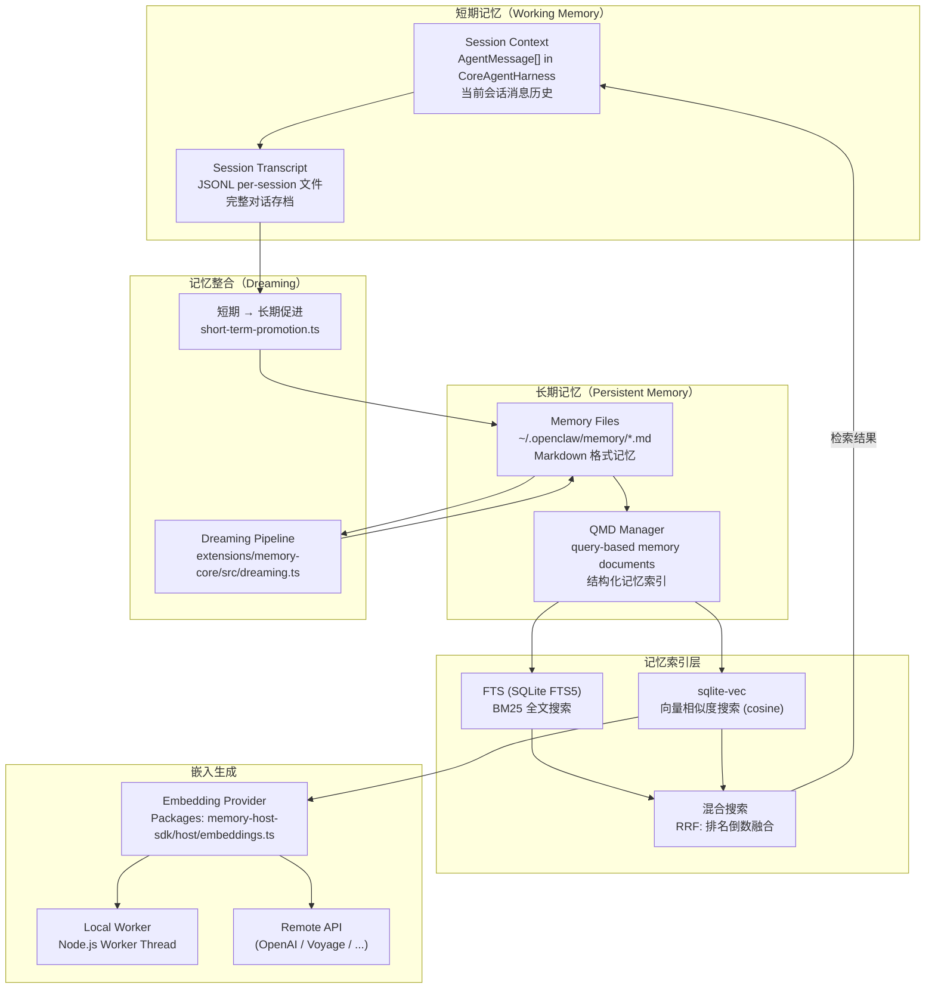
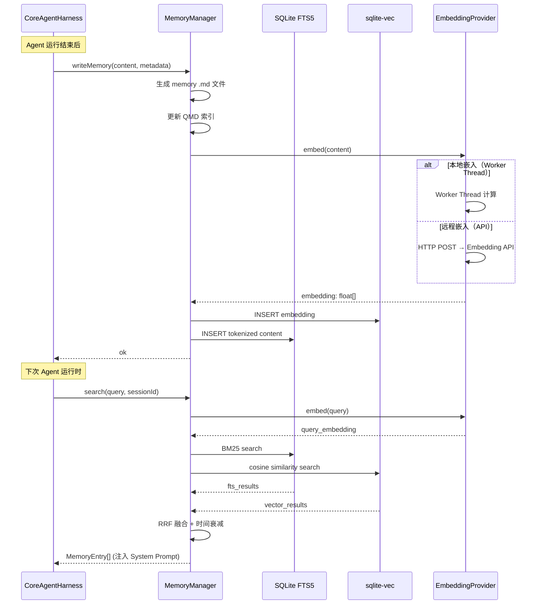

# Chapter 05 — 记忆系统

> **核心文件**：  
> - `extensions/memory-core/src/memory/manager.ts` — 记忆管理器主入口  
> - `extensions/memory-core/src/memory/manager-search.ts` — 混合检索（FTS + 向量）  
> - `extensions/memory-core/src/dreaming.ts` — 记忆整合（Dreaming）  
> - `packages/memory-host-sdk/src/host/sqlite-vec.ts` — 向量存储（sqlite-vec）  
> - `packages/memory-host-sdk/src/host/embeddings.ts` — 嵌入生成

---

## 设计动机

个人 AI 助手的差异化价值在于"记住你"。通用 LLM 每次都从零开始，而 OpenClaw 需要跨会话记忆用户的偏好、项目背景、历史决策。设计挑战：**如何在个人设备上高效存储和检索大量记忆，同时保持隐私（不上传到云）**。

### Pain Point

1. 纯文本全文搜索（BM25）对语义相近但词汇不同的内容召回率低
2. 纯向量搜索精确率低（相关但不完全匹配）
3. 长期记忆会累积无用信息，需要遗忘和整合机制
4. 嵌入生成是计算密集型操作，需要异步批处理
5. 向量数据库在个人设备上不可用，需要轻量化方案

---

## 记忆架构全景



---

## 短期记忆（Working Memory）

### 结构

```typescript
// packages/agent-core/src/types.ts:379
interface AgentState {
  messages: AgentMessage[];  // 当前会话的完整消息历史
  // ...
}
```

短期记忆就是 `AgentMessage[]` 数组，由 `CoreAgentHarness` 持有。每条消息在会话结束后写入 Session Transcript（JSONL 文件）。

### Token 上限处理

当短期记忆超出 Context Window：
1. **主动 Compaction**：应用层调用 `harness.compact()` → LLM 生成摘要 → 插入 `compactionSummary` 消息
2. **transformContext 截断**：通过 `AgentLoopConfig.transformContext` 裁剪旧消息（上层实现）
3. **滑动窗口**：保留最后 N 轮，丢弃更早历史（上层实现）

### 会话清理

```typescript
// src/trajectory/cleanup.ts
// 定期清理过期的会话文件和轨迹数据
```

---

## 长期记忆（Persistent Memory）

### 存储格式

长期记忆以 Markdown 文件存储在 `~/.openclaw/memory/`：

```markdown
---
name: user-preference-dark-mode
description: 用户偏好暗色主题
metadata:
  type: user
  created: 2026-06-01T10:00:00Z
  updated: 2026-06-07T09:00:00Z
  importance: 0.8
---

用户明确表示偏好暗色主题界面。在 2026-06-01 的对话中用户提到"每次都要改主题真烦"。

**Why:** 用户体验改进偏好
**How to apply:** 每次提供 UI 相关建议时优先推荐暗色主题选项
```

### QMD Manager（Query-based Memory Documents）

```typescript
// extensions/memory-core/src/memory/qmd-manager.ts
// QMD 是记忆的结构化索引层
// 每个 .md 文件对应一个 QMD 条目
// QMD 条目包含: path, content, embedding, fts_token, importance, timestamp
```

---

## 向量记忆与 RAG

### 向量存储（sqlite-vec）

OpenClaw 使用 `sqlite-vec`（SQLite 扩展）作为本地向量数据库：

```typescript
// packages/memory-host-sdk/src/host/sqlite-vec.ts
// sqlite-vec 提供:
// - CREATE VIRTUAL TABLE memory_vec USING vec0(embedding FLOAT[1536])
// - INSERT INTO memory_vec VALUES (id, embedding_vector)
// - SELECT ... ORDER BY vec_distance_L2(embedding, query_vec) LIMIT 10
```

### 混合搜索（Hybrid Search）

```typescript
// extensions/memory-core/src/memory/manager-search.ts
async hybridSearch(query: string, options: SearchOptions): Promise<MemoryEntry[]> {
  // 并发执行 BM25 + 向量搜索
  const [ftsResults, vectorResults] = await Promise.all([
    this.ftsSearch(query, options),
    this.vectorSearch(await this.embed(query), options),
  ]);

  // RRF（Reciprocal Rank Fusion）融合排名
  return reciprocalRankFusion(ftsResults, vectorResults, { k: 60 });
}
```

### MMR（Maximal Marginal Relevance）去重

```typescript
// extensions/memory-core/src/memory/mmr.ts
// 在向量检索结果中应用 MMR 算法
// 平衡相关性和多样性，避免返回重复内容
function mmr(results: VectorResult[], queryEmbedding: number[], lambda = 0.5): VectorResult[] {
  // 迭代选择：每次选相关性高且与已选项差异大的结果
}
```

### 时间衰减

```typescript
// extensions/memory-core/src/memory/temporal-decay.ts
// 最近访问/创建的记忆获得更高权重
function applyTemporalDecay(score: number, timestamp: Date): number {
  const ageInDays = (Date.now() - timestamp.getTime()) / 86400000;
  return score * Math.exp(-DECAY_RATE * ageInDays);
}
```

---

## Session Memory 与隔离

```typescript
// extensions/memory-core/src/session-search-visibility.ts
// 控制跨 session 的记忆可见性
interface SessionSearchVisibility {
  sessionId: string;
  // 只返回该 session 写入的记忆（短期记忆隔离）
  // 或返回所有记忆（长期记忆共享）
}
```

**隔离策略**：
- **短期**：严格按 `sessionId` 隔离（每个对话独立）
- **长期**：全局共享（跨对话的用户偏好、知识）
- **混合**：Session 内的重要事件自动促进到长期记忆

---

## 记忆写入与读取时序



---

## Memory Compaction（Dreaming 整合）

```typescript
// extensions/memory-core/src/dreaming.ts
// Dreaming 是 OpenClaw 的记忆整合机制（灵感来自人类睡眠中的记忆巩固）
async function runDreaming(config: DreamingConfig): Promise<DreamingResult> {
  // Phase 1: 分析近期记忆，识别相关群组
  const groups = await identifyMemoryGroups(recentMemories);

  // Phase 2: 用 LLM 合并相似记忆（去重 + 强化）
  for (const group of groups) {
    const consolidated = await consolidateMemories(group, model);
    await updateMemoryFiles(consolidated);
  }

  // Phase 3: 修复损坏/不一致的记忆
  await repairPhase(allMemories);

  // Phase 4: Shadow Trial（用合并后的记忆评估质量）
  await shadowTrialPhase(consolidated, historicalQueries);
}
```

### Dreaming 阶段

| 阶段 | 文件 | 功能 |
|---|---|---|
| 分析 | `dreaming-phases.ts` | 识别相似记忆群组 |
| 叙事整合 | `dreaming-narrative.ts` | LLM 生成整合叙述 |
| Markdown 更新 | `dreaming-markdown.ts` | 更新 .md 文件 |
| 修复 | `dreaming-repair.ts` | 修复不一致记忆 |
| 影子评估 | `dreaming-shadow-trial.ts` | 质量评估 |

### 触发时机

1. **定时触发**：后台 cron 任务（非 Agent 运行时）
2. **会话后触发**：大量新记忆写入后
3. **手动触发**：用户命令 `openclaw memory dream`

---

## 嵌入生成

```typescript
// packages/memory-host-sdk/src/host/embeddings.ts
interface EmbeddingProvider {
  embed(texts: string[]): Promise<number[][]>;
}

// 支持:
// 1. 本地 Worker Thread（CPU）
//    packages/memory-host-sdk/src/host/embeddings-worker.ts
// 2. 远程 API（OpenAI text-embedding-3-small 等）
//    packages/memory-host-sdk/src/host/embeddings-remote-client.ts
```

批处理嵌入，避免频繁小批次请求：

```typescript
// memory-host-sdk/src/host/embedding-chunk-limits.ts
// 每批最多 100 个文本，总 token 不超过 8192
```

---

## 企业级 Memory 落地问题

### 1. 多租户隔离

```
问题：默认长期记忆是全局的，多用户场景下会互相污染
方案：在 MemoryManager 实例化时传入 userId namespace
      每个用户的 .md 文件存在独立目录 ~/.openclaw/memory/{userId}/
```

### 2. 数据备份

```
问题：sqlite-vec 文件损坏后向量索引丢失，需要重新嵌入（耗时）
方案：定期备份 SQLite 文件到 S3
      维护 .md 原始文件（重建索引的数据源）
```

### 3. 嵌入模型版本更新

```
问题：更换嵌入模型（如 text-embedding-3-small → large）后，老向量不兼容
方案：记录每个记忆条目的 embedding_model 版本
      manager-atomic-reindex.ts 提供全量重新索引功能
```

---

## 与四大框架对比

| 维度 | **OpenClaw** | **Claude Code** | **OpenAI Codex** | **OpenHands** | **Archon** |
|---|---|---|---|---|---|
| **短期记忆** | AgentMessage[] + Session JSONL | 对话 transcript | API 对话历史 | 工作目录 + transcript | LangGraph 状态 |
| **长期记忆** | SQLite + sqlite-vec + Markdown | CLAUDE.md 文件 | 无 | 无 | 向量 DB（可选） |
| **记忆格式** | Markdown frontmatter + prose | Markdown 文件 | 无 | 无 | 任意（取决于实现） |
| **向量搜索** | ✅ sqlite-vec (local) | ❌ | ❌ | ❌ | ✅ Chroma/Pinecone |
| **混合搜索** | ✅ BM25 + cosine + RRF | ❌ | ❌ | ❌ | 取决于实现 |
| **记忆整合** | ✅ Dreaming pipeline | ❌ | ❌ | ❌ | ❌ |
| **时间衰减** | ✅ temporal-decay.ts | ❌ | ❌ | ❌ | ❌ |
| **Session 隔离** | ✅ sessionId 隔离 | ✅ 项目隔离 | ❌ | ✅ Docker 隔离 | ✅ thread_id |
| **隐私（本地）** | ✅ 全部本地（可选远程 embedding） | ✅ | ❌（云端） | ✅（可本地） | 取决于配置 |

---

## 面试题

**Q1：OpenClaw 为什么选择 sqlite-vec 而不是独立的向量数据库（如 Chromadb、Pinecone）？**

> **参考答案**：个人 AI 助手的核心约束是**隐私和零运维**。sqlite-vec 作为 SQLite 扩展运行在同一个进程内，不需要单独启动服务，数据完全本地，适合个人设备。Chroma/Pinecone 需要启动额外服务或依赖云端，不符合 OpenClaw 的"运行在你自己设备上"定位。

**Q2：Dreaming 机制的"Shadow Trial"是什么？为什么需要它？**

> **参考答案**：Shadow Trial 是用历史查询测试整合后记忆的召回质量的评估机制（`dreaming-shadow-trial.ts`）。整合操作可能意外删除有价值的细节，Shadow Trial 用真实的历史查询验证整合前后的召回结果是否一致，防止"记忆丢失"。只有通过 Shadow Trial 的整合才会持久化。

**Q3：记忆检索结果注入到 Prompt 的什么位置最合理？**

> **参考答案**：建议注入 System Prompt 的末尾（紧接任务描述之前），而非追加到 user messages 中。System Prompt 位置的记忆会被 LLM 视为"背景知识"而非"用户说的话"，语义更准确。如果使用 Anthropic Prompt Cache，记忆注入到 System Prompt 还能利用缓存降低 token 成本（记忆内容相对稳定，可以缓存）。

**Q4：如何评估记忆系统的检索质量？**

> **参考答案**：可以设计评估集：收集历史对话中"用户的实际偏好/信息"，用相关查询测试检索结果是否包含这些信息（Recall）；同时检查检索结果中不相关条目的比例（Precision）。Dreaming 的 Shadow Trial 是一个内置的召回率检测机制。企业场景可以结合人工标注的黄金测试集进行定期评估。
