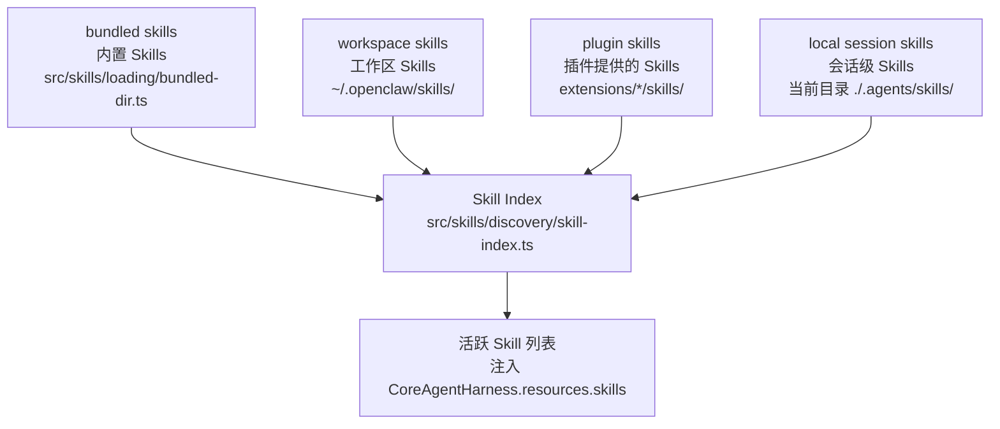
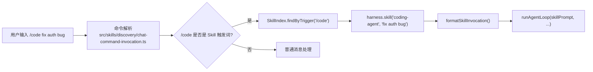

# Chapter 06 — 技能系统（Skill System）

> **核心文件**：  
> - `src/skills/loading/frontmatter.ts` — Skill 格式解析  
> - `src/skills/discovery/skill-index.ts` — Skill 发现与索引  
> - `src/skills/lifecycle/install.ts` — Skill 安装  
> - `src/skills/types.ts` — Skill 类型定义  
> - `packages/agent-core/src/harness/skills.ts` — Skill 执行格式化

---

## 设计动机

Skill 系统解决的核心问题：**如何让非技术用户（和技术用户）在不写代码的情况下扩展 Agent 的行为模式？**

OpenClaw 的答案：Markdown 文件 + YAML frontmatter = Skill。类似于给 Agent 写"工作说明书"，而不是写函数。

### Skill vs Tool vs Prompt 的本质区别

| 概念 | 形式 | 执行者 | 适用场景 |
|---|---|---|---|
| **Tool** | TypeScript 函数 + TypeBox Schema | 代码（确定性执行） | 文件操作、API 调用、数据库查询 |
| **Skill** | Markdown + YAML frontmatter | LLM（语义理解执行） | 行为模式、工作流程、思维框架 |
| **Prompt** | 字符串 | LLM | 一次性指令 |

**何时用 Skill**：当你想告诉 Agent "每当用户问你 X 类问题时，你应该先做 A，然后做 B，最后做 C" —— 这是 Skill 而不是 Tool。

---

## Skill 定义格式

Skill 是 Markdown 文件，带有标准化的 YAML frontmatter：

```markdown
---
name: coding-agent
description: "Transform into a coding assistant that follows TDD principles"
version: "1.2.0"
author: "openclaw-team"
tags: [coding, tdd, testing]
trigger:
  type: slash-command
  command: /code
requires:
  - tool: run_shell
  - tool: read_file
  - tool: write_file
agent-filter:
  models: [claude-*, gpt-4*]
  min-context-window: 32000
---

# Coding Agent Skill

When this skill is active, you are a senior software engineer following TDD.

## Workflow

1. **Understand** the user's requirement completely before writing any code
2. **Write tests first** (TDD: Red → Green → Refactor)
3. **Implement** the minimal code to pass tests
4. **Refactor** for clarity and performance

## Guidelines

- Always explain your reasoning before writing code
- Suggest type annotations for TypeScript/Python
- Highlight potential edge cases in your implementation
```

### Frontmatter 字段说明

| 字段 | 类型 | 必填 | 说明 |
|---|---|---|---|
| `name` | string | ✅ | 唯一标识符（用于 `harness.skill("coding-agent")`） |
| `description` | string | ✅ | 一句话描述（用于 Skill 选择 / UI 展示） |
| `version` | semver | ✅ | 版本号（用于升级管理） |
| `trigger.type` | enum | ❌ | `slash-command` / `auto` / `manual` |
| `trigger.command` | string | ❌ | 斜杠命令触发词 |
| `requires` | array | ❌ | 依赖的工具列表（运行时检查） |
| `agent-filter` | object | ❌ | 适用的模型/上下文窗口要求 |

---

## Skill Registry 与加载

### 加载层级



优先级（高到低）：Session > Workspace > Plugin > Bundled（高优先级同名 Skill 覆盖低优先级）。

### Frontmatter 解析

```typescript
// src/skills/loading/frontmatter.ts
interface SkillFrontmatter {
  name: string;
  description: string;
  version: string;
  trigger?: {
    type: "slash-command" | "auto" | "manual";
    command?: string;
  };
  requires?: Array<{ tool: string }>;
  "agent-filter"?: {
    models?: string[];
    "min-context-window"?: number;
  };
}

function parseFrontmatter(content: string): { frontmatter: SkillFrontmatter; body: string } {
  const match = content.match(/^---\n([\s\S]+?)\n---\n([\s\S]*)$/);
  if (!match) throw new Error("Invalid skill format: missing frontmatter");
  const frontmatter = yaml.parse(match[1]) as SkillFrontmatter;
  return { frontmatter, body: match[2] };
}
```

---

## Skill Discovery

```typescript
// src/skills/discovery/skill-index.ts
class SkillIndex {
  private skills: Map<string, Skill> = new Map();

  async load(sources: SkillSource[]): Promise<void> {
    for (const source of sources) {
      const skills = await source.loadSkills();
      for (const skill of skills) {
        this.skills.set(skill.name, skill);  // 高优先级覆盖低优先级
      }
    }
  }

  findByTrigger(command: string): Skill | undefined {
    for (const skill of this.skills.values()) {
      if (skill.trigger?.command === command) return skill;
    }
  }

  listActive(filter?: AgentFilter): Skill[] {
    return [...this.skills.values()].filter(skill =>
      matchesAgentFilter(skill, filter)
    );
  }
}
```

### Agent 过滤器

```typescript
// src/skills/discovery/agent-filter.ts
function matchesAgentFilter(skill: Skill, model: Model): boolean {
  const filter = skill.agentFilter;
  if (!filter) return true;

  // 检查模型名 glob 匹配
  if (filter.models) {
    const matches = filter.models.some(pattern => micromatch([model.id], [pattern]).length > 0);
    if (!matches) return false;
  }

  // 检查最小 context window
  if (filter.minContextWindow && model.contextWindow < filter.minContextWindow) {
    return false;
  }

  return true;
}
```

---

## Skill 类型

### 1. Prompt Skill（注入 System Prompt）

最常见类型。Skill 的 Markdown body 被注入到 System Prompt 末尾，持续影响整个会话：

```typescript
// packages/agent-core/src/harness/agent-harness.ts:392
// 在 systemPrompt() 函数中遍历 activeSkills，追加描述
systemPrompt = await this.systemPrompt({
  resources: { skills, promptTemplates }
});
// 上层实现将 skills.map(s => s.body).join('\n---\n') 追加到 systemPrompt
```

### 2. 斜杠命令 Skill（单次 Prompt）

```typescript
// agent-harness.ts:726-748
async skill(name: string, additionalInstructions?: string): Promise<AssistantMessage> {
  const skill = turnState.resources.skills.find(s => s.name === name);
  if (!skill) throw new Error(`Unknown skill: ${name}`);

  // 格式化为用户消息（一次性 prompt）
  return await this.executeTurn(
    turnState,
    formatSkillInvocation(skill, additionalInstructions),
  );
}

// packages/agent-core/src/harness/skills.ts
function formatSkillInvocation(skill: Skill, additionalInstructions?: string): string {
  let text = skill.body;
  if (additionalInstructions) {
    text += `\n\nAdditional instructions:\n${additionalInstructions}`;
  }
  return text;
}
```

### 3. Workflow Skill（多步骤编排）

通过 Skill body 中的工作流描述引导 LLM 执行多步骤任务。实际步骤执行由 LLM 推理控制，Skill 只提供框架。

---

## Skill Routing



```typescript
// src/skills/discovery/chat-commands.ts
// 解析 chat 消息，识别 Skill 触发词
async function parseSlashCommand(text: string): Promise<SlashCommand | null> {
  const match = text.match(/^\/(\S+)(.*)$/);
  if (!match) return null;
  const [, command, rest] = match;
  return { command: `/${command}`, args: rest.trim() };
}
```

---

## Skill 安装与分发

### 安装来源

```typescript
// src/skills/lifecycle/install.ts
type InstallSource =
  | { type: "archive"; url: string }        // ZIP/tarball URL
  | { type: "source"; path: string }        // 本地目录
  | { type: "upload"; content: string }     // 直接上传内容
  | { type: "clawhub"; name: string }       // ClawHub 市场

async function install(source: InstallSource, targetDir: string): Promise<void> {
  switch (source.type) {
    case "archive": return installFromArchive(source.url, targetDir);
    case "source":  return installFromSource(source.path, targetDir);
    case "upload":  return installFromUpload(source.content, targetDir);
    case "clawhub": return installFromClawHub(source.name, targetDir);
  }
}
```

### ClawHub Marketplace

```typescript
// src/skills/lifecycle/clawhub.ts
// ClawHub 是 OpenClaw 官方的 Skill 市场
async function installFromClawHub(skillName: string, targetDir: string): Promise<void> {
  const metadata = await fetchClawHubSkillMetadata(skillName);
  const archiveUrl = metadata.downloadUrl;
  await installFromArchive(archiveUrl, targetDir);
}
```

### 安全扫描

```typescript
// src/skills/security/scanner.ts
// 安装前扫描 Skill 内容，检测恶意模式
async function scanSkill(skill: Skill): Promise<ScanResult> {
  const verdict = await fetchClawHubVerdicts(skill.name, skill.version);
  if (verdict.blocked) throw new Error(`Skill ${skill.name} is blocked: ${verdict.reason}`);
  return scanContent(skill.body);  // 检测 Prompt Injection 模式
}
```

---

## 企业级 Skill Marketplace 设计建议

```
1. 私有 ClawHub 实例
   - Fork ClawHub 协议，部署私有注册中心
   - 企业内部 Skill 库，不对外公开

2. Skill 审批流程
   - 新 Skill 提交 → 自动安全扫描 → 人工审核 → 发布
   - 类似 App Store 审核机制

3. 版本管理与灰度发布
   - Skill 版本 semver 管理
   - 支持 A/B 发布（不同用户组使用不同 Skill 版本）

4. Skill 性能监控
   - 记录每个 Skill 被调用的频率、成功率、用户满意度
   - 自动下架低质量 Skill
```

---

## 与四大框架对比

| 维度 | **OpenClaw** | **Claude Code** | **OpenAI Codex** | **OpenHands** | **Archon** |
|---|---|---|---|---|---|
| **Skill 概念** | ✅ Markdown frontmatter | Slash commands（类似） | ❌ | ❌ | ❌ |
| **声明式** | ✅ YAML 无需代码 | ❌ 需要配置 CLAUDE.md | ❌ | ❌ | ❌ |
| **版本管理** | ✅ semver | ❌ | ❌ | ❌ | ❌ |
| **市场/分发** | ✅ ClawHub | ❌ | ❌ | ❌ | ❌ |
| **安全扫描** | ✅ 内置扫描器 | ❌ | ❌ | ❌ | ❌ |
| **Agent 过滤** | ✅ model glob + context window | ❌ | ❌ | ❌ | ❌ |
| **热加载** | ✅ session-level 即时生效 | ❌（重启生效） | ❌ | ❌ | ❌ |

---

## 面试题

**Q1：Skill 和 Prompt Template 有什么区别？**

> **参考答案**：Skill（技能）描述 Agent 的**行为模式和工作方式**，通常持续影响整个会话（注入 System Prompt）。Prompt Template（提示模板）是**参数化的文本模板**，用于生成特定格式的单次 prompt（如"用 {{language}} 重写以下代码：\n{{code}}"）。Skill 是"Agent 的身份和习惯"，Prompt Template 是"快捷指令"。

**Q2：当多个 Skill 同时激活时，它们是如何合并的？会产生冲突吗？**

> **参考答案**：多个激活 Skill 的 body 通过分隔符拼接追加到 System Prompt（`---` 分隔）。这可能产生指令冲突（如一个 Skill 要求"简洁回答"，另一个要求"详细解释"）。OpenClaw 没有内置冲突解决机制，由 LLM 自己在冲突的指令中"权衡"。企业最佳实践是每次只激活一个高级 Skill，避免冲突。

**Q3：Skill 的安全风险是什么？ClawHub 如何防御？**

> **参考答案**：Skill 的本质是注入 System Prompt 的文本，存在 Prompt Injection 风险（恶意 Skill 可以覆盖原有指令，让 Agent 执行未经授权的操作）。ClawHub 通过：(1) 安全扫描器检测注入模式（`src/skills/security/scanner.ts`）；(2) 人工审核高风险 Skill；(3) `clawhub-verdicts.ts` 维护黑名单。企业部署建议只允许安装私有注册中心的 Skill。
