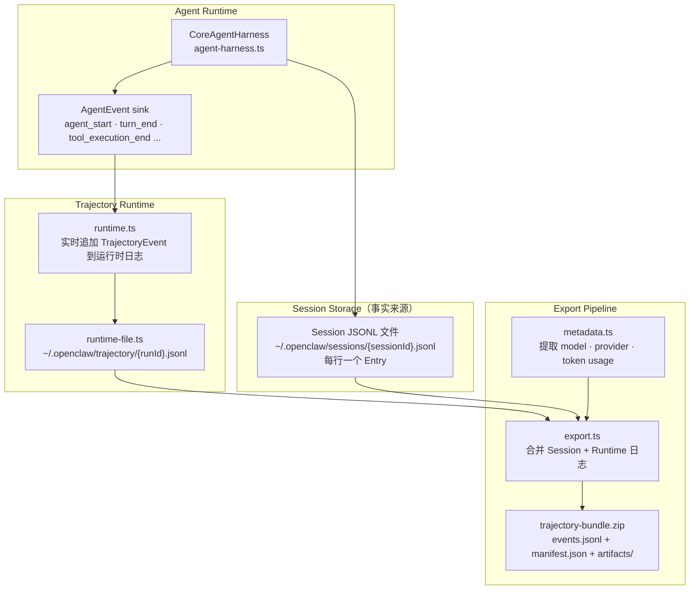

# Chapter 07 — Trajectory & 事件追踪

> **核心文件**：  
> - `src/trajectory/types.ts` — 轨迹事件类型定义  
> - `src/trajectory/runtime.ts` — 运行时轨迹写入  
> - `src/trajectory/export.ts` — 轨迹导出  
> - `extensions/diagnostics-otel/` — OpenTelemetry 集成  
> - `extensions/diagnostics-prometheus/` — Prometheus 指标

---

## 设计动机

Agent 系统的调试难点在于：LLM 决策是非确定性的，工具执行可能有副作用，多轮交互难以回溯。OpenClaw 的 Trajectory 系统旨在解决：**"这个 Agent 到底做了什么，为什么这样做？"**

### Pain Point

1. Agent 运行失败时，没有足够的诊断信息
2. 需要对 Agent 的决策过程进行事后分析和审计
3. 开发者需要理解"上下文如何演化"来优化 prompt
4. 企业合规需要完整的操作日志

---

## Trajectory 设计

### TrajectoryEvent 数据结构

```typescript
// src/trajectory/types.ts
type TrajectoryEvent = {
  traceSchema: "openclaw-trajectory";  // 格式标识
  schemaVersion: 1;                     // 版本（用于向前兼容解析）
  traceId: string;                      // 本次导出的唯一 ID（UUID）
  source: "runtime" | "transcript" | "export";  // 事件来源
  type: string;                         // 事件类型（见下表）
  ts: string;                           // ISO 8601 时间戳
  seq: number;                          // 全局递增序号（用于排序）
  sourceSeq?: number;                   // 原始来源的序号
  sessionId: string;                    // 会话 ID
  sessionKey?: string;                  // 会话键（用户可读标识）
  runId?: string;                       // 单次 Agent 运行 ID
  workspaceDir?: string;                // 工作目录
  provider?: string;                    // LLM Provider
  modelId?: string;                     // 模型 ID
  modelApi?: string | null;             // API 格式
  entryId?: string;                     // 消息 Entry ID（分支导航用）
  parentEntryId?: string | null;        // 父消息 Entry ID（树状结构）
  data?: Record<string, unknown>;       // 事件携带的业务数据
};
```

### 事件类型

| 事件类型 | 来源 | 说明 |
|---|---|---|
| `session_start` | runtime | 会话开始 |
| `user_message` | transcript | 用户消息 |
| `assistant_message` | transcript | 助手消息（含 tool_calls） |
| `tool_call` | runtime | 工具调用开始 |
| `tool_result` | runtime | 工具结果 |
| `model_change` | transcript | 模型切换 |
| `compaction` | transcript | 上下文压缩 |
| `branch_summary` | transcript | 分支切换摘要 |
| `context_event` | runtime | 上下文转换事件 |

---

## 轨迹写入架构



### 运行时写入

```typescript
// src/trajectory/runtime.ts
class TrajectoryRuntime {
  private seq = 0;
  private writer: JsonlWriter;

  async append(event: Partial<TrajectoryEvent>): Promise<void> {
    const entry: TrajectoryEvent = {
      traceSchema: "openclaw-trajectory",
      schemaVersion: 1,
      traceId: this.traceId,
      source: "runtime",
      seq: ++this.seq,
      ts: new Date().toISOString(),
      sessionId: this.sessionId,
      ...event,
    };
    await this.writer.writeLine(JSON.stringify(entry));
  }
}
```

---

## Event Bus 设计

OpenClaw 没有独立的 Event Bus，而是使用**直接回调链**：

```
CoreAgentHarness
  → handleAgentEvent(event)
    → session.appendMessage()    // 持久化到 JSONL
    → emitAny(event, signal)     // 通知所有订阅者
      → trajectory runtime        // 写入轨迹文件
      → UI layer（TUI/Channel）  // 渲染更新
      → diagnostics plugin        // OTEL/Prometheus
```

这是**同步链式调用**（全部 await），而不是发布订阅解耦。设计原因：保证事件顺序和错误传播路径清晰。

### 事件订阅

```typescript
// CoreAgentHarness.subscribe / on
harness.subscribe(async (event, signal) => {
  // 监听所有事件（广播）
  if (event.type === "message_end") {
    await updateUI(event.message);
  }
});

harness.on("tool_call", async ({ toolName, input }) => {
  // 监听特定事件（可返回结果的 hook）
  if (isHighRisk(toolName)) {
    return { block: true, reason: "High risk tool" };
  }
});
```

---

## Bundle 导出格式

```typescript
// src/trajectory/export.ts
type TrajectoryBundleManifest = {
  traceSchema: "openclaw-trajectory";
  schemaVersion: 1;
  generatedAt: string;
  traceId: string;
  sessionId: string;
  workspaceDir: string;
  leafId: string | null;          // 当前分支叶节点（分支导航用）
  eventCount: number;
  runtimeEventCount: number;
  transcriptEventCount: number;
  sourceFiles: {
    session: string;              // Session JSONL 文件路径
    runtime?: string;             // Runtime 轨迹文件路径（可选）
  };
  contents?: Array<{              // 导出的附件文件列表
    path: string;
    mediaType: string;
    bytes: number;
  }>;
  warnings?: TrajectoryBundleWarning[];  // 解析警告（损坏的行等）
};
```

导出的 Bundle 是一个 ZIP 文件，包含：
- `events.jsonl`：所有事件的时间序列（合并 Session + Runtime）
- `manifest.json`：Bundle 元数据
- `artifacts/`：相关文件（截图、输出文件等）

---

## 可观测性体系

### OpenTelemetry 集成

```typescript
// extensions/diagnostics-otel/
// 将 AgentEvent 转换为 OTEL Span
harness.subscribe(async (event) => {
  switch (event.type) {
    case "agent_start":
      span = tracer.startSpan("agent.run", {
        attributes: { "session.id": sessionId, "model.id": model.id }
      });
      break;
    case "tool_execution_start":
      childSpan = tracer.startSpan("tool.call", {
        attributes: { "tool.name": event.toolName },
        parent: span,
      });
      break;
    case "tool_execution_end":
      childSpan.setStatus({ code: event.isError ? SpanStatusCode.ERROR : SpanStatusCode.OK });
      childSpan.end();
      break;
    case "agent_end":
      span.end();
      break;
  }
});
```

OTEL Span 映射：
- Agent 运行 → Root Span
- 每次 LLM 调用 → Child Span（含 model、token usage 属性）
- 每个工具调用 → Child Span（含 tool name、is_error 属性）

### Prometheus 指标

```typescript
// extensions/diagnostics-prometheus/
// 暴露 /metrics 端点，供 Prometheus 抓取
const metrics = {
  agentRuns: new Counter("openclaw_agent_runs_total"),
  llmCalls: new Histogram("openclaw_llm_call_duration_seconds"),
  toolCalls: new Counter("openclaw_tool_calls_total", ["tool_name", "status"]),
  tokenUsage: new Counter("openclaw_tokens_total", ["type"]),  // input/output/cache
};
```

### 三支柱映射

| 可观测性支柱 | OpenClaw 实现 | 输出 |
|---|---|---|
| **日志（Logs）** | Trajectory JSONL + Session JSONL | 本地文件 / 可对接 Loki |
| **指标（Metrics）** | Prometheus extension | /metrics HTTP 端点 |
| **追踪（Traces）** | OTEL extension | Jaeger / Zipkin / Tempo |

---

## 轨迹重放

```typescript
// src/trajectory/export.ts
// 支持从导出的 Bundle 重放 Agent 执行
async function replayTrajectory(bundlePath: string): Promise<TrajectoryEvent[]> {
  const manifest = await readManifest(bundlePath);
  const events = await readEventsJsonl(bundlePath);

  // 按 seq 排序
  events.sort((a, b) => a.seq - b.seq);

  // 可以过滤特定 runId 或时间范围
  return events;
}
```

重放用途：
1. **Debug**：找到工具调用失败的根因（完整参数和结果都在事件中）
2. **Eval**：对比不同模型/prompt 在相同输入下的行为差异
3. **审计**：合规场景下证明 Agent 的操作符合规范
4. **训练数据**：高质量的 Agent 轨迹可用于微调数据集构建

---

## 与 Langfuse 集成

```typescript
// 社区集成示例（非官方内置）
const langfuse = new Langfuse({ publicKey: "...", secretKey: "..." });

harness.subscribe(async (event) => {
  if (event.type === "agent_start") {
    trace = langfuse.trace({ name: "agent-run", sessionId });
    generation = trace.generation({ name: "llm-call" });
  }
  if (event.type === "message_end" && event.message.role === "assistant") {
    generation.end({
      output: event.message.content,
      usage: {
        promptTokens: event.message.usage.input,
        completionTokens: event.message.usage.output,
      },
    });
  }
});
```

---

## 与四大框架对比

| 维度 | **OpenClaw** | **Claude Code** | **OpenAI Codex** | **OpenHands** | **Archon** |
|---|---|---|---|---|---|
| **轨迹格式** | JSONL（版本化 schema） | 无标准格式 | 无 | 无 | LangSmith Trace |
| **OTEL 集成** | ✅ Extension 插件 | ❌ | ❌ | ❌ | ✅（LangSmith 原生）|
| **Prometheus** | ✅ Extension 插件 | ❌ | ❌ | ❌ | ❌ |
| **轨迹重放** | ✅ export.ts | ❌ | ❌ | ❌ | ✅（LangSmith） |
| **分布式追踪** | ✅（OTEL） | ❌ | ❌ | ❌ | ✅（LangSmith） |
| **事件粒度** | Token 级 delta + 工具 update | 粗粒度 | 粗粒度 | 粗粒度 | Turn 级 |
| **审计日志** | ✅ 完整 args + results | ❌ | ❌ | ❌ | 部分 |

---

## 企业实践建议

1. **集中式日志收集**：将 Trajectory JSONL 推送到 Elasticsearch 或 S3，用 Kibana/Athena 做分析。
2. **实时告警**：在 Prometheus 上配置告警规则（如工具错误率 > 5%、LLM 超时 > 30s）。
3. **数据脱敏**：在 `afterToolCall` 中对敏感字段（密码、API Key）脱敏后再写入轨迹。
4. **容量规划**：每次 Agent 运行产生约 10-100KB 轨迹数据（视 tool_call 数量），估算存储需求。

---

## 面试题

**Q1：为什么 Trajectory 要同时维护 Session JSONL 和 Runtime JSONL 两个文件？**

> **参考答案**：Session JSONL 是"事实来源"（消息历史、分支结构），由 Harness 严格管理，是树状结构（支持分支导航）。Runtime JSONL 是"执行日志"（工具调用细节、上下文转换、性能指标），是线性时间序列。两者合并才能得到完整的"发生了什么 + 为什么"画面。分开存储避免了频繁的文件锁竞争（Runtime 是高频追加操作）。

**Q2：`seq` 和 `sourceSeq` 字段有什么区别？**

> **参考答案**：`seq` 是导出时的全局递增序号，用于合并后的排序（当 Session 和 Runtime 事件交错时保证正确顺序）。`sourceSeq` 是原始文件中的序号（Session JSONL 的行号或 Runtime JSONL 的序号），用于追溯回原始文件的具体行，方便定位和调试。

**Q3：如何利用 Trajectory 数据改善 Agent 性能？**

> **参考答案**：可以分析：(1) 哪些工具调用失败率高（参数校验失败？权限不足？）；(2) LLM 在哪些场景会产生无效 tool_call（工具名拼写错误、不必要的工具调用）；(3) Context Window 使用率（多少百分比的对话接近上限触发压缩）；(4) 哪些 Skill 被频繁触发（说明用户需求集中在这些场景）。
