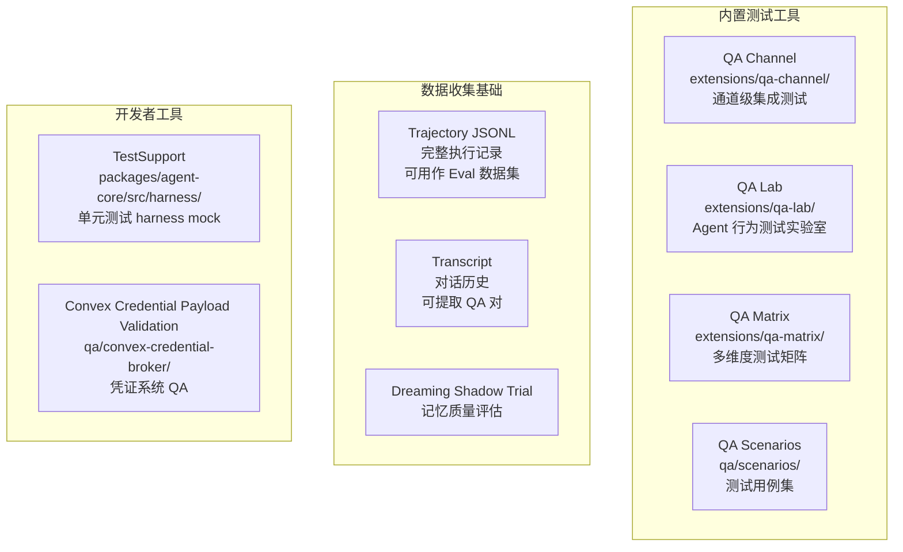
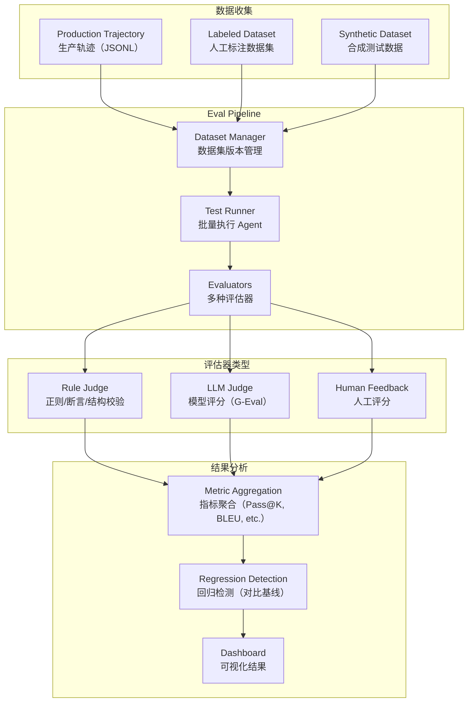

# Chapter 09 — Eval & Feedback 体系

> **核心结论**：OpenClaw 当前版本**没有内置 Eval 框架**，但有以下相关基础设施：`extensions/qa-channel/`（QA 通道）、`extensions/qa-lab/`（测试实验室）、`extensions/qa-matrix/`（矩阵测试）、Trajectory 导出（支持 offline eval），以及 `packages/agent-core` 的测试工具链。本章分析现有基础并给出企业级 Eval 补充方案。

---

## 现有 Eval 相关基础设施



---

## QA Channel & QA Lab 设计

### QA Channel

`extensions/qa-channel/` 是一个专门用于集成测试的通道 Extension，可以：
- 模拟用户消息（无需真实通道）
- 断言 Agent 回复内容
- 测试通道 Extension 的行为

### QA Lab

`extensions/qa-lab/` 提供：
- 预定义测试场景（scenarios）
- 运行批量测试并收集结果
- 比较不同 prompt/model 下的行为差异

### QA Matrix

`extensions/qa-matrix/` 是多维度测试矩阵，可以：
- 跨 N 个 LLM Provider × M 个 Skill × K 个输入 的组合测试
- 用于"在换模型前确认行为一致性"

---

## 设计补充：完整 Eval Framework

### 整体架构建议



---

## LLM Judge 实现方案

基于 G-Eval 框架（Chain-of-Thought Evaluation）：

```typescript
// 建议实现：packages/eval-core/src/llm-judge.ts
interface LLMJudgeConfig {
  model: Model;
  criteria: EvalCriteria[];
  systemPrompt: string;
}

interface EvalCriteria {
  name: string;        // 评估维度名称（correctness, helpfulness, etc.）
  description: string; // 评估标准描述
  scale: [number, number];  // 分数范围（如 [1, 5]）
}

async function llmJudge(
  input: string,
  output: string,
  config: LLMJudgeConfig
): Promise<EvalResult> {
  const prompt = buildJudgePrompt(input, output, config.criteria);

  // Chain-of-Thought: 让 LLM 先推理后打分
  const response = await stream(config.model, {
    systemPrompt: config.systemPrompt,
    messages: [{ role: "user", content: prompt }],
  });

  return parseJudgeResponse(response);
}

// G-Eval Prompt 模板
function buildJudgePrompt(input: string, output: string, criteria: EvalCriteria[]): string {
  return `
You are evaluating an AI assistant's response.

Input: ${input}
Output: ${output}

Please evaluate the output on the following criteria:
${criteria.map(c => `- ${c.name}: ${c.description} (Score: ${c.scale[0]}-${c.scale[1]})`).join('\n')}

Think step by step, then provide scores in JSON format:
{"correctness": 4, "helpfulness": 5, "reasoning": "..."}
  `;
}
```

---

## Rule Judge 实现方案

```typescript
// 确定性规则评估
interface RuleJudge {
  name: string;
  evaluate(input: string, output: string): EvalResult;
}

// 示例：JSON 格式校验
const jsonFormatJudge: RuleJudge = {
  name: "json-format",
  evaluate: (input, output) => {
    try {
      JSON.parse(output);
      return { pass: true, score: 1.0 };
    } catch {
      return { pass: false, score: 0.0, reason: "Output is not valid JSON" };
    }
  }
};

// 示例：正则匹配
const emailFormatJudge: RuleJudge = {
  name: "email-format",
  evaluate: (input, output) => {
    const hasEmail = /\b[A-Za-z0-9._%+-]+@[A-Za-z0-9.-]+\.[A-Z|a-z]{2,}\b/.test(output);
    return { pass: hasEmail, score: hasEmail ? 1.0 : 0.0 };
  }
};

// 示例：Agent 工具调用断言
const toolCallJudge: RuleJudge = {
  name: "tool-call-assertion",
  evaluate: (_, output, trajectory) => {
    const toolCalls = trajectory.filter(e => e.type === "tool_call");
    const hasReadFile = toolCalls.some(e => e.data?.toolName === "read_file");
    return { pass: hasReadFile, score: hasReadFile ? 1.0 : 0.0 };
  }
};
```

---

## Human Feedback 接入

```typescript
// 利用 CoreAgentHarness 的事件机制收集人工反馈
harness.subscribe(async (event) => {
  if (event.type === "agent_end") {
    // 向通道发送评分请求（👍/👎）
    const feedbackRequest = {
      sessionId: sessionId,
      runId: currentRunId,
      messages: event.messages,
    };

    // 通过通道扩展 Extension 发送评分卡片
    await feedbackChannel.sendRatingCard(feedbackRequest);
  }
});

// 接收评分并存储
feedbackChannel.onRating(async ({ sessionId, runId, score, comment }) => {
  await feedbackStore.save({
    sessionId,
    runId,
    score,  // -1 (bad) / 0 (neutral) / 1 (good)
    comment,
    timestamp: Date.now(),
  });
});
```

---

## Offline Eval Pipeline

基于 Trajectory JSONL 的批量评估：

```typescript
// 从生产轨迹构建 Eval 数据集
async function buildDatasetFromTrajectory(
  trajectoryDir: string,
  filter: TrajectoryFilter
): Promise<EvalDataset> {
  const events = await loadTrajectoryEvents(trajectoryDir);

  return events
    .filter(filter)
    .map(event => ({
      input: extractUserMessage(event),
      expectedOutput: event.data?.humanRating === 1 ? extractAssistantMessage(event) : null,
      tags: extractTags(event),
    }))
    .filter(item => item.input && item.expectedOutput);
}

// 批量运行 Eval
async function runOfflineEval(
  dataset: EvalDataset,
  evaluators: Evaluator[],
  agentFactory: () => CoreAgentHarness
): Promise<EvalReport> {
  const results: EvalItemResult[] = [];

  for (const item of dataset.items) {
    const harness = agentFactory();
    const response = await harness.prompt(item.input);

    const scores = await Promise.all(
      evaluators.map(e => e.evaluate(item.input, response))
    );

    results.push({ item, response, scores });
  }

  return aggregateResults(results);
}
```

---

## Online Eval（A/B 测试）

```typescript
// 通过 prepareNextTurn 实现 A/B 测试（不同 prompt 版本）
const experimentConfig = await loadExperimentConfig(sessionId);

const config: AgentLoopConfig = {
  // A/B 测试：50% 用户看到 Variant A，50% 看到 Variant B
  prepareNextTurn: async () => {
    if (experimentConfig.variant === "A") {
      return { model: modelA };
    } else {
      return { model: modelB };
    }
  }
};

// 收集实验数据
harness.subscribe(async (event) => {
  if (event.type === "agent_end") {
    await experimentTracker.record({
      variant: experimentConfig.variant,
      sessionId,
      outcome: await autoEval(event.messages),
    });
  }
});
```

---

## 与四大框架对比

| 维度 | **OpenClaw** | **Claude Code** | **OpenAI Codex** | **OpenHands** | **Archon** |
|---|---|---|---|---|---|
| **内置 Eval** | ❌（有 QA 工具，无系统 Eval） | ❌ | ❌ | ❌ | ❌ |
| **LLM Judge** | ❌（需自行实现） | ❌ | ❌ | ❌ | ❌ |
| **Rule Judge** | 部分（QA scenarios） | ❌ | ❌ | ❌ | ❌ |
| **Human Feedback** | ❌（需通过通道实现） | ❌ | ❌ | ❌ | ❌ |
| **Trajectory for Eval** | ✅（JSONL 格式完备） | ❌ | ❌ | ❌ | ✅（LangSmith） |
| **A/B 测试** | ✅（通过 prepareNextTurn） | ❌ | ❌ | ❌ | ✅（LangSmith） |
| **回归检测** | ❌ | ❌ | ❌ | ❌ | ✅（LangSmith） |

---

## 企业实践建议

1. **从 Trajectory 挖掘高质量样本**：将用户👍评价的对话导出为黄金测试集，用于回归测试。
2. **分层评估策略**：快速 Rule Judge（毫秒级）→ 本地小模型 Judge（秒级）→ 云端 LLM Judge（分钟级），只有前两层失败的才进入昂贵的 LLM Judge。
3. **Eval 即 CI**：将 Eval 集成到 CI/CD 流水线，每次发布前自动运行核心测试集，设置通过率阈值（如 Pass@1 ≥ 90%）。
4. **多维度指标**：不只看准确率，还要评估延迟（P50/P99）、成本（每次对话 token 数）、用户满意度（人工反馈）。

---

## 面试题

**Q1：LLM Judge 和 Rule Judge 各自的适用场景是什么？**

> **参考答案**：Rule Judge 适合有明确正确答案的场景（格式验证、关键词存在、数值在范围内），速度快、成本低、可重现。LLM Judge 适合需要语义理解的场景（"回答是否有帮助"、"代码是否遵循最佳实践"），更灵活但成本高、结果有随机性。最佳实践是"Rule Judge 做第一道过滤，LLM Judge 做深度评估"。

**Q2：如何处理 LLM Judge 本身的幻觉和不一致性？**

> **参考答案**：(1) **多样本采样**：对同一输出用 LLM Judge 评分 5 次，取平均值降低随机性；(2) **Chain-of-Thought**：要求 LLM Judge 先推理再打分，减少"直觉打分"的不稳定性；(3) **校准（Calibration）**：用人工标注样本校验 LLM Judge 的评分分布，发现系统性偏差；(4) **强模型 Judge**：用比被评估模型更强的模型做 Judge（如用 Claude Opus 评估 Haiku 的输出）。

**Q3：如何设计"不破坏用户体验"的在线 Eval 数据收集？**

> **参考答案**：(1) **被动采集**：Trajectory JSONL 记录所有对话，不需要用户额外操作；(2) **轻量反馈**：在回复末尾加 👍👎 按钮（比填写表单侵入性低得多）；(3) **抽样 Eval**：不是每次对话都收集评分，按一定比例随机采样；(4) **明确知情同意**：在用户协议中说明对话记录用于改善服务，不要偷偷收集。
