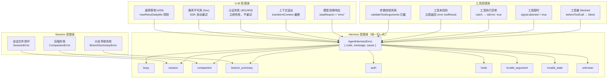
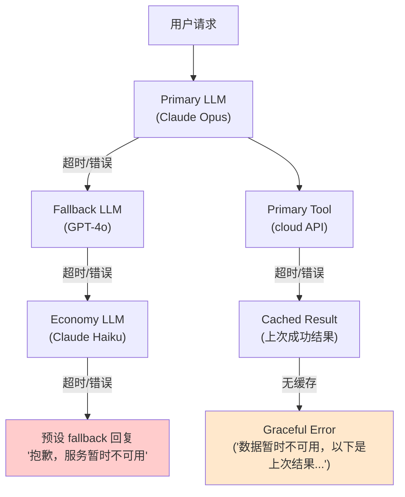

# Chapter 10 — 错误处理、重试与降级

> **核心文件**：  
> - `packages/agent-core/src/agent-loop.ts` — 循环级错误处理  
> - `packages/agent-core/src/harness/agent-harness.ts` — Harness 级错误归一化  
> - `packages/llm-core/src/types.ts` — StreamOptions（重试配置）  
> - `packages/memory-host-sdk/src/host/retry-utils.ts` — 通用重试工具

---

## 错误分类体系



---

## 错误处理分层设计

### 第一层：LLM Provider 层（SDK 自动重试）

```typescript
// llm-core/types.ts::StreamOptions
interface StreamOptions {
  maxRetries?: number;       // SDK 重试次数（默认 2）
  maxRetryDelayMs?: number;  // 最大重试等待（默认 60000ms）
}
```

当 Provider 返回 429（速率限制）或 5xx（服务错误），SDK 自动指数退避重试。超过 `maxRetryDelayMs` 的等待请求立即失败（快速失败原则）。

### 第二层：AgentLoop 层（停止信号）

```typescript
// agent-loop.ts:260-265
if (message.stopReason === "error" || message.stopReason === "aborted") {
  await emit({ type: "turn_end", message, toolResults: [] });
  await emit({ type: "agent_end", messages: newMessages });
  return;  // 清洁退出，不抛出异常
}
```

LLM 层的错误最终会体现在 `AssistantMessage.stopReason = "error"` 和 `errorMessage` 字段。AgentLoop 不抛出异常，而是通过事件流传播错误状态，保证消费者能接收到完整的事件序列。

### 第三层：工具层（错误即结果）

```typescript
// agent-loop.ts:759-765
try {
  const result = await prepared.tool.execute(id, args, signal, onUpdate);
  return { result, isError: false };
} catch (error) {
  // 工具异常 → 转换为错误结果，不终止循环
  return {
    result: createErrorToolResult(error instanceof Error ? error.message : String(error)),
    isError: true,
  };
}
```

工具执行异常被捕获并转换为 `isError: true` 的工具结果。LLM 在下一轮看到错误工具结果后，可以决定重试或换方案（自然语言推理）。

### 第四层：Harness 层（错误归一化）

```typescript
// agent-harness.ts:176-194
function normalizeHarnessError(error: unknown, fallbackCode: AgentHarnessError["code"]): AgentHarnessError {
  if (error instanceof AgentHarnessError) return error;

  const cause = toError(error);
  if (cause instanceof SessionError) return new AgentHarnessError("session", cause.message, cause);
  if (cause instanceof CompactionError) return new AgentHarnessError("compaction", cause.message, cause);
  if (cause instanceof BranchSummaryError) return new AgentHarnessError("branch_summary", cause.message, cause);

  return new AgentHarnessError(fallbackCode, cause.message, cause);
}
```

所有错误在 Harness 层统一归一化为 `AgentHarnessError`，上层应用只需处理一种错误类型。

---

## Retry 策略

### SDK 层重试（指数退避）

```typescript
// 各 Provider SDK 默认配置（参考 llm-core/types.ts）
// OpenAI SDK: maxRetries=2, backoff=exponential
// Anthropic SDK: maxRetries=2, backoff=exponential
// 上层配置示例：
const options: StreamOptions = {
  maxRetries: 3,
  maxRetryDelayMs: 30000,  // 最多等待 30 秒，超过立即失败
};
```

### 动态 API Key 刷新（OAuth Token 过期）

```typescript
// agent-loop.ts:372-374
// 每次 LLM 调用前刷新 API Key（用于 OAuth 短期令牌）
const resolvedApiKey = (config.getApiKey
  ? await config.getApiKey(config.model.provider)
  : undefined) || config.apiKey;
```

### 模型级 Failover（prepareNextTurn）

```typescript
// 主模型失败后切换备用模型
const config: AgentLoopConfig = {
  prepareNextTurn: async ({ message }) => {
    if (message.stopReason === "error") {
      const errorMsg = message.errorMessage ?? "";
      if (errorMsg.includes("rate_limit") || errorMsg.includes("overloaded")) {
        return { model: fallbackModel };  // 切换到备用模型
      }
    }
    return undefined;
  }
};
```

---

## Timeout 设计

| 层级 | 配置项 | 默认值 | 说明 |
|---|---|---|---|
| HTTP 连接 | `StreamOptions.timeoutMs` | Provider SDK 默认（通常 10min） | HTTP 请求超时 |
| LLM 调用 | `StreamOptions.timeoutMs` | 继承 | 整个 SSE 流的超时 |
| 工具执行 | `AbortSignal`（无内置超时） | 无 | 需上层实现 |
| Agent 运行 | `AbortController`（手动中止） | 无 | 通过 `abort()` 触发 |
| 重试等待 | `maxRetryDelayMs` | 60000ms | 单次重试最大等待 |

### 工具超时实现方案

```typescript
// 通过 AbortSignal.timeout 实现工具级超时
const tool: AgentTool = {
  name: "slow_tool",
  execute: async (id, args, signal) => {
    // 组合 agent AbortSignal 和工具超时 Signal
    const timeoutSignal = AbortSignal.timeout(30000);  // 30 秒超时
    const combined = AbortSignal.any([signal, timeoutSignal].filter(Boolean));

    return await doWork(args, combined);
  }
};
```

---

## Circuit Breaker（熔断器）

OpenClaw **没有内置熔断器**。可以通过 `beforeToolCall` hook 实现：

```typescript
// 建议实现：工具级熔断器
class CircuitBreaker {
  private failures = 0;
  private lastFailureTime = 0;
  private state: "closed" | "open" | "half-open" = "closed";

  isOpen(): boolean {
    if (this.state === "closed") return false;
    if (this.state === "open") {
      // 超过冷却时间进入 half-open
      if (Date.now() - this.lastFailureTime > RECOVERY_TIMEOUT) {
        this.state = "half-open";
        return false;
      }
      return true;
    }
    return false;  // half-open 允许一次尝试
  }

  recordFailure(): void {
    this.failures++;
    this.lastFailureTime = Date.now();
    if (this.failures >= FAILURE_THRESHOLD) {
      this.state = "open";
    }
  }

  recordSuccess(): void {
    this.failures = 0;
    this.state = "closed";
  }
}

const breakers = new Map<string, CircuitBreaker>();

const config: AgentLoopConfig = {
  beforeToolCall: async ({ toolCall }) => {
    const breaker = breakers.get(toolCall.name) ?? new CircuitBreaker();
    if (breaker.isOpen()) {
      return { block: true, reason: `Tool ${toolCall.name} circuit breaker is open` };
    }
  },
  afterToolCall: async ({ toolCall, isError }) => {
    const breaker = breakers.get(toolCall.name) ?? new CircuitBreaker();
    if (isError) breaker.recordFailure();
    else breaker.recordSuccess();
  }
};
```

---

## Fallback 链



实现方案：通过 `prepareNextTurn` 返回不同模型：

```typescript
const modelFallbackChain = [premiumModel, standardModel, economyModel];
let fallbackIndex = 0;

prepareNextTurn: async ({ message }) => {
  if (message.stopReason === "error" && fallbackIndex < modelFallbackChain.length - 1) {
    fallbackIndex++;
    return { model: modelFallbackChain[fallbackIndex] };
  }
  return undefined;
}
```

---

## Graceful Degradation

### 场景一：记忆系统不可用

```typescript
// 记忆检索失败时，降级到无记忆模式
async function safeMemorySearch(query: string): Promise<MemoryEntry[]> {
  try {
    return await memoryManager.search(query);
  } catch (error) {
    logger.warn("Memory search failed, continuing without memory context", { error });
    return [];  // 降级：返回空记忆（Agent 仍可工作，只是不记得历史）
  }
}
```

### 场景二：工具执行失败但 Agent 可继续

```typescript
// 工具失败 → 错误结果 → LLM 推理替代方案
// 这是 OpenClaw 的原生降级路径
// isError: true 的工具结果会被 LLM 解读并尝试其他方法
```

### 场景三：Session 损坏时的降级

```typescript
// agent-harness.ts::normalizeHarnessError
// SessionError → AgentHarnessError("session", ...)
// 上层应用可以根据 code === "session" 决定：
// 1. 创建新 session（最安全的降级）
// 2. 从最近的检查点恢复
// 3. 告知用户并等待人工干预
```

---

## 错误恢复时序

```mermaid
sequenceDiagram
    participant App as 应用层
    participant H as CoreAgentHarness
    participant Loop as AgentLoop
    participant LLM as LLM Provider

    App->>H: prompt("任务")
    H->>Loop: runAgentLoop(...)
    Loop->>LLM: streamAssistantResponse()

    LLM-->>Loop: 429 Too Many Requests
    Loop->>Loop: SDK 重试 (exponential backoff)
    Note over Loop: 等待 2s, 4s, 8s...

    alt 重试成功
        LLM-->>Loop: 正常响应
        Loop-->>H: 正常执行
    else maxRetryDelayMs 超限
        LLM-->>Loop: 错误
        Loop->>Loop: AssistantMessage { stopReason: "error" }
        Loop->>H: emit agent_end (带错误消息)
        H->>H: normalizeHarnessError()
        H-->>App: AgentHarnessError { code: "unknown", message: "Rate limit exceeded" }
    end

    App->>App: 检查错误类型
    alt code === "unknown" && includes("rate_limit")
        App->>H: 延迟后用 fallback 模型重试
        H->>Loop: runAgentLoop(..., fallbackModel)
    end
```

---

## 与四大框架对比

| 维度 | **OpenClaw** | **Claude Code** | **OpenAI Codex** | **OpenHands** | **Archon** |
|---|---|---|---|---|---|
| **错误类型体系** | AgentHarnessError (code enum) | 原生 JS Error | 原生 Error | Python Exception | LangChain Exception |
| **SDK 重试** | ✅（maxRetries + maxRetryDelayMs） | ✅ 内置 | ✅ 内置 | ✅ LiteLLM | ✅ LangChain |
| **模型 Failover** | ✅ prepareNextTurn | ❌ | ❌ | ✅ LiteLLM fallback | ❌ |
| **工具级超时** | ❌（需上层实现） | ❌ | ❌ | ❌ | ❌ |
| **熔断器** | ❌（需上层实现） | ❌ | ❌ | ❌ | ❌ |
| **Graceful Degradation** | ✅（工具错误变结果，不中断） | 部分 | 部分 | 部分 | 部分 |
| **AbortSignal 传播** | ✅ 全链路传播 | ✅ | ✅ | ❌ | ❌ |
| **错误事件流** | ✅ agent_end 事件携带错误 | ❌（直接抛出） | ❌ | ❌ | ❌ |

---

## 企业实践建议

1. **分级重试策略**：LLM 层 SDK 重试（毫秒级）→ 模型 Failover（秒级）→ 手动干预（分钟级），每级都有独立的等待上限。
2. **工具级超时必须实现**：对所有外部 API 工具设置超时（通过 `AbortSignal.timeout`），避免工具无限等待导致 Agent 卡死。
3. **统一错误上报**：在 `harness.subscribe` 中监听所有 `agent_end` 事件，检查 `message.errorMessage`，上报到错误追踪系统（Sentry 等）。
4. **熔断器是必须的**：生产环境中，外部 API 偶发故障时工具会连续失败，没有熔断器会导致大量 LLM token 浪费在明知会失败的工具调用上。

---

## 面试题

**Q1：OpenClaw 为什么设计成"工具失败 → 错误结果"而不是"工具失败 → 抛出异常"？**

> **参考答案**：LLM 是这个系统的"大脑"，工具失败本身就是 LLM 需要处理的信息。把工具错误转换为 `isError: true` 的工具结果，LLM 在下一轮可以"看到"错误并决定：重试、换工具、或者告知用户无法完成。如果工具失败直接抛出异常终止循环，LLM 就失去了"自我修复"的机会，整个 Agent 对用户的有用性大幅降低。

**Q2：`maxRetryDelayMs` 设为 0 会发生什么？**

> **参考答案**：当 `maxRetryDelayMs = 0` 时，任何 Provider 要求等待的重试请求都会立即失败（不等待）。这适用于对延迟极度敏感的实时场景（如语音交互），宁可立即切换到 Failover 模型，也不等待 429 冷却。但需要配合完善的 Failover 链，否则错误率会显著升高。

**Q3：如何为同一工具实现"最多重试 3 次，每次等待递增"的逻辑？**

> **参考答案**：通过 `beforeToolCall` 和 `afterToolCall` 组合实现（维护外部状态）：
> ```typescript
> const retryCount = new Map<string, number>();
> beforeToolCall: async ({ toolCall }) => {
>   const count = retryCount.get(toolCall.id) ?? 0;
>   if (count > 0) await sleep(count * 2000);  // 递增等待
>   return undefined;
> },
> afterToolCall: async ({ toolCall, isError }) => {
>   if (isError) {
>     const count = retryCount.get(toolCall.id) ?? 0;
>     if (count >= 3) return { terminate: true };  // 超过最大重试
>     retryCount.set(toolCall.id, count + 1);
>   }
>   return undefined;
> }
> ```
> 注意：这需要 LLM 在看到错误结果后实际重新调用同一工具，才能触发重试计数。
