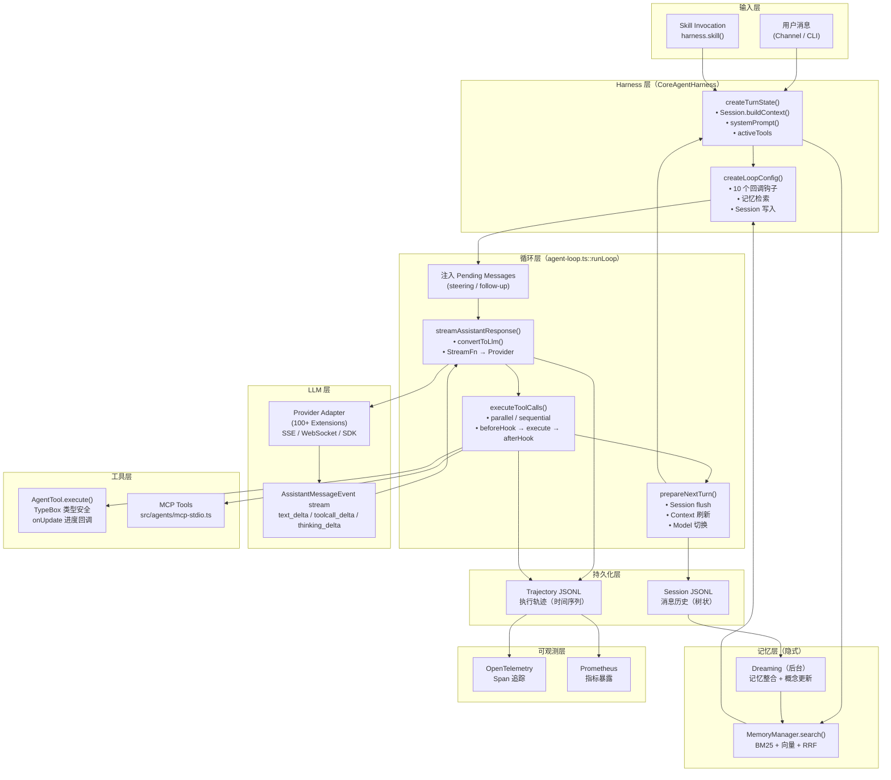

# Chapter 11 — 阅读路线图

> 本章为不同背景的读者设计最高效的 OpenClaw 源码阅读路径，帮助你在最短时间内掌握最关键的设计决策。

---

## 推荐阅读顺序

### 新人（0-1 年经验）

**目标**：理解"OpenClaw 是什么，基本流程如何运转"

```
Week 1: 概念建立
1. README.md — 了解项目定位（个人 AI 助手，不是 API）
2. AGENTS.md — 理解 Agent 视角的开发规范
3. 本分析 Chapter 00 — 整体架构图

Week 2: 核心流程
4. packages/agent-core/src/types.ts — 数据结构（AgentTool, AgentEvent）
5. packages/agent-core/src/agent-loop.ts — 主循环（重点看 runLoop() 函数）
6. packages/agent-core/src/agent.ts — Agent 类（prompt() / steer() / followUp()）

Week 3: 扩展能力
7. extensions/anthropic/ 或 extensions/openai/ — 理解 Provider 扩展结构
8. skills/coding-agent/ 或 skills/weather/ — 理解 Skill 格式
9. extensions/memory-core/src/memory/manager.ts — 记忆管理器
```

**新人重点**：主循环的双层 while 结构、工具 execute 接口、AgentEvent 事件类型。不要陷入 Extension 的细节，先把骨架摸清。

---

### 高级开发（3+ 年经验）

**目标**：深度理解设计决策，能够贡献 Extension 或集成 OpenClaw

```
Day 1: 直接看关键文件
1. packages/agent-core/src/agent-loop.ts — 重点看 executeToolCallsParallel()
2. packages/agent-core/src/harness/agent-harness.ts — 重点看 createLoopConfig() 和 compact()
3. packages/agent-core/src/types.ts — 完整读完（200行，值得逐行理解）

Day 2: 记忆系统深挖
4. extensions/memory-core/src/memory/manager-search.ts — 混合搜索
5. extensions/memory-core/src/memory/hybrid.ts — RRF 实现
6. extensions/memory-core/src/dreaming.ts — Dreaming 机制

Day 3: 技能和工具系统
7. src/skills/loading/frontmatter.ts — Skill 格式解析
8. src/skills/discovery/skill-index.ts — Skill 发现
9. src/agents/mcp-stdio.ts — MCP 集成

Day 4: 可观测性
10. src/trajectory/types.ts — 轨迹数据结构
11. extensions/diagnostics-otel/ — OTEL 集成
```

**高级开发跳过**：UI 层（src/tui/）、通道 Extension 的具体实现（除非你要集成特定通道）、测试 fixture。

---

### 架构师（20% → 80%）

**目标**：5 小时内掌握 OpenClaw 的架构精髓，用于做技术决策

```
2 小时: 核心设计原则
1. packages/agent-core/src/types.ts:134 — AgentLoopConfig（10个关键扩展点）
2. packages/agent-core/src/agent-loop.ts:213 — runLoop()（70行，理解双层循环）
3. packages/llm-core/src/types.ts 前100行 — KnownApi枚举 + Model + StreamOptions

1.5 小时: 关键扩展机制
4. packages/agent-core/src/harness/agent-harness.ts:485 — createLoopConfig()（50行，钩子注入）
5. packages/memory-host-sdk/src/engine.ts — 记忆引擎接口（30行，扩展点）
6. src/skills/types.ts — Skill 类型（20行）

1.5 小时: 系统边界
7. AGENTS.md（全文，理解 Core 保持 plugin-agnostic 的原则）
8. pnpm-workspace.yaml — 理解 monorepo 包边界
9. 任选一个 Extension（如 extensions/anthropic/）— 理解 Extension 合约
```

**架构师核心结论**：
- **核心约束**：packages/agent-core 不依赖任何具体 Provider 或通道
- **扩展机制**：全部通过 callback 注入（AgentLoopConfig 的 10 个函数字段）
- **数据流**：AgentMessage[] → convertToLlm() → Message[] → Provider
- **隔离机制**：每个 Session 一个 CoreAgentHarness 实例

---

## Top 20 必看源码文件

| # | 文件路径 | 为什么必看 |
|---|---|---|
| 1 | `packages/agent-core/src/agent-loop.ts` | 主循环：整个 Agent 能力的基础，理解它就理解了 ReAct 的实现 |
| 2 | `packages/agent-core/src/types.ts` | 数据合约：所有核心类型（AgentTool, AgentEvent, AgentLoopConfig）都在这里 |
| 3 | `packages/agent-core/src/agent.ts` | 公共 API：外部如何使用 Agent（prompt/steer/followUp/abort） |
| 4 | `packages/agent-core/src/harness/agent-harness.ts` | 高阶 Harness：Session 持久化、钩子路由、压缩、分支导航 |
| 5 | `packages/llm-core/src/types.ts` | LLM 类型：StreamFn、Model、KnownApi、AssistantMessageEvent |
| 6 | `packages/agent-core/src/harness/messages.ts` | 消息转换：AgentMessage[] 如何变成 LLM 理解的 Message[] |
| 7 | `extensions/memory-core/src/memory/manager.ts` | 记忆管理器：搜索、写入、索引的统一入口 |
| 8 | `extensions/memory-core/src/memory/manager-search.ts` | 混合搜索：BM25 + 向量 + RRF 融合 |
| 9 | `extensions/memory-core/src/dreaming.ts` | Dreaming：记忆整合机制，OpenClaw 的"学习"能力 |
| 10 | `packages/memory-host-sdk/src/host/sqlite-vec.ts` | 向量存储：本地 sqlite-vec 实现 |
| 11 | `src/skills/loading/frontmatter.ts` | Skill 格式：YAML frontmatter 解析 |
| 12 | `src/skills/discovery/skill-index.ts` | Skill 发现：多来源 Skill 加载和优先级 |
| 13 | `packages/agent-core/src/validation.ts` | 工具验证：TypeBox schema 校验 + 类型转换 |
| 14 | `src/trajectory/types.ts` | 轨迹格式：JSONL 事件结构（版本化 schema） |
| 15 | `src/trajectory/runtime.ts` | 轨迹写入：实时事件记录实现 |
| 16 | `src/agents/mcp-stdio.ts` | MCP 集成：外部工具服务接入方式 |
| 17 | `packages/agent-core/src/harness/compaction/compaction.ts` | 上下文压缩：触发条件 + LLM 摘要生成 |
| 18 | `src/llm/api-registry.ts` | Provider 注册：动态 API 适配器发现 |
| 19 | `packages/llm-runtime/src/stream.ts` | 流式包装：统一 StreamFn 路由实现 |
| 20 | `AGENTS.md` | 设计哲学：理解 Core plugin-agnostic 原则 |

---

## Agent 核心链路全景图



---

## 二次开发推荐扩展点

### 1. 新 LLM Provider Extension

**扩展方式**：
```
extensions/my-provider/
├── index.ts          # 实现 StreamFn
├── package.json
└── openclaw.plugin.json
```

**风险**：需要仔细处理流式 SSE 解析边界情况（delta 拼接、tool_call 参数流式构建）

### 2. 新消息通道 Extension

**扩展方式**：实现 Channel Adapter 接口，注册 webhook 或长轮询  
**风险**：不同通道的消息格式差异大，需要仔细处理富文本/附件/反应的映射

### 3. 自定义工具集

**扩展方式**：
```typescript
const myTools: AgentTool[] = [
  {
    name: "my_tool",
    label: "My Tool",
    description: "...",
    parameters: Type.Object({ ... }),
    execute: async (id, params, signal, onUpdate) => { ... }
  }
];
harness.setTools(myTools);
```
**风险**：工具描述质量直接影响 LLM 调用准确率，description 必须精确

### 4. 自定义记忆后端

**扩展方式**：实现 `packages/memory-host-sdk/src/engine.ts` 的 `MemoryEngine` 接口  
**风险**：向量索引的维护（嵌入模型版本升级时需要全量重新索引）

### 5. Reflection / Eval 层

**扩展方式**：通过 `harness.on('turn_end')` 和 `harness.steer()` 实现  
**风险**：额外 LLM 调用增加延迟和成本，需要设置最大反思次数

### 6. 分布式部署适配

**扩展方式**：将 Session JSONL 替换为分布式存储（如 Redis + S3）  
**风险**：Session 的树状分支结构依赖原子性追加操作，分布式存储需要加锁

### 7. 自定义 Dreaming 策略

**扩展方式**：实现自定义 `DreamingPhase`，替换默认的记忆整合逻辑  
**风险**：Dreaming 涉及 LLM 调用，错误的整合策略可能造成记忆丢失

---

## 常见坑与避雷指南

### 坑 1：混淆 Agent 并发与多会话

```
❌ 错误：创建一个 Agent 实例，并发调用 prompt()
✅ 正确：每个会话/用户创建独立的 CoreAgentHarness 实例
原因：Agent 内部 activeRun 状态不是线程安全的
```

### 坑 2：在 convertToLlm 中抛出异常

```
❌ 错误：convertToLlm 抛出 throw new Error()
✅ 正确：返回安全的降级值（空数组或过滤后的数组）
原因：types.ts:162 注释明确说明 "must not throw or reject"
```

### 坑 3：工具 execute 中的 await 不传 signal

```
❌ 错误：await fetch(url)
✅ 正确：await fetch(url, { signal })
原因：没有传递 AbortSignal 导致工具无法被中止，Agent abort() 后工具继续运行
```

### 坑 4：在 beforeToolCall 中做耗时操作（无超时保护）

```
❌ 错误：在 beforeToolCall 中调用外部 API（无超时）
✅ 正确：用 AbortSignal.timeout() 包裹外部调用
原因：beforeToolCall 在工具执行前串行调用，耗时会阻塞整个 tool batch
```

### 坑 5：假设 Skill body 内容安全

```
❌ 错误：直接安装来路不明的 Skill，不做安全检查
✅ 正确：安装前用 src/skills/security/scanner.ts 扫描
原因：Skill 直接注入 System Prompt，恶意 Skill 可以覆盖 Agent 行为
```

### 坑 6：在 Session write 时机不当导致数据丢失

```
❌ 错误：在 Agent 运行中途直接调用 session.appendMessage()
✅ 正确：通过 pendingSessionWrites 队列（harness.appendMessage()）
原因：运行中直接写入可能与 flushPendingSessionWrites 竞争，破坏消息顺序
```

### 坑 7：记忆写入后不等待索引完成就检索

```
❌ 错误：写入记忆后立即检索，期望找到刚写入的内容
✅ 正确：等待 MemoryManager 的写入确认（索引是异步的）
原因：sqlite-vec 的嵌入生成是异步操作，刚写入的记忆不会立即出现在向量搜索结果中
```

---

## 快速上手路径

如果你只有 **2 小时**，按以下顺序读完核心：

```bash
# 1. 了解数据结构（15 分钟）
cat packages/agent-core/src/types.ts

# 2. 理解主循环（20 分钟）
# 重点看 runLoop(), streamAssistantResponse(), executeToolCalls()
cat packages/agent-core/src/agent-loop.ts

# 3. 看高阶 Harness 的钩子注入（15 分钟）
# 重点看 createLoopConfig()
grep -n "createLoopConfig\|beforeToolCall\|afterToolCall\|prepareNextTurn" \
  packages/agent-core/src/harness/agent-harness.ts

# 4. 理解工具接口（10 分钟）
# 看 AgentTool 接口定义
grep -n "interface AgentTool" packages/agent-core/src/types.ts

# 5. 看一个真实 Extension 的结构（15 分钟）
ls extensions/anthropic/
cat extensions/anthropic/index.ts | head -100

# 6. 理解 Skill 格式（5 分钟）
cat skills/weather/skill.md

# 总计：~1.5 小时，掌握 80% 核心架构
```
