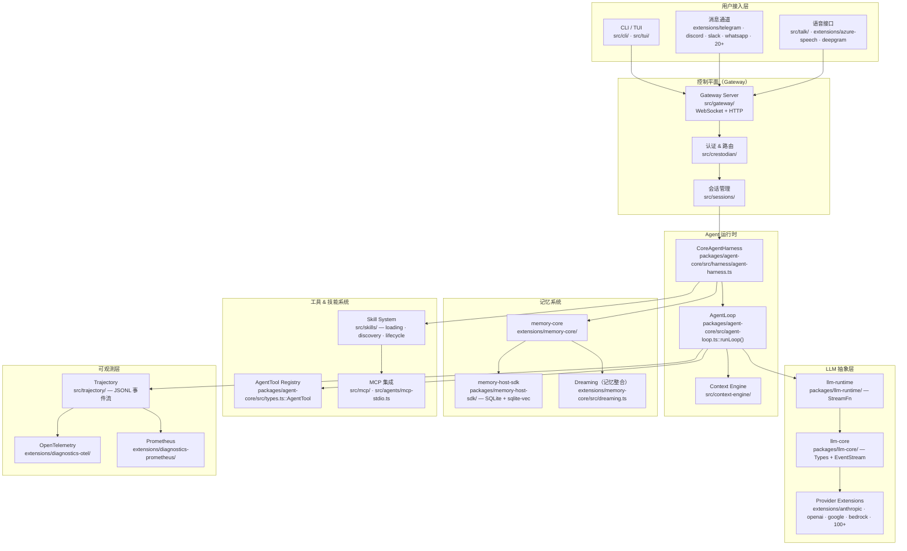
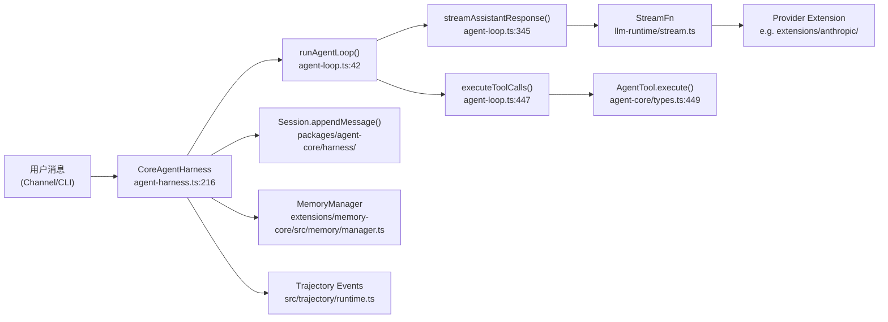
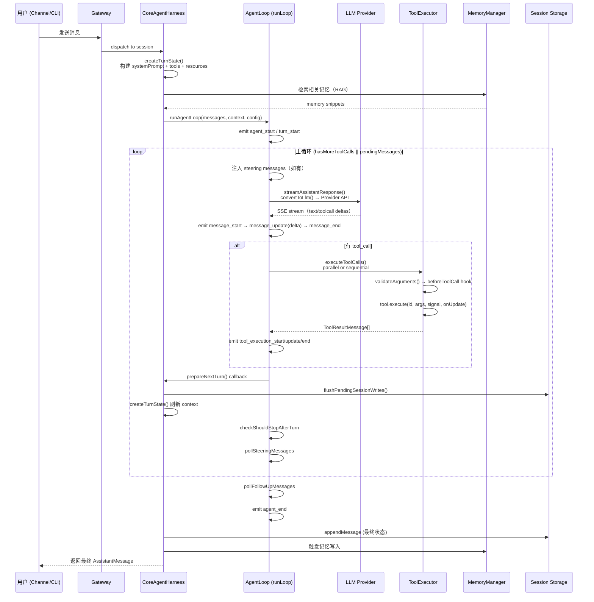

# Chapter 00 — OpenClaw 架构全景

> **源码截止日期**：2026-06-07  
> **目标读者**：Agent 开发工程师 / AI 平台研发 / LLM Application Engineer / Agent Framework Designer

---

## 项目定位

OpenClaw 是一个**个人 AI 助手框架**（Personal AI Assistant Framework），运行在用户自己的设备上，通过用户已有的消息通道（WhatsApp、Telegram、Slack、Discord 等 20+ 平台）与用户交互，支持语音、Canvas 渲染和多模态能力。

### Agent 类型分类

| 维度 | OpenClaw 的答案 |
|---|---|
| Agent 类型 | **混合型**：ReAct（工具调用循环）+ Workflow（技能编排）+ Multi-Agent（子 Agent 系统） |
| 执行模式 | 事件驱动 + 流式 SSE/WebSocket |
| 部署模式 | 个人节点（self-hosted）+ Gateway 控制平面 |
| 核心抽象 | Channel（通道）→ Agent Runtime → LLM Provider → Skill/Tool |

### 与同类框架的本质差异

1. **通道优先**（Channel-First）：OpenClaw 不是一个聊天 API，而是以消息通道为第一公民的生态系统，LLM 只是其中一个节点。
2. **扩展即一切**（Extension as Everything）：100+ 扩展覆盖所有 LLM Provider 和通道，核心保持插件无关（plugin-agnostic）。
3. **记忆即基础设施**（Memory as Infrastructure）：内置基于 SQLite + sqlite-vec 的向量记忆系统，包含"梦境整合"（Dreaming）机制。
4. **技能与工具分离**（Skill ≠ Tool）：技能（Skill）是声明式 Markdown 文件，工具（Tool）是类型安全的 TypeScript 执行单元。

---

## 总体架构图

---

## 核心模块关系与数据流

### 模块依赖图（关键路径）

### 各模块职责

| 模块 | 文件位置 | 职责 |
|---|---|---|
| **CoreAgentHarness** | `packages/agent-core/src/harness/agent-harness.ts:216` | 状态管理、会话持久化、钩子路由 |
| **AgentLoop** | `packages/agent-core/src/agent-loop.ts:213` | 核心 ReAct 循环（LLM call → tool call → observation） |
| **StreamFn** | `packages/llm-runtime/src/stream.ts` | LLM 流式调用统一接口 |
| **AgentTool** | `packages/agent-core/src/types.ts:437` | 工具执行合约（TypeBox schema + execute）  |
| **MemoryManager** | `extensions/memory-core/src/memory/manager.ts` | 向量检索 + FTS + 记忆整合 |
| **Trajectory** | `src/trajectory/types.ts` | JSONL 执行轨迹记录 |
| **SkillSystem** | `src/skills/loading/frontmatter.ts` | 技能发现、加载、生命周期 |

---

## 一次完整执行链路

---

## 与四大框架对比矩阵

| 维度 | **OpenClaw** | **Claude Code** | **OpenAI Codex** | **OpenHands** | **Archon** |
|---|---|---|---|---|---|
| **Agent 类型** | 混合型 Multi-Agent + Workflow | 编码 Agent (Autonomous Coding) | 编码 Agent (Autonomous Coding) | Autonomous Software Dev | Meta-Agent (构建 Agents 的 Agent) |
| **主循环设计** | ReAct + steering/followUp 双队列 | ReAct (thinking → action → observe) | Task-level subtask decomposition | CodeAct (Python as action space) | Supervisor + subgraph 编排 |
| **工具系统** | TypeBox schema + parallel/sequential | 内置文件/shell/browser 工具 | Bash + GitHub tools | Sandbox (Docker) + OpenHands tools | LangGraph tools |
| **记忆系统** | SQLite + sqlite-vec + Dreaming 整合 | 文件系统持久化 (CLAUDE.md) | 无内置长期记忆 | 工作目录状态 | 向量 DB (可选) |
| **多 Agent** | SubAgent Registry + embedded agents | 无原生 Multi-Agent | 无原生 Multi-Agent | 无原生 Multi-Agent | 核心设计（Supervisor/Worker） |
| **LLM 抽象** | 统一 StreamFn + 100+ provider extensions | Anthropic Claude API | OpenAI API | LiteLLM (多提供商) | LangGraph + LangChain |
| **通道系统** | 20+ 消息通道（核心特性） | CLI 单通道 | CLI 单通道 | Web UI 单通道 | API 单通道 |
| **技能系统** | Markdown frontmatter Skill | Slash commands / CLAUDE.md | 无 | 无 | 无 |
| **可观测性** | OTEL + Prometheus + Trajectory JSONL | 有限（日志） | 有限 | 有限 | LangSmith 集成 |
| **开源协议** | MIT | Proprietary | Proprietary | MIT | Apache 2.0 |

---

## 设计动机与 Pain Point

### 1. 为什么这么设计

**通道优先**：用户不应该为每个 AI 助手打开一个新 APP。OpenClaw 把 AI 能力注入用户已有的通信工具（WhatsApp、Telegram），降低上下文切换成本。

**插件无关核心**：Core 不 hard-code 任何 Provider ID 或通道名，使得任何人都可以通过 extension manifest 添加新的 LLM Provider 或消息通道，不需要修改核心。

**记忆即基础设施**：个人助手的价值来自于"记住你"，内置记忆系统是产品差异化的核心，不是可选功能。

### 2. 替代方案与 Trade-off

| 方案 | 优点 | 缺点 | OpenClaw 选择 |
|---|---|---|---|
| 纯 API 代理 | 简单、低延迟 | 无状态、无记忆 | ❌ |
| LangChain/LangGraph | 生态丰富 | 抽象复杂、vendor lock-in | ❌ |
| 自研 Extension 系统 | 完全控制、插件无关 | 维护成本高 | ✅ |
| MCP-only 工具系统 | 标准化 | MCP 在工具发现上有局限 | 混合使用 |

### 3. 优缺点

**优点**：
- 通道覆盖极广（20+），开箱即用
- 记忆系统生产级（sqlite-vec + FTS hybrid search）
- 工具并发执行模式灵活（parallel/sequential）
- 流式事件设计优雅，可观测性良好

**缺点**：
- 学习曲线陡峭（Extension 生态 + 自有工具链）
- 主循环全部串行事件，高并发下瓶颈明显
- 多 Agent 编排尚未形成标准化框架
- 缺乏内置 Eval/Feedback 系统

---

## packages/ 完整模块清单（基于源码）

OpenClaw 的 `packages/` 目录包含 20 个独立 TS 包，每个包都有明确的职责边界：

| 包名 | 核心职责 | 关键类型/函数 |
|---|---|---|
| **agent-core** | Agent 主循环、Harness、类型定义 | `CoreAgentHarness`、`agentLoop()`、`AgentTool` |
| **llm-core** | LLM 类型定义、EventStream 抽象 | `StreamFn`、`Model`、`Context`、`EventStream` |
| **llm-runtime** | LLM 流式调用实现、Provider 路由 | `resolveStreamFn()`、运行时 Provider 注册 |
| **sdk** | 对外公开 SDK 入口 | `openclaw/sdk` 的统一 re-export |
| **plugin-sdk** | 插件开发公开合约 | `OpenClawPluginApi`、`PluginEntry` |
| **plugin-package-contract** | 插件包 manifest 结构合约 | `openclaw.plugin.json` 类型定义 |
| **memory-host-sdk** | 向量记忆 SQLite + sqlite-vec 接口 | `MemoryEngine`、`hybridSearch()` |
| **model-catalog-core** | 模型目录、能力注册 | `ModelCatalog`、模型 cap 类型 |
| **gateway-protocol** | Gateway WebSocket/HTTP 协议定义 | 协议消息类型、帧格式 |
| **gateway-client** | Gateway 客户端 SDK | 客户端连接、事件监听 |
| **markdown-core** | Markdown 解析、frontmatter 处理 | Skill 加载器的底层依赖 |
| **media-core** | 媒体类型抽象（图像/音频/视频） | `MediaAttachment` 统一接口 |
| **media-generation-core** | AI 生成媒体（文生图等）抽象 | 图像/视频生成能力接口 |
| **media-understanding-common** | 多模态理解通用工具 | 媒体理解能力共享类型 |
| **speech-core** | 语音 TTS/ASR 抽象层 | `SpeechEngine`、TTS/ASR 统一接口 |
| **terminal-core** | 终端渲染、TUI 组件 | 命令行交互组件 |
| **normalization-core** | 消息标准化工具（跨 Provider） | 消息格式归一化 |
| **net-policy** | 网络访问策略控制 | 白名单、代理、网络隔离规则 |
| **acp-core** | ACP 协议核心（Agent Communication Protocol） | ACP 消息类型、桥接合约 |
| **tool-call-repair** | 工具调用格式修复（LLM 幻觉校正） | 修复格式错误的 JSON tool call |

> **设计原则**：`packages/` 之间只允许向上依赖（`agent-core` 依赖 `llm-core`，反之不行）。`extensions/` 只能通过 `packages/plugin-sdk` 的公开接口与 Core 交互，不能直接 import `packages/agent-core/src/**` 内部模块。

---

## 扩展点（Extension Points）

1. **新 LLM Provider**：实现 `StreamFn` 类型函数，通过 `extensions/` 注册。入口参考 `extensions/anthropic/index.ts`。
2. **新消息通道**：实现 Channel Adapter，注册到 `extensions/` 并声明 `openclaw.plugin.json`。
3. **自定义工具**：实现 `AgentTool` 接口（`packages/agent-core/src/types.ts:437`），通过 `CoreAgentHarness.setTools()` 注入。
4. **自定义记忆后端**：实现 `MemoryEngine` 接口（`packages/memory-host-sdk/src/engine.ts`）。
5. **Harness 钩子**：通过 `harness.on('before_agent_start')` / `'tool_call'` / `'tool_result'` / `'context'` 拦截执行。
6. **技能（Skill）**：编写 Markdown frontmatter 文件，安装到 `~/.openclaw/skills/`。

---

## 企业落地建议

1. **多租户隔离**：Session 以 `sessionKey` 区分，但向量记忆默认全局，企业部署需实现 Memory 命名空间隔离。
2. **LLM 成本控制**：`AgentLoopConfig.shouldStopAfterTurn` 可以注入 token budget 检查，超预算时优雅停止。
3. **审计与合规**：Trajectory JSONL 格式可直接接入 SIEM，所有 tool call 的 args/results 都被记录。
4. **高可用部署**：Gateway 是控制平面，建议独立部署并做负载均衡；Session 状态在 SQLite，需要 S3 备份。
5. **模型路由**：`prepareNextTurn` 钩子支持每轮动态切换模型，可实现"便宜模型 routing + 高质量模型 fallback"策略。

---

## 面试题

**Q1：OpenClaw 的主循环为什么设计成"双层 while"而不是单次 ReAct？**

> **参考答案**：外层循环处理 Follow-up 消息（用户在 Agent 停止后追加的问题），内层循环处理工具调用轮次和 Steering 消息（用户在 Agent 运行中注入的修正指令）。这种设计让 Agent 可以在不重新 `prompt()` 的情况下，优雅地处理用户的实时干预和追问，实现了真正意义上的对话连续性。

**Q2：为什么工具执行支持 parallel 和 sequential 两种模式，默认是哪个？**

> **参考答案**：默认是 `parallel`（`agent.ts:260`）。当 LLM 在一次响应中生成多个 tool_call 时，parallel 模式可以并发执行这些工具，降低延迟。但某些工具（如写文件）有副作用顺序依赖，需要 `executionMode: "sequential"`。工具级别的 sequential 设置会强制整个批次串行（`agent-loop.ts:455-468`）。

**Q3：OpenClaw 的 Skill 和 Tool 有什么本质区别？什么时候用 Skill，什么时候用 Tool？**

> **参考答案**：Tool 是 TypeBox-typed TypeScript 函数，LLM 可以在工具调用中调用它；Skill 是 Markdown + YAML frontmatter 的声明式文件，被渲染成自然语言指令注入 System Prompt 或用户消息。Tool 适合需要确定性执行的操作（文件读写、API 调用）；Skill 适合注入 Agent 的行为模式（"每次回答先搜索记忆"）。

**Q4：多用户多会话如何实现隔离？**

> **参考答案**：每个会话有独立的 `sessionKey`，`CoreAgentHarness` 持有一个 `Session` 对象（`agent-harness.ts:228`）。Session 的消息历史、pending writes 完全隔离。记忆系统通过 `sessionId` 做检索范围限定，但长期记忆（promoted memories）是跨 session 共享的，这是设计意图（个人助手需要记住跨对话的信息）。

**Q5：如果要给 OpenClaw 增加一个 Reflection（自我反思）机制，应该在哪里实现？**

> **参考答案**：最自然的扩展点是 `CoreAgentHarness.on('turn_end')` 钩子（`agent-harness.ts:586`）。在每轮结束后，检查 assistant message 的内容质量，如果不满足条件，通过 `harness.steer()` 注入反思指令，触发下一轮 LLM 调用进行自我批评和修正。这样不需要修改核心循环，完全通过钩子实现。
