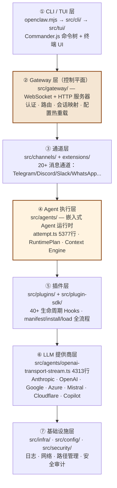
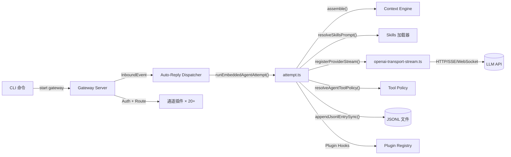

# 第 1 章：项目概览与架构全景

> **核心结论**：OpenClaw 是以 Gateway 为控制平面的 7 层多通道 AI 助手平台，通过插件系统实现无限扩展，以 `attempt.ts` 为执行内核编排所有子系统。

---

## 项目规模

| 指标 | 数据 |
|---|---|
| TypeScript 源文件 | 8,000+ |
| 代码行数 | 228,000+ 行（含测试） |
| 测试文件 | 3,625 个 |
| npm 子包 | 22 个（`packages/`） |
| 官方通道插件 | 20+ |
| 支持 LLM Provider | 8 个 |
| 版本（源码截至） | 2026.6.2（2026-06-07） |

---

## 7 层分层架构



---

## 关键设计原则（来自 AGENTS.md）

### 原则一：Core 保持插件无关

```
Core stays plugin-agnostic.
No bundled ids/defaults/policy in core when manifest/registry/capability contracts work.
```

Core 层不包含任何具体插件的 ID 或默认值。通道名（`telegram`、`discord`）、LLM Provider ID（`anthropic`、`openai`）都不在 Core 里硬编码——它们通过 manifest 声明和 Plugin Registry 动态注册。

**实际意义**：可以在不修改 Core 代码的情况下，新增任意通道或 LLM Provider。

### 原则二：插件只通过 SDK 边界访问 Core

```typescript
// 合法的插件 import（通过 SDK barrel）
import { createTool } from "openclaw/plugin-sdk/tools";
import { getSessionStore } from "openclaw/plugin-sdk/sessions";

// 非法的插件 import（直接访问 Core 内部）
import { sessionManager } from "openclaw/src/config/sessions/store";  // ❌ 违规
```

SDK 边界是插件隔离的技术保障。`src/plugin-sdk/` 是公开 API；`src/` 其他路径是内部实现，插件不可直接访问。

### 原则三：安全优先，但不扼杀能力

```
Security in OpenClaw is a deliberate tradeoff: strong defaults without killing capability.
The goal is to stay powerful for real work while making risky paths explicit.
```

默认安全，旋钮显式——每个高风险配置以 `dangerously` 开头，强迫操作者做有意识的选择。

### 原则四：存储统一走 SQLite（架构演进方向）

```
Storage default: SQLite only. Do not add JSON/JSONL/TXT files for OpenClaw-owned
runtime state, caches, queues, registries, or plugin scratch data.
```

注意：当前 Session 存储仍使用 JSONL，但项目已明确将 SQLite 作为唯一默认存储目标，JSONL 是历史遗留正在迁移中。

---

## 目录结构全览

```
openclaw/
├── openclaw.mjs          # 可执行入口（纯 JS：Node 版本检查 + 编译缓存 Respawn）
├── src/                  # TypeScript 源码主目录
│   ├── acp/              # Agent Control Plane（ACP 协议桥接 Codex 等外部 Agent）
│   ├── agents/           # Agent 执行引擎（attempt.ts 在此）
│   │   ├── embedded-agent-runner/run/attempt.ts   # ← 核心：5377 行
│   │   ├── openai-transport-stream.ts             # ← 核心：4313 行
│   │   ├── sessions/     # Agent 会话级工具（Bash/Read/Edit/Write...）
│   │   ├── sandbox/      # 沙盒配置（Docker/bubblewrap/macOS）
│   │   └── runtime-plan/ # RuntimePlan 类型定义
│   ├── channels/         # 多通道系统（绑定/路由/Turn 状态机）
│   ├── cli/              # Commander.js 命令树
│   ├── config/           # 配置读写、Session 路径、JSONL 转录
│   │   └── sessions/     # transcript-jsonl.ts · session-key.ts
│   ├── context-engine/   # 可插拔上下文引擎接口（types.ts 定义契约）
│   ├── cron/             # 定时任务（Cron Agent 调度）
│   ├── gateway/          # WebSocket/HTTP 控制平面（含 Webhook hooks.ts）
│   ├── hooks/            # 全局 Hook 基础设施
│   ├── infra/            # 网络/日志/exec-approvals（执行审批）
│   ├── llm/              # LLM 类型定义与 Provider 适配
│   ├── mcp/              # MCP 服务器（channel-bridge.ts · tools-stdio-server.ts）
│   ├── memory/           # MEMORY.md 文件系统（root-memory-files.ts）
│   ├── plugins/          # 插件生命周期管理（loader · registry · hooks）
│   ├── plugin-sdk/       # 插件开发者公开 SDK
│   ├── routing/          # 消息路由（session-key.ts）
│   ├── security/         # 安全审计（audit-*.ts 14 模块）
│   ├── sessions/         # Session Key 工具函数
│   ├── skills/           # Skill 文件系统加载
│   ├── talk/             # 语音对话系统（TTS + ASR 编排）
│   ├── tts/              # 文本转语音 Provider
│   └── tui/              # 终端 UI（Ink/React）
├── packages/             # 22 个共享子包（gateway-protocol · acp-core · model-catalog-core...）
├── extensions/           # 第三方通道插件（telegram · discord · slack · whatsapp...）
├── apps/                 # 独立应用（Windows Hub 等）
└── docs/                 # 文档源文件（publish 到 docs.openclaw.ai）
```

---

## 最关键的 5 个文件

| 文件 | 行数 | 角色 |
|---|---|---|
| `src/agents/embedded-agent-runner/run/attempt.ts` | 5,377 | Agent 执行总装配厂 |
| `src/agents/openai-transport-stream.ts` | 4,313 | 统一 8 个 LLM Provider 的流式传输 |
| `src/context-engine/types.ts` | 387 | 可插拔上下文引擎的接口契约 |
| `src/agents/agent-tools.policy.ts` | ~300 | 工具权限三层栅栏的决策核心 |
| `src/agents/runtime-plan/types.ts` | ~150 | 执行计划类型系统（ThinkLevel · FailoverReason） |

---

## 模块间调用关系



---

## 核心数据流

一条用户消息从发送到回复的完整数据流：

```
用户（Telegram）
  → extensions/telegram/src/：接收消息，封装为 InboundEvent
  → src/gateway/：认证 + sessionKey 解析
  → src/auto-reply/：调度到 attempt.ts
  → src/agents/embedded-agent-runner/run/attempt.ts：
      ├─ Context Engine.assemble() → 压缩历史消息
      ├─ Skills 加载 → 注入 System Prompt
      ├─ openai-transport-stream.ts → 流式调用 LLM
      ├─ 工具执行循环（Bash/Read/Write + 沙盒）
      └─ appendJsonlEntrySync() → 持久化到 JSONL
  → extensions/telegram/src/：发送回复
用户（Telegram）收到回复
```

---

## 小结

1. **7 层架构**：Gateway 是控制平面，attempt.ts 是执行内核，Plugin 系统是扩展骨架
2. **插件无关 Core**：通道、Provider、工具都以插件形式注册，Core 不知道具体实现
3. **两个超大文件**：`attempt.ts`（5377 行）和 `openai-transport-stream.ts`（4313 行）是项目最复杂的单体文件，理解它们等于理解 Agent 执行和 LLM 传输的全部
4. **存储过渡期**：当前用 JSONL，架构目标是全面迁移到 SQLite
5. **安全内嵌于架构**：`audit-*.ts` 14 个审计模块、`exec-approvals.ts` 执行审批、沙盒配置——安全不是插件，是 Core 的一部分

## 延伸阅读

- [第 2 章：启动流程与 CLI 命令树](02-startup.html)
- [第 4 章：Agent 执行引擎](04-agent-engine.html)
- [第 5 章：插件系统深解](05-plugin-system.html)
