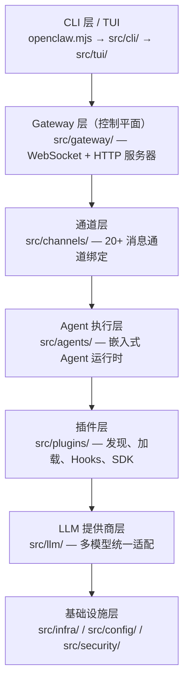

# 第 1 章：项目概览与架构全景

## 本章信息

| | |
|--|--|
| **本章目标** | 建立对 OpenClaw 整体架构的准确认知 |
| **适合读者** | 所有读者，推荐作为第一章阅读 |
| **前置知识** | 无 |
| **核心结论** | OpenClaw 是以 Gateway 为控制平面的 7 层多通道 AI 助手网关，通过插件系统实现无限扩展 |

---

## 核心结论

**OpenClaw 是一个"以 Gateway 为核心控制平面、以插件为扩展机制"的多通道个人 AI 助手网关。** 它将 AI 助手的对话入口从单一界面扩展到 20+ 个即时通讯频道，同时通过严格的插件边界保持核心代码的精简与稳定。

---

## 整体分层架构

OpenClaw 的代码组织清晰地体现了 7 层分层结构：



---

## 各层职责详解

### 层 1：CLI / TUI 层

入口文件 `openclaw.mjs` 是一个纯 JavaScript 的 Node.js 启动脚本。它在加载 TypeScript 编译产物之前完成运行时检查和编译缓存配置。

CLI 层的核心是基于 Commander.js 的命令树，注册了 `onboard`、`gateway`、`node`、`doctor`、`configure` 等命令。TUI 层（`src/tui/`）提供终端界面。

### 层 2：Gateway 层（控制平面）

`src/gateway/` 是整个系统的神经中枢，承担以下职责：

- WebSocket 服务器（频道连接管理）
- HTTP API（OpenAI 兼容接口、MCP HTTP、管理接口）
- 认证与授权（多种认证模式）
- 配置热重载
- 会话管理（创建、存储、恢复）
- 插件启动与生命周期

Gateway 使用懒加载优化：

```typescript
// 文件路径：src/gateway/server.ts
/**
 * Lazy public entrypoint for the gateway server implementation.
 * Keeping `server.impl` behind dynamic import lets light-weight callers import
 * server types and helpers without paying the full startup dependency graph.
 */
export async function startGatewayServer(
  ...args: Parameters<typeof import("./server.impl.js").startGatewayServer>
): ReturnType<typeof import("./server.impl.js").startGatewayServer> {
  const mod = await loadServerImpl();
  return await mod.startGatewayServer(...args);
}
```

这个设计让 `gateway/server.ts` 可以被轻量级调用者引入类型而不触发完整的启动依赖图。

### 层 3：通道层

`src/channels/` 管理所有即时通讯频道的接入。每个频道以插件形式存在，通过统一的绑定接口接入 Gateway。

核心目录结构：

| 目录 | 职责 |
|---|---|
| `channels/plugins/` | 通道插件注册与管理 |
| `channels/turn/` | 消息轮次（Turn）状态机 |
| `channels/transport/` | 底层传输抽象 |
| `channels/message/` | 消息对象模型 |
| `channels/allowlists/` | 发送者白名单控制 |

### 层 4：Agent 执行层

`src/agents/` 是 AI 对话实际执行的地方。核心文件 `agents/embedded-agent-runner/run/attempt.ts`（5,377 行）负责编排一次完整的 Agent 执行尝试，从 Prompt 准备到 LLM 流式返回。

### 层 5：插件层

`src/plugins/` 实现了完整的插件生命周期管理，包括发现、安装、加载、Hooks 注册和健康检查。插件 SDK（`src/plugin-sdk/`）提供插件开发者可用的公开 API。

### 层 6：LLM 提供商层

`src/llm/` 提供多 LLM 提供商的统一适配，支持 Anthropic、OpenAI、Google、Azure、Mistral、Cloudflare、GitHub Copilot 等 8 个主要提供商。

### 层 7：基础设施层

`src/infra/`、`src/config/`、`src/security/` 构成基础设施层，提供日志、网络、路径管理、配置 I/O、安全审计等跨层通用能力。

---

## 关键设计原则

通过阅读项目的 `VISION.md` 和 `AGENTS.md`，可以提炼出 OpenClaw 的几个核心设计原则：

**原则一：Core 保持插件无关**

```
// 文件路径：src/gateway/AGENTS.md（根 AGENTS.md 摘录）
Core stays plugin-agnostic. No bundled ids/defaults/policy in core when
manifest/registry/capability contracts work.
```

Core 层不应包含任何具体插件的 ID、默认值或策略，这些都通过 manifest 和 registry 合约来处理。

**原则二：插件只通过 SDK 边界访问 Core**

```
Plugins cross into core only via `openclaw/plugin-sdk/*`, manifest metadata,
injected runtime helpers, documented barrels (`api.ts`, `runtime-api.ts`).
```

**原则三：安全优先，但不扼杀能力**

```
// 文件路径：VISION.md
Security in OpenClaw is a deliberate tradeoff: strong defaults without killing capability.
The goal is to stay powerful for real work while making risky paths explicit and
operator-controlled.
```

---

## 目录总览

```
openclaw/
├── openclaw.mjs          # 可执行入口（纯 JS，Node.js 检查 + 编译缓存）
├── src/                  # TypeScript 源码主目录（5,156 个源文件）
│   ├── acp/              # Agent Control Plane（桥接 Codex 等外部 Agent）
│   ├── agents/           # 嵌入式 Agent 执行引擎
│   ├── channels/         # 多通道系统（绑定/路由/分发）
│   ├── cli/              # CLI 命令树（Commander.js）
│   ├── config/           # 配置读写与会话存储
│   ├── context-engine/   # 上下文引擎插件化接口
│   ├── gateway/          # 控制平面（WebSocket/HTTP 服务器）
│   ├── hooks/            # 全局事件钩子基础设施
│   ├── infra/            # 网络/日志/诊断等基础设施
│   ├── llm/              # 多 LLM 提供商统一抽象
│   ├── mcp/              # MCP 服务器（channel bridge）
│   ├── memory/           # 记忆文件系统
│   ├── plugins/          # 插件生命周期管理
│   ├── plugin-sdk/       # 插件开发者 SDK
│   ├── security/         # 安全审计模块
│   ├── sessions/         # 会话管理
│   ├── skills/           # Skills 文件系统
│   ├── talk/             # 语音对话系统
│   ├── tts/              # 文本转语音
│   └── tui/              # 终端 UI
├── packages/             # 共享子包（22 个）
├── extensions/           # 第三方通道插件（内部称为 extensions）
├── apps/                 # 独立应用（Windows Hub 等）
└── docs/                 # 文档源文件
```

---

## 小结

1. OpenClaw 是 7 层分层架构，Gateway 作为控制平面统一管理所有频道连接
2. 插件系统是扩展机制的核心，通道、LLM 提供商、工具均以插件形式接入
3. Core 代码严格保持插件无关，通过 manifest 和 SDK 边界进行解耦
4. 安全与能力的平衡是核心设计哲学：强默认值，但提供明确的操作旋钮
5. 项目规模庞大（228k 行源码），但分层结构清晰，每层职责明确

## 延伸阅读

- [第 2 章：启动流程与 CLI 命令树](02-startup.html)
- [第 5 章：插件系统深解](05-plugin-system.html)
