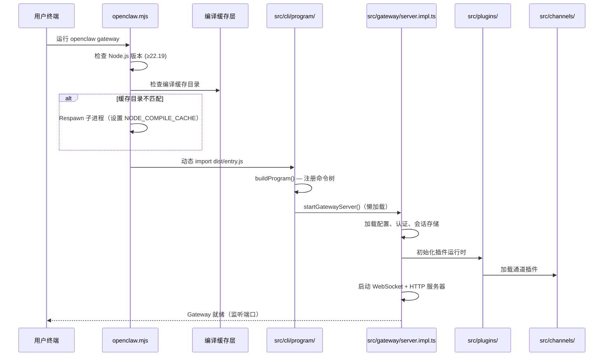

# 第 2 章：启动流程与 CLI 命令树

## 本章信息

| | |
|--|--|
| **本章目标** | 追踪从 `openclaw` 命令到 Gateway 服务器运行的完整路径 |
| **适合读者** | 想了解项目启动机制和命令结构的开发者 |
| **前置知识** | 第 1 章 |
| **核心结论** | 启动流程分为三阶段：launcher 预检、CLI 命令解析、Gateway 懒加载初始化，整个链路中编译缓存优化是性能关键 |

---

## 核心结论

**OpenClaw 的启动流程分为三个清晰阶段：launcher 做 Node.js 版本检查和编译缓存配置（`openclaw.mjs`）、Commander.js 构建命令树（`src/cli/`）、Gateway 服务器懒加载启动（`src/gateway/`）。** 每个阶段都有精心设计的优化和容错机制。

---

## 阶段一：Launcher（openclaw.mjs）

`openclaw.mjs` 是 npm 包暴露的可执行文件，也是整个启动链的第一步。它是一个纯 JavaScript 文件（不依赖 TypeScript 编译），负责：

### 1.1 Node.js 版本检查

```javascript
// 文件路径：openclaw.mjs
const MIN_NODE_MAJOR = 22;
const MIN_NODE_MINOR = 19;

const isSupportedNodeVersion = (version) =>
  version.major > MIN_NODE_MAJOR ||
  (version.major === MIN_NODE_MAJOR && version.minor >= MIN_NODE_MINOR);

const ensureSupportedNodeVersion = () => {
  if (isSupportedNodeVersion(parseNodeVersion(process.versions.node))) {
    return;
  }
  process.stderr.write(
    `openclaw: Node.js v${MIN_NODE_VERSION}+ is required (current: v${process.versions.node}).\n`
  );
  process.exit(1);
};
```

要求 Node.js 22.19+（推荐 24），在任何其他逻辑之前执行。

### 1.2 编译缓存策略（重要设计）

Launcher 实现了一个精妙的**编译缓存 Respawn 机制**：

```javascript
// 文件路径：openclaw.mjs
const respawnWithPackagedCompileCacheIfNeeded = () => {
  if (isSourceCheckoutLauncher() || isNodeCompileCacheDisabled()) {
    return false;
  }
  const currentDirectory = module.getCompileCacheDir?.();
  if (!currentDirectory) { return false; }
  const desiredDirectory = resolvePackagedCompileCacheDirectory();
  if (path.resolve(currentDirectory) === path.resolve(desiredDirectory)) {
    return false;
  }
  const env = {
    ...process.env,
    NODE_COMPILE_CACHE: desiredDirectory,
    OPENCLAW_PACKAGED_COMPILE_CACHE_RESPAWNED: "1",
  };
  return runRespawnedChild(process.execPath, [...process.execArgv, ...], env);
};
```

**设计意图**：Node.js 的 `module.enableCompileCache()` 可以将 V8 字节码缓存到磁盘，显著提升冷启动速度。Launcher 通过 respawn（重新 spawn 子进程并设置正确的缓存目录）来确保编译缓存生效。这解释了为什么有时 `openclaw` 命令会看起来有两个进程。

缓存目录路径策略：
```javascript
const resolvePackagedCompileCacheDirectory = () => {
  // 路径格式：/tmp/node-compile-cache/openclaw/{version}/{install-marker}
  return path.join(baseDirectory, "openclaw", version,
    sanitizeCompileCachePathSegment(installMarker));
};
```

### 1.3 Help 快速路径

对于 `--help` / `-h` 参数，Launcher 会尝试从预编译的 `dist/cli-startup-metadata.json` 直接读取帮助文字，避免加载完整的 Commander.js 依赖图：

```javascript
// 文件路径：openclaw.mjs
const tryOutputBareRootHelp = async () => {
  if (!isBareRootHelpInvocation(process.argv)) { return false; }
  const precomputed = loadPrecomputedHelpText("rootHelpText");
  if (precomputed) {
    process.stdout.write(precomputed);
    return true;
  }
  // 如果没有预编译文字，回退到完整加载
  for (const specifier of ["./dist/cli/program/root-help.js", ...]) { ... }
};
```

### 1.4 最终入口加载

所有预检通过后，Launcher 加载编译产物：

```javascript
// 文件路径：openclaw.mjs
if (await tryImport("./dist/entry.js")) {
  // OK
} else if (await tryImport("./dist/entry.mjs")) {
  // OK
} else {
  throw new Error(await buildMissingEntryErrorMessage());
}
```

---

## 阶段二：CLI 命令树

`src/cli/program/` 构建基于 Commander.js 的完整命令树。

### 2.1 程序初始化

```typescript
// 文件路径：src/cli/program/build-program.ts
export function buildProgram() {
  const program = new Command();
  program.enablePositionalOptions();
  program.exitOverride((err) => {
    process.exitCode = typeof err.exitCode === "number" ? err.exitCode : 1;
    throw err;
  });
  const ctx = createProgramContext();
  setProgramContext(program, ctx);
  configureProgramHelp(program, ctx);
  registerPreActionHooks(program, ctx.programVersion);
  registerProgramCommands(program, ctx, argv);
  return program;
}
```

`exitOverride` 的使用是一个细节：它允许捕获 Commander 的退出事件，确保 `process.exitCode` 被正确设置，避免 Commander 内部 `process.exit()` 调用绕过 Node.js 的 exit code 机制。

### 2.2 命令目录（截至 2026-06-07）

```typescript
// 文件路径：src/cli/program/core-command-descriptors.ts
const coreCliCommandCatalog = defineCommandDescriptorCatalog([
  { name: "crestodian",   description: "Open the interactive setup and repair assistant" },
  { name: "setup",        description: "Initialize local config and an agent workspace" },
  { name: "onboard",      description: "Interactive onboarding for gateway, workspace, and skills" },
  { name: "configure",    description: "Interactive configuration for credentials, channels, ..." },
  { name: "config",       description: "Non-interactive config helpers (get/set/unset/file/validate)" },
  { name: "backup",       description: "Create and verify local backup archives" },
  { name: "migrate",      description: "Import state from another agent system" },
  { name: "doctor",       description: "Diagnose and repair config, Gateway, plugin, and channel problems" },
  { name: "dashboard",    description: "Open the Control UI with your current token" },
  { name: "reset",        description: "Reset local config/state" },
  { name: "uninstall",    description: "Uninstall the gateway service + local data" },
  { name: "message",      description: "Send, read, and manage channel messages" },
  { name: "mcp",          description: "Manage OpenClaw MCP config and channel bridge" },
  { name: "transcripts",  description: "Inspect stored transcripts" },
  // ... 更多命令
]);
```

### 2.3 懒加载命令注册

命令的实际实现代码通过 `defineImportedCommandGroupSpec` 懒加载，只有在用户实际调用命令时才会执行动态 import：

```typescript
// 文件路径：src/cli/program/command-group-descriptors.ts
export function defineImportedCommandGroupSpec<TRegisterArgs, TModule>(
  commandNames: readonly string[],
  loadModule: () => Promise<TModule>,
  register: (module: TModule, args: TRegisterArgs) => Promise<void> | void,
): CommandGroupDescriptorSpec<...> {
  return {
    commandNames,
    register: async (args) => {
      const module = await loadModule();  // 懒加载！
      await register(module, args);
    },
  };
}
```

这个设计使得 `openclaw --help` 可以在毫秒级响应，而不需要加载所有命令的依赖。

---

## 阶段三：Gateway 启动

当用户运行 `openclaw gateway` 或 `openclaw onboard` 时，最终会调用 `startGatewayServer()`。

### 3.1 Gateway 依赖图

```typescript
// 文件路径：src/gateway/server.impl.ts（部分 import 列表）
import { getActiveEmbeddedRunCount } from "../agents/embedded-agent-runner/run-state.js";
import { getRuntimeConfig, setRuntimeConfigSnapshot, ... } from "../config/io.js";
import { setCurrentPluginMetadataSnapshot } from "../plugins/current-plugin-metadata-snapshot.js";
import { pinActivePluginChannelRegistry, pinActivePluginHttpRouteRegistry } from "../plugins/runtime.js";
import { createAuthRateLimiter } from "./auth-rate-limit.js";
import { resolveGatewayAuth } from "./auth.js";
import { createGatewayServerLiveState } from "./server-live-state.js";
import { createGatewayRuntimeState } from "./server-runtime-state.js";
// ... 共计 60+ 个直接依赖
```

Gateway 启动时会加载认证状态、插件运行时、通道注册表、会话存储等几乎所有子系统。

### 3.2 启动追踪

Gateway 内置了启动性能追踪：

```typescript
// 文件路径：src/gateway/server.ts
function emitStartupTrace(name: string, durationMs: number, totalMs: number): void {
  if (!process.env.OPENCLAW_GATEWAY_STARTUP_TRACE) {
    return;
  }
  process.stderr.write(
    `[gateway] startup trace: ${name} ${durationMs.toFixed(1)}ms total=${totalMs.toFixed(1)}ms\n`,
  );
}
```

通过设置环境变量 `OPENCLAW_GATEWAY_STARTUP_TRACE=1` 可以启用启动阶段计时。

---

## 完整启动流程图



---

## 配置文件路径解析

Launcher 会按以下顺序查找配置文件：

```javascript
// 文件路径：openclaw.mjs
const resolveLauncherConfigPaths = () => {
  const explicit = process.env.OPENCLAW_CONFIG_PATH?.trim();
  if (explicit) { return [resolveLauncherUserPath(explicit)]; }

  const homeDir = resolveLauncherHomeDir();
  return [
    path.join(homeDir, ".openclaw", "openclaw.json"),
    path.join(homeDir, ".openclaw", "clawdbot.json"),   // 历史名称兼容
    path.join(homeDir, ".clawdbot", "openclaw.json"),   // 历史名称兼容
    path.join(homeDir, ".clawdbot", "clawdbot.json"),   // 历史名称兼容
  ];
};
```

配置文件支持 `~` 路径扩展，也支持 `OPENCLAW_HOME`、`OPENCLAW_STATE_DIR` 等环境变量覆盖。

---

## 小结

1. 启动链路：`openclaw.mjs` → Node.js 预检 → 编译缓存 Respawn → `dist/entry.js` → CLI 程序构建 → Gateway 懒加载
2. 编译缓存 Respawn 机制是冷启动性能优化的核心，通过 `NODE_COMPILE_CACHE` 环境变量控制
3. 命令树采用懒加载注册，`--help` 等轻量操作无需加载完整依赖图
4. 配置文件路径支持多种环境变量覆盖，保持向后兼容（支持旧名称 `clawdbot`）
5. Gateway 启动时依赖项超过 60 个，是整个系统依赖最重的初始化点

## 延伸阅读

- [第 1 章：项目概览与架构全景](01-architecture.html)
- [第 5 章：插件系统深解](05-plugin-system.html)
- [第 8 章：安全审计机制](08-security.html)
