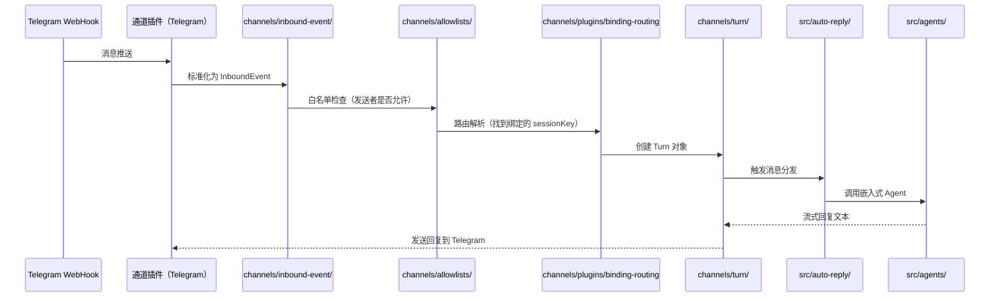
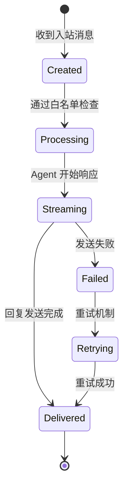

# 第 3 章：多通道系统

## 本章信息

| | |
|--|--|
| **本章目标** | 理解 OpenClaw 如何将 20+ 个即时通讯平台统一纳入一套消息框架 |
| **适合读者** | 对多平台集成、消息路由感兴趣的开发者 |
| **前置知识** | 第 1 章 |
| **核心结论** | 通道系统以"绑定-路由-轮次"三层模型工作：通道以插件形式注册绑定，消息经路由引擎分发到对应会话，通过 Turn 状态机控制回复生命周期 |

---

## 核心结论

**OpenClaw 的多通道系统以"绑定（Binding）→ 路由（Routing）→ 轮次（Turn）"三层模型统一处理来自 20+ 个平台的消息。** 每个通道以插件方式注册，消息经统一的入站事件流水线处理后，由 `auto-reply` 层分发给 Agent 执行引擎。

---

## 支持的通道清单

根据 `README.md` 和 `src/channels/plugins/` 的内容，截至 2026-06-07 支持以下通道：

| 分类 | 通道 |
|---|---|
| **主流社交** | WhatsApp、Telegram、Discord、Slack、LINE |
| **企业协作** | Microsoft Teams、Google Chat（Mattermost、Feishu/飞书） |
| **开放协议** | Matrix、IRC、Nostr |
| **端对端加密** | Signal |
| **苹果生态** | iMessage |
| **中国平台** | WeChat、QQ、Zalo、Zalo Personal |
| **自建平台** | Nextcloud Talk、Synology Chat、Tlon、Twitch |
| **内置** | WebChat（浏览器界面） |

---

## 通道系统架构

### 目录结构

```
src/channels/
├── plugins/          # 通道插件注册、加载、状态管理
│   ├── registry-loaded.ts      # 已加载通道插件注册表
│   ├── binding-registry.ts     # 绑定注册表
│   ├── binding-routing.ts      # 消息路由逻辑
│   ├── binding-targets.ts      # 路由目标解析
│   └── types.plugin.ts         # 通道插件类型定义
├── inbound-event/    # 入站消息事件处理
├── message/          # 消息对象模型
├── message-access/   # 消息访问控制
├── turn/             # 消息轮次状态机
├── transport/        # 传输层抽象
├── allowlists/       # 发送者白名单
└── status/           # 通道状态管理
```

### 通道插件绑定模型

每个通道在 Gateway 中以一个"绑定"（Binding）存在，绑定包含：

```typescript
// 文件路径：src/channels/plugins/binding-targets.ts
export type ChannelBindingTarget = {
  channelId: ChannelId;          // 通道标识符（如 "telegram", "discord"）
  conversationId: string;        // 会话 ID（如群组 ID、DM 对话 ID）
  sessionKey: string;            // 对应的 Agent 会话键
};
```

多个通道可以绑定到同一个 Agent 会话，实现跨通道对话上下文共享。

### 通道插件注册流程

```typescript
// 文件路径：src/channels/plugins/registry-loaded.ts
export function getLoadedChannelPluginEntryById(id: ChannelId): LoadedChannelPluginEntry | undefined {
  // 从已加载的插件注册表中查找
}

export function listLoadedChannelPlugins(): LoadedChannelPluginEntry[] {
  // 列出所有已加载的通道插件
}
```

通道插件在 Gateway 启动时由 `src/plugins/` 中的插件加载器统一初始化，并注册到通道注册表。

---

## 消息流水线

一条来自 Telegram 的消息进入系统的完整路径：



### 入站事件标准化

所有通道的消息都被标准化为统一的 `InboundEvent` 格式：

```typescript
// 文件路径：src/channels/inbound-event/ 相关类型
type InboundEvent = {
  channelId: string;
  conversationId: string;
  senderId: string;
  messageId?: string;
  text?: string;
  attachments?: Attachment[];
  timestamp: number;
  // ...通道特定字段
};
```

### 白名单控制

```typescript
// 文件路径：src/channels/allowlists/allowlist-match.ts
// 控制哪些发送者可以触发 Agent 响应
export function matchesAllowlist(
  senderId: string,
  allowlist: string[],
): boolean {
  // 支持精确匹配和 glob 模式
}
```

OpenClaw 为每个通道维护独立的发送者白名单，默认拒绝非白名单用户的请求。

---

## Turn（轮次）状态机

Turn 是 OpenClaw 通道层的核心概念，代表一次完整的"用户消息 → AI 回复"交互单元。

### Turn 生命周期



### 草稿流（Draft Stream）

OpenClaw 支持在 AI 回复流式生成期间，将中间结果作为"草稿"发送到通道，让用户看到实时进度：

```typescript
// 文件路径：src/channels/turn/draft-stream-loop.ts
// 控制草稿消息的发送频率和合并策略
export class DraftStreamLoop {
  // 将流式 token 合并为适合通道发送的块大小
  // 避免消息平台的速率限制
}
```

---

## 通道命令门控

OpenClaw 支持通过特定命令前缀触发特殊行为（类似 Slash Commands）：

```typescript
// 文件路径：src/channels/command-gating.ts
export function isCommandGated(
  text: string,
  commandPrefix: string,
): boolean {
  return text.startsWith(commandPrefix);
}
```

用户可以在通道消息中使用 `/reset`、`/new` 等内置命令控制 Agent 会话。

---

## 通道状态监控

Gateway 持续监控每个通道的健康状态：

```typescript
// 文件路径：src/gateway/channel-health-monitor.ts
export class ChannelHealthMonitor {
  // 定期探测通道连接状态
  // 在通道断连时触发重连逻辑
  // 向 Gateway 报告通道健康状态
}
```

通道健康状态会反映在 `openclaw status` 命令的输出中，并通过 Control UI 可视化。

---

## 消息进度指示

对于需要较长时间处理的请求，OpenClaw 会发送"正在输入"（typing）指示：

```typescript
// 文件路径：src/channels/typing.ts
export class TypingLifecycle {
  // 在 Agent 开始处理时发送 typing 事件
  // 在回复完成或超时时停止 typing
}
```

每个通道的 typing 实现由通道插件自己决定（Telegram 是 `sendChatAction`，Discord 是 `triggerTypingIndicator` 等）。

---

## 小结

1. 通道系统以插件方式注册，Gateway 统一管理 20+ 个通道的生命周期
2. 消息流水线：入站标准化 → 白名单检查 → 路由解析 → Turn 创建 → Agent 执行 → 回复发送
3. Turn 是通道层的核心抽象，封装了一次完整的请求-响应生命周期
4. 草稿流机制让用户可以实时看到 AI 生成进度，提升使用体验
5. 白名单控制是安全的第一道防线，默认拒绝非授权用户

## 延伸阅读

- [第 4 章：Agent 执行引擎](04-agent-engine.html)
- [第 8 章：安全审计机制](08-security.html)
- [第 9 章：会话与上下文管理](09-session-context.html)
