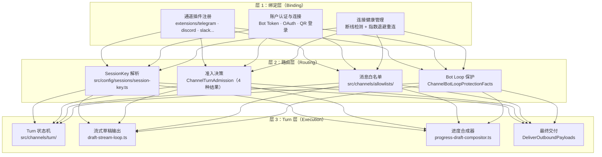
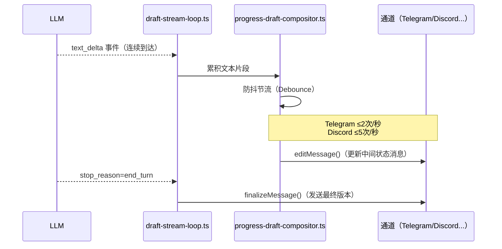
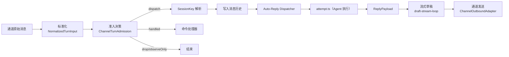

# 第 3 章：多通道系统

> **核心结论**：OpenClaw 的多通道系统以"绑定-路由-Turn"三层模型统一管理 20+ 个消息平台，每条消息经过 `ChannelTurnAdmission` 准入决策后才进入 attempt.ts，通道插件只负责 I/O 适配，不承载任何 Agent 业务逻辑。

---

## 通道系统的三层模型



---

## 关键类型：ChannelTurnAdmission

```typescript
// src/channels/turn/types.ts
// 每条入站消息都经过 Admission 决策——决定是否触发 Agent 执行
export type ChannelTurnAdmission =
  | { kind: "dispatch";     reason?: string }
  | { kind: "observeOnly";  reason: string }
  | { kind: "handled";      reason: string }
  | { kind: "drop";         reason: string; recordHistory?: boolean };
```

**四种结果的实际场景**：

| 结果 | 触发场景 | 后续动作 |
|---|---|---|
| `dispatch` | 用户发了正常消息 | 进入 attempt.ts 执行 Agent |
| `observeOnly` | Bot 收到自己消息的回显 | 仅记录，不触发（防 Bot 循环） |
| `handled` | 用户发了 `/status` 命令 | 命令处理器直接回复，不需 Agent |
| `drop` | 用户不在白名单 | 静默丢弃（可选记录） |

---

## 关键类型：NormalizedTurnInput

```typescript
// src/channels/turn/types.ts
// 各通道消息经过标准化后的统一格式
export type NormalizedTurnInput = {
  id: string;
  timestamp?: number;
  rawText: string;          // 通道原始文本（含 @mention 等平台字符）
  textForAgent?: string;    // 清洗后发给 Agent 的文本（去掉 @mention 等）
  textForCommands?: string; // 命令解析用的文本
  raw?: unknown;            // 完整的平台原始 payload（调试用）
};
```

`rawText` 和 `textForAgent` 分离是关键设计：Telegram 群组里用户发 `@bot 帮我分析这段代码`，`rawText` 是完整内容，`textForAgent` 是 `帮我分析这段代码`（已去掉 mention 前缀）。这使 Agent 收到的内容始终是干净的用户意图，不含平台特有的格式字符。

---

## 关键类型：SenderFacts 与 ConversationFacts

```typescript
// src/channels/turn/types.ts
// 发送者身份（投影到路由和 Prompt 上下文）
export type SenderFacts = {
  id?: string;
  name?: string;
  username?: string;
  tag?: string;
  roles?: string[];      // 平台角色（如 Discord 的 role）
  isBot?: boolean;       // 是否是机器人账户（防 Bot Loop）
  isSelf?: boolean;      // 是否是 OpenClaw 自己（防自我触发）
  displayLabel?: string;
};

// 对话身份和线程信息
export type ConversationFacts = {
  kind: "direct" | "group" | "channel";
  id: string;
  label?: string;
  spaceId?: string;
  parentId?: string;
  threadId?: string;          // 线程回复 ID
  nativeChannelId?: string;
  routePeer?: {
    kind: "direct" | "group" | "channel";
    id: string;
  };
};
```

`isSelf` 是防止无限循环的关键字段：当 Bot 在群组里收到自己刚才发出的消息时，`isSelf=true`，准入决策立即返回 `observeOnly`，打破循环。

---

## SessionKey 解析：消息如何路由到 Agent

SessionKey 是跨通道路由的核心——它决定哪条消息进入哪个 Agent 会话：

```typescript
// src/config/sessions/session-key.ts
export function resolveSessionKey(
  scope: SessionScope,      // "global" | "per-user" | "per-group"
  ctx: MsgContext,
  mainKey?: string,
  agentId: string = DEFAULT_AGENT_ID,
): string {
  // 1. 显式 SessionKey（通道可在消息中携带）
  const explicit = ctx.SessionKey?.trim();
  if (explicit) { return normalizeExplicitSessionKey(explicit, ctx); }

  const raw = deriveSessionKey(scope, ctx);

  // 2. 全局 scope → 所有用户共享同一 Agent 会话
  if (scope === "global") { return raw; }

  // 3. 私聊 → agent:default:+1234567890
  const isGroup = raw.includes(":group:") || raw.includes(":channel:");
  if (!isGroup) {
    return buildAgentMainSessionKey({ agentId: canonicalAgentId, mainKey: canonicalMainKey });
  }

  // 4. 群组/频道 → agent:default:telegram:group:12345678
  // 按 agentId 命名空间隔离，防止多 Agent 的 sessionKey 碰撞
  return `agent:${canonicalAgentId}:${raw}`;
}
```

**SessionKey 格式示例**：

| 场景 | SessionKey 示例 |
|---|---|
| 个人私聊 | `agent:default:+1234567890` |
| Telegram 群组 | `agent:default:telegram:group:12345678` |
| 全局共享会话 | `global` |
| 子 Agent 会话 | `agent:default:+1234567890:sub:7f3a2b1c` |

---

## 通道插件的标准适配器接口

每个通道插件需要实现若干 Adapter 接口，按能力声明：

```typescript
// src/channels/plugins/types.adapters.ts（精简）
export type ChannelLifecycleAdapter = {
  connect(): Promise<void>;
  disconnect(): Promise<void>;
};

export type ChannelOutboundAdapter = {
  sendMessage(ctx: ChannelOutboundContext, payload: OutboundPayload): Promise<MessageReceipt>;
  editMessage?(ctx: ChannelOutboundContext, payload: EditPayload): Promise<void>;
  deleteMessage?(ctx: ChannelOutboundContext, msgId: string): Promise<void>;
};

export type ChannelAuthAdapter = {
  authenticate(credentials: unknown): Promise<AuthResult>;
  logout?(ctx: ChannelLogoutContext): Promise<ChannelLogoutResult>;
};

export type ChannelAllowlistAdapter = {
  resolveAllowlist(): Promise<string[]>;
  addToAllowlist?(userId: string): Promise<void>;
};
```

通道插件通过**选择性实现 Adapter** 声明能力边界：不实现 `editMessage` 的通道（如 SMS）不会在 UI 上出现"编辑消息"选项；不实现 `ChannelGroupAdapter` 的通道只支持私聊。这是"渐进能力声明"的典型实践。

---

## 流式草稿输出机制

OpenClaw 支持流式输出——LLM 生成的文字边生成边推送到通道：



`progress-draft-compositor.ts` 负责控制编辑频率，避免触发各平台的 API 限速（Rate Limit）。各平台编辑频率上限不同，compositor 通过 `ChannelMessageCapability` 获取各平台的限速参数。

---

## Bot Loop 保护机制

```typescript
// src/channels/turn/types.ts
export type ChannelBotLoopProtectionFacts = {
  senderIsBot: boolean;       // 发送者是机器人账户
  senderIsSelf: boolean;      // 是 OpenClaw 自己
  consecutiveBotMessageThreshold?: number;  // 连续 Bot 消息上限
};
```

当群组中出现以下模式时，准入决策返回 `drop` 自动停止响应：
- `senderIsSelf = true`（收到自己消息的回显）
- 最近 N 条消息全部来自机器人账户（Bot 互相触发循环）

---

## 入站消息完整处理链



---

## 通道插件的 CLI 扩展

通道插件还可以向 `openclaw` CLI 贡献子命令：

```typescript
// 例如 telegram 插件注册：
// openclaw telegram status   — 查看连接状态
// openclaw telegram login    — 手机号登录
// openclaw telegram qr       — 二维码登录
// openclaw telegram logout   — 退出登录
```

这通过 `OpenClawPluginCliCommandDescriptor` 接口实现，使每个通道插件的运维操作都归入同一命名空间，用户体验一致。

---

## 小结

1. **三层模型**：绑定（Adapter 接口）→ 路由（SessionKey + Admission）→ Turn（流式输出 + 最终交付）
2. **ChannelTurnAdmission** 是核心准入门控：四种结果覆盖所有消息类型，通道插件只做判断，不执行 Agent 逻辑
3. **NormalizedTurnInput** 的 rawText/textForAgent 分离：保证 Agent 收到的是干净的用户意图，不含平台符号
4. **SessionKey** 是跨通道路由的唯一标识：私聊/群组/全局使用不同格式，按 agentId 命名空间防止多 Agent 冲突
5. **流式草稿 + 防抖节流**：各平台编辑频率不同，compositor 统一处理，避免 API 限速

## 延伸阅读

- [第 4 章：Agent 执行引擎](04-agent-engine.html)
- [第 8 章：安全审计机制](08-security.html)
- [第 9 章：会话与上下文管理](09-session-context.html)
