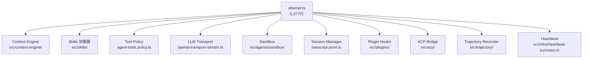

# 第 4 章：Agent 执行引擎

> **核心结论**：`attempt.ts`（5,377 行）是 OpenClaw 的执行总装配厂，以"总装车间"模式编排 70+ 个子系统，完成 7 个阶段的完整执行流水线：准备→上下文装配→Prompt 组装→工具注册→LLM 流式调用→工具循环→持久化。

---

## attempt.ts 的角色定位

`attempt.ts` 不实现任何具体业务逻辑，它只做一件事：**按正确顺序调用所有子系统**。这是"总装车间（Assembly Plant）"模式：



---

## 7 阶段执行流水线

### 阶段 1：准备阶段（Locking + Config）

```typescript
// src/agents/embedded-agent-runner/run/attempt.ts
// 获取会话写锁——同一会话不能有两个并发 Attempt
const sessionWriteLock = await acquireSessionWriteLock(sessionKey, {
  timeout: resolveAgentTimeoutMs(runtimeConfig),  // 超时后强制释放
  abortSignal,
});

// 解析运行时配置快照（整个 Attempt 期间使用同一快照，不受热重载影响）
const runtimeConfig = getRuntimeConfig();

// 检查 ACP 运行时是否可用（是否有外部 Agent 如 Codex 已连接）
const acpAvailable = await isAcpRuntimeSpawnAvailable(runtimeConfig);
```

**会话写锁的必要性**：用户同时从 Telegram 和 Discord 发消息，两个 Attempt 并发写入同一 JSONL 文件会导致数据竞争。写锁确保同一会话的 Attempt 串行执行。

### 阶段 2：上下文装配（Context Engine.assemble）

```typescript
// 调用可插拔的上下文引擎
const assembleResult: AssembleResult = await contextEngine.assemble({
  sessionId,
  sessionKey,
  messages: sessionMessages,
  tokenBudget: resolvedTokenBudget,
  availableTools: toolNameSet,   // 传入工具列表，引擎可据此调整提示
  model: resolvedModel,           // 按模型调整上下文窗口策略
  prompt: userPrompt,             // 当前 prompt（支持 RAG 引擎）
  citationsMode,
});
// 返回：压缩后的消息列表 + tokenBudget 建议 + 可选的 systemPromptAddition
```

`tokenBudget` 是动态的——Runtime 根据模型上下文窗口大小、已用 token 等因素计算，传给引擎用于截断决策。

### 阶段 3：System Prompt 组装

```typescript
// System Prompt 的多来源合并
const finalSystemPrompt = [
  baseSystemPrompt,              // 硬编码的能力描述和约束
  skillsPrompt,                  // 用户 Skill 文件（.md）
  heartbeatSummary,              // 后台心跳任务的摘要（如有）
  assembleResult.systemPromptAddition,  // Context Engine 注入的额外指令
  subagentContextAddition,       // 子 Agent 活跃上下文提示（如有）
  memoryFileContent,             // MEMORY.md 内容（如有）
].filter(Boolean).join("\n\n");
```

### 阶段 4：工具注册与冲突检查

```typescript
// 4 类来源的工具合并
const builtinTools = createOpenClawCodingTools({ config, session, sandbox });
// → Bash · Read · Write · Edit · Grep · LS · Find · NotebookEdit · WebFetch ...

const pluginTools = resolvePluginTools({ snapshot: pluginMetadataSnapshot });
// → 插件注册的工具（如 ImageGeneration · VideoGeneration...）

const mcpTools = await materializeBundleMcpToolsForRun({ sessionKey });
// → Bundle MCP 服务器暴露的工具

const clientTools = toClientToolDefinitions(skillEntries);
// → Skill 文件中定义的工具（客户端侧工具）

// 工具名冲突检查（防止 Skill 定义的工具名遮蔽内置工具）
const conflicts = findClientToolNameConflicts(clientTools, builtinTools);
if (conflicts.length > 0) {
  throw createClientToolNameConflictError(conflicts);
}
```

### 阶段 5：LLM 流式调用

```typescript
// 根据 RuntimePlan 选择 Provider 和传输方式
const streamFn = registerProviderStreamForModel({
  model: resolvedModel,
  config: runtimeConfig,
  providerHandle: providerRuntimeHandle,
  transport: runtimePlan.transport,  // "sse" | "websocket" | "auto"
});

// 流式调用，处理每个事件
for await (const event of streamFn({ messages, systemPrompt, tools, maxTokens })) {
  switch (event.type) {
    case "text_delta":
      // 实时推送到通道（通过草稿输出机制）
      await streamTextToChannel(event.delta);
      break;
    case "tool_use":
      // 进入工具执行阶段（阶段 6）
      pendingToolCalls.push(event);
      break;
    case "end":
      // 收集 token 使用量
      tokenUsage = event.usage;
      break;
  }
}
```

### 阶段 6：工具执行循环

```typescript
// 工具调用循环：直到 LLM 不再请求工具为止
while (pendingToolCalls.length > 0) {
  const toolResults: ToolResult[] = [];

  for (const toolCall of pendingToolCalls) {
    // 工具策略检查（Policy → Approval → Sandbox）
    const policyDecision = await resolveToolCallPolicy(toolCall, {
      isSubagent,
      sandboxMode,
      execApprovals,
    });

    if (policyDecision.kind === "deny") {
      toolResults.push(buildDeniedToolResult(toolCall, policyDecision.reason));
      continue;
    }

    // 执行工具（可能在沙盒中）
    const result = await executeToolCall(toolCall, sandboxContext);
    toolResults.push(result);
  }

  // 将工具结果追加到消息历史，重新调用 LLM
  messages = [...messages, buildAssistantMessage(pendingToolCalls), ...toolResults];
  pendingToolCalls = await callLlmAgain(messages);
}
```

### 阶段 7：持久化与后置处理

```typescript
// 将本次 Attempt 的消息追加到 JSONL 文件（追加写入，不覆盖）
await appendJsonlEntriesSync(sessionFile, turnMessages.map(serializeJsonlEntry));

// 触发 Context Engine 后置生命周期
await contextEngine.afterTurn({
  sessionId,
  messages: turnMessages,
  prePromptMessageCount,
  tokenBudget: resolvedTokenBudget,
  autoCompactionSummary,
  runtimeContext,
});

// 释放写锁
sessionWriteLock.release();

// 触发 Plugin Hooks（onAfterAttempt 等）
await runPluginHooks("onAfterAttempt", { sessionKey, result });
```

---

## 会话写锁的实现细节

写锁基于会话 Key 的 Promise 队列：

```typescript
// 简化的写锁逻辑
const lockMap = new Map<string, Promise<void>>();

async function acquireSessionWriteLock(sessionKey: string, opts: LockOptions) {
  const prev = lockMap.get(sessionKey) ?? Promise.resolve();
  let release!: () => void;
  const next = new Promise<void>((res) => { release = res; });
  // 将当前锁排在上一个锁之后
  lockMap.set(sessionKey, prev.then(() => next));
  // 等待上一个锁释放
  await Promise.race([prev, timeoutPromise(opts.timeout)]);
  return { release };
}
```

这个实现保证了同一 `sessionKey` 的 Attempt 严格串行，而不同 `sessionKey` 的 Attempt 可以并发。

---

## 子 Agent 支持

当 Agent 被要求派生子 Agent 时，attempt.ts 通过以下机制协调：

```typescript
// 子 Agent 检测
const isSubagent = isSubagentEnvelopeSession(sessionKey);
// → sessionKey 包含 ":sub:" 标记时为子 Agent

// 子 Agent 的活跃上下文注入到 System Prompt
const subagentContextAddition = buildActiveSubagentSystemPromptAddition({
  parentSessionKey,
  activeSubagents,
});

// 子 Agent 工具封禁（不可配置覆盖）
const toolPolicy = resolveAgentToolPolicy({
  isSubagent: true,
  // → 自动封禁 SUBAGENT_TOOL_DENY_ALWAYS
});
```

---

## 心跳机制（Heartbeat）

Agent 支持后台定时心跳运行，无需用户触发：

```typescript
// 心跳标志注入
const heartbeatSummary = await resolveHeartbeatSummaryForAgent({ config, sessionKey });

// 心跳的 System Prompt 附加内容
const heartbeatSystemPromptAddition = resolveHeartbeatPromptForSystemPrompt({
  heartbeatSchedule,
  heartbeatSummary,
});

// 心跳 Attempt 与普通 Attempt 共用相同执行路径
// 区别：isHeartbeat=true → afterTurn/ingest 传递此标志
```

---

## 轨迹记录（Trajectory）

```typescript
// 记录 Agent 执行轨迹，用于调试和分析
const trajectoryArtifacts = await buildTrajectoryArtifacts({
  sessionKey,
  runMetadata: buildTrajectoryRunMetadata({
    model: resolvedModel,
    provider: resolvedProvider,
    thinkingLevel: runtimePlan.thinkingLevel,
    tokenUsage,
    durationMs: Date.now() - startedAt,
  }),
  messages: turnMessages,
  toolDefinitions: toTrajectoryToolDefinitions(normalizedTools),
});
```

轨迹文件保存在 `~/.openclaw/trajectories/` 目录，可用于复盘 Agent 决策过程。

---

## 小结

1. **总装车间模式**：attempt.ts 不实现逻辑，只按顺序调用 70+ 个子系统——这使每个子系统可以独立测试
2. **会话写锁**：基于 Promise 队列，保证同一会话串行、不同会话并发，是多通道安全的基石
3. **工具 4 类来源**：内置 + 插件 + MCP + Skill（客户端）——注册时做名称冲突检查，防止 Skill 遮蔽内置工具
4. **子 Agent 和心跳复用同一路径**：通过 `isSubagent` 和 `isHeartbeat` 标志区分，不需要独立代码路径
5. **后置处理链**：`afterTurn` → 写锁释放 → Plugin Hooks，顺序有意义——确保 Context Engine 在锁释放前完成状态更新

## 延伸阅读

- [第 5 章：插件系统深解](05-plugin-system.html)
- [第 6 章：多 LLM 提供商抽象](06-llm-providers.html)
- [第 7 章：Skills 系统](07-skills.html)
- [第 9 章：会话与上下文管理](09-session-context.html)
