# 第 5 章：插件系统深解

> **核心结论**：OpenClaw 的插件系统以"manifest → 激活规划 → 运行时加载 → Hooks 注册"为完整流程，通过 `PluginRecord` 统一追踪每个插件的状态，并通过严格的 SDK 边界防止插件访问 Core 内部。

---

## 插件类型

| 类型 | 描述 | 适用场景 |
|---|---|---|
| **Code 插件** | 运行 OpenClaw 插件运行时代码，可注册 Hooks | 通道接入、LLM Provider、工具扩展、自定义认证 |
| **Bundle 插件** | 打包稳定外部服务（Skills、MCP Server） | 功能不需要 runtime 钩子的静态能力 |

Bundle 插件优先——接口更稳定，安全边界更清晰，启动开销更小。

---

## 完整插件生命周期

```mermaid
graph LR
    subgraph "编译时"
        M1["manifest.json<br>声明：通道 ID · Provider ID · 工具名<br>Hook 契约 · 权限要求"]
    end

    subgraph "安装时"
        I1["npm install<br>插件包到 node_modules"]
        I2["openclaw doctor --fix<br>manifest 校验 + 迁移"]
    end

    subgraph "激活规划"
        P1["PluginActivationPlanner<br>src/plugins/activation-planner.ts"]
        P2["按触发器决定加载哪些插件<br>command · provider · channel · route · capability"]
    end

    subgraph "运行时加载"
        L1["manifest 注册<br>manifest-registry.ts"]
        L2["运行时激活<br>active-runtime-registry.ts"]
        L3["createPluginRecord()<br>loader-records.ts"]
        L4["Hooks 注册<br>host-hooks.ts"]
    end

    subgraph "执行阶段"
        E1["40+ 生命周期 Hook 调用<br>onAfterAttempt · beforeToolCall..."]
    end

    M1 --> I1 --> I2 --> P1 --> P2 --> L1 --> L2 --> L3 --> L4 --> E1
```



---

## PluginRecord：插件的完整状态快照

`PluginRecord` 是 Plugin Registry 中每个插件的内存表示，是了解插件系统的关键数据结构：

```typescript
// src/plugins/loader-records.ts（精简）
export function createPluginRecord(params: {
  id: string;
  name?: string;
  version?: string;
  format?: PluginFormat;          // "openclaw" | "bundle" | "bundled"
  bundleFormat?: PluginBundleFormat;
  source: string;                 // 安装来源（npm 包名 · 本地路径）
  origin: PluginOrigin;           // "core" | "user" | "workspace"
  enabled: boolean;
  activationState?: PluginActivationState;
  channelIds?: string[];          // 该插件拥有的通道 ID 列表
  providerIds?: string[];         // 该插件拥有的 Provider ID 列表
  contracts?: PluginManifestContracts;
}): PluginRecord {
  return {
    status: params.enabled ? "loaded" : "disabled",
    toolNames: [],                // 注册后填充
    hookNames: [],                // 注册后填充
    channelIds: [...(params.channelIds ?? [])],
    providerIds: [...(params.providerIds ?? [])],
    // 各类 Provider 的 ID 列表（按能力分类）
    speechProviderIds: [...(params.contracts?.speechProviders ?? [])],
    imageGenerationProviderIds: [...(params.contracts?.imageGenerationProviders ?? [])],
    webSearchProviderIds: [...(params.contracts?.webSearchProviders ?? [])],
    // ... 共 15+ 类 Provider 分类
  };
}
```

**为什么 `status: "disabled"` 的插件也会进入 Registry？**

禁用的插件仍然记录在 Registry 中，这样 `openclaw doctor` 可以解释"为什么某个通道不可用"——不是"找不到这个插件"，而是"这个插件已禁用"。提供更友好的诊断信息。

---

## 激活规划器：按需加载插件

```typescript
// src/plugins/activation-planner.ts
// 触发器类型：什么情况下需要激活哪些插件
export type PluginActivationPlannerTrigger =
  | { kind: "command";     command: string }    // 用户运行 openclaw <cmd>
  | { kind: "provider";    provider: string }   // 配置里用了某个 Provider
  | { kind: "channel";     channel: string }    // 某个通道要连接
  | { kind: "route";       route: string }      // HTTP 路由被访问
  | { kind: "capability";  capability: PluginManifestActivationCapability };

// 激活计划条目（包含激活原因，便于诊断）
export type PluginActivationPlanEntry = {
  pluginId: string;
  origin: PluginOrigin;
  reasons: readonly PluginActivationPlannerReason[];
};

export type PluginActivationPlannerReason =
  | "manifest-channel-owner"     // manifest 声明了 channelIds
  | "manifest-command-alias"     // manifest 声明了 CLI 命令别名
  | "manifest-provider-owner"    // manifest 声明了 providerIds
  | "activation-channel-hint"    // 用户配置了该通道
  | "activation-provider-hint";  // 用户配置了该 Provider
```

**按需加载的意义**：如果用户只配置了 Telegram，Discord 插件就不会被激活——减少内存占用，缩短启动时间，降低攻击面。

---

## Plugin Hooks：40+ 生命周期钩子点

通过 `src/plugins/host-hooks.ts` 定义的主要 Hook 类别：

```typescript
// 会话扩展（插件可以往 Session 里存储自己的数据）
export type PluginSessionExtensionRegistration = {
  namespace: string;
  description: string;
  project?: (ctx: PluginSessionExtensionProjectionContext) => PluginJsonValue | undefined;
  cleanup?: (ctx: { reason: PluginHostCleanupReason }) => void | Promise<void>;
  sessionEntrySlotKey?: string;     // 在 SessionEntry 里的槽位 key
  sessionEntrySlotSchema?: PluginJsonValue;  // 槽位 JSON Schema
};

// 工具策略（插件可以决定是否允许某个工具调用）
export type PluginTrustedToolPolicyRegistration = {
  id: string;
  description: string;
  evaluate: (
    event: PluginHookBeforeToolCallEvent,
    ctx: PluginHookToolContext,
  ) => PluginToolPolicyDecision | void | Promise<PluginToolPolicyDecision | void>;
};

// 工具元数据（为工具添加显示名称、描述、风险级别）
export type PluginToolMetadataRegistration = {
  toolName: string;
  displayName?: string;
  description?: string;
  risk?: "low" | "medium" | "high";
  tags?: string[];
};

// 控制 UI 描述符（插件可以添加控制面板按钮）
export type PluginControlUiDescriptor = {
  id: string;
  surface: "session" | "tool" | "run" | "settings";
  label: string;
  schema?: PluginJsonValue;         // 按钮的参数 Schema
  requiredScopes?: OperatorScope[];
};

// Agent 会话调度任务（插件可以注册定期任务）
export type PluginSessionSchedulerJobRegistration = {
  id: string;
  cronExpression: string;           // Cron 表达式
  handler: (ctx: JobContext) => Promise<void>;
};
```

---

## SDK 边界：插件如何访问 Core

```typescript
// ✅ 合法的插件 import（通过 SDK barrel）
import { createTool } from "openclaw/plugin-sdk/tools";
import { getSessionStore } from "openclaw/plugin-sdk/sessions";
import { registerProvider } from "openclaw/plugin-sdk/providers";

// ❌ 非法的插件 import（违反边界）
import { sessionManager } from "openclaw/src/config/sessions/store";
import { tryApproveExec } from "openclaw/src/infra/exec-approvals";
```

SDK 边界不仅是代码规范，还有构建工具的检查：

```
// AGENTS.md 的架构规则
Plugin prod code: no core src/**, src/plugin-sdk-internal/**, other plugin src/**,
or relative outside package.
```

---

## 插件注册的能力分类

一个插件可以同时注册多类能力：

```typescript
// src/plugins/registry-types.ts 定义的 PluginRecord 字段（精简）
export type PluginRecord = {
  // 通信能力
  channelIds: string[];                     // 通道（Telegram/Discord/Slack）
  // LLM 能力
  providerIds: string[];                    // 文本生成 Provider
  speechProviderIds: string[];             // TTS（文本转语音）
  imageGenerationProviderIds: string[];    // 图像生成
  videoGenerationProviderIds: string[];    // 视频生成
  musicGenerationProviderIds: string[];    // 音乐生成
  webSearchProviderIds: string[];          // 网络搜索
  webFetchProviderIds: string[];           // 网页抓取
  // 数据能力
  embeddingProviderIds: string[];          // 向量嵌入
  memoryEmbeddingProviderIds: string[];    // 记忆嵌入
  // 工具能力
  toolNames: string[];                     // 注册的工具名
  hookNames: string[];                     // 注册的 Hook 名
  // 服务能力
  services: PluginServiceRecord[];         // 插件后台服务
  cliCommands: PluginCliCommandRecord[];   // CLI 子命令
  // 其他
  contextEngineIds: string[];              // Context Engine 实现
  agentHarnessIds: string[];               // Agent Harness 实现
};
```

---

## 插件兼容性检测

```typescript
// src/plugins/compat/registry.ts
// 兼容性问题码（用于 openclaw doctor 诊断）
export type PluginCompatCode =
  | "sdk-version-mismatch"          // SDK 版本不兼容
  | "node-version-too-old"          // Node.js 版本不满足插件要求
  | "deprecated-hook"               // 使用了已废弃的 Hook
  | "missing-required-config";      // 缺少必要配置
```

`openclaw doctor` 会读取所有插件的 `compat` 字段，将不兼容问题以清晰的修复建议展示给用户。

---

## 内置插件 vs 外部插件

OpenClaw 有两类插件的物理分布不同：

| 类型 | 位置 | 加载方式 | 说明 |
|---|---|---|---|
| **内置捆绑插件** | `dist/` 内打包 | 直接 import | 核心通道（CLI 通道等） |
| **外部官方插件** | 独立 npm 包 | Registry 发现 + 安装 | Telegram/Discord/Slack... |
| **用户自定义插件** | 用户 npm 安装 | Registry 发现 + 加载 | 第三方扩展 |

```
// AGENTS.md 中的分发规则
Internal bundled plugins ship in core dist; bundled-only facade loader ok only for them.
External official plugins own package/deps and are excluded from core dist;
core uses registry-aware facade-runtime or generic contracts.
```

---

## 小结

1. **manifest → 激活 → 加载 → Hooks** 是插件的完整生命周期，每个阶段有独立的代码模块负责
2. **PluginRecord** 是插件状态的唯一真相来源，包含 15+ 类 Provider 能力分类和状态字段
3. **激活规划器**按需加载插件——用户只配置了 Telegram，Discord 插件不会激活，减少启动开销
4. **SDK 边界**是插件安全隔离的技术保障，通过构建工具强制检查，不可通过"聪明"的 import 绕过
5. **40+ Hooks** 覆盖从会话扩展到工具策略的完整生命周期，使插件能干预 Agent 执行的每个关键节点

## 延伸阅读

- [第 4 章：Agent 执行引擎](04-agent-engine.html)
- [第 6 章：多 LLM 提供商抽象](06-llm-providers.html)
- [第 8 章：安全审计机制](08-security.html)
