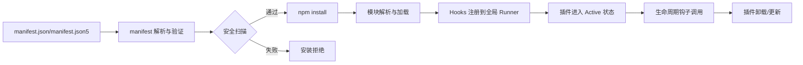

# 第 5 章：插件系统深解

## 本章信息

| | |
|--|--|
| **本章目标** | 理解 OpenClaw 插件系统的设计、运作方式和 40+ 生命周期钩子 |
| **适合读者** | 想开发 OpenClaw 插件或理解其扩展机制的开发者 |
| **前置知识** | 第 1 章、第 4 章 |
| **核心结论** | 插件系统是 OpenClaw 的扩展骨架，以 manifest → 安装 → 加载 → Hooks 注册为流程，提供 40+ 生命周期钩子点，覆盖从 Gateway 启动到 Agent 每次工具调用 |

---

## 核心结论

**OpenClaw 的插件系统以"manifest 声明 → npm 安装 → 运行时加载 → Hooks 注册"为核心流程，对外提供 40+ 个生命周期钩子点，使插件可以介入通道接入、LLM 调用、工具执行、Session 管理等所有关键路径。** 这是 OpenClaw 保持 Core 轻量而能力强大的关键机制。

---

## 插件类型

根据 `VISION.md` 的描述，OpenClaw 有两种插件风格：

| 类型 | 描述 | 适用场景 |
|---|---|---|
| **Code 插件** | 运行 OpenClaw 插件代码 | 需要 runtime hooks、自定义 Provider、通道接入、工具扩展 |
| **Bundle 插件** | 打包稳定的外部服务（Skills、MCP Server 等） | 功能不需要 runtime 钩子的场景 |

优先使用 Bundle 插件，接口更稳定，安全边界更清晰。

---

## 插件目录结构

```
src/plugins/
├── loader.ts               # 插件加载器（发现 → 验证 → 初始化）
├── manifest.ts             # manifest 解析与验证
├── hooks.ts                # Hook Runner（执行生命周期钩子）
├── hook-types.ts           # 40+ 钩子类型定义
├── hook-runner-global.ts   # 全局 Hook 执行器
├── discovery.ts            # 插件发现（从 npm / 本地路径）
├── runtime.ts              # 插件运行时注册表
├── installed-plugin-index*.ts  # 已安装插件索引（10+ 文件）
├── provider-runtime.ts     # LLM Provider 插件运行时
├── provider-hook-runtime.ts    # Provider 级 Hook 运行时
└── plugin-sdk/             # 插件 SDK（开发者 API）
```

---

## 插件生命周期



### manifest.json 结构

每个插件都有一个 `manifest.json`（支持 JSON5 语法）声明其能力：

```json5
// 示例：一个通道插件的 manifest
{
  "name": "@openclaw/telegram",
  "version": "1.0.0",
  "contributes": {
    "channels": ["telegram"],
    "hooks": ["beforeAgentStart", "messageSending", "messageReceived"],
    "tools": [],
    "commands": []
  },
  "minHostVersion": "2026.1.0"
}
```

### 安全扫描

插件安装前会做安全扫描：

```typescript
// 文件路径：src/plugins/install-security-scan.ts
export async function runInstallSecurityScan(
  pluginDir: string,
  opts: InstallSecurityScanOptions,
): Promise<InstallSecurityScanResult> {
  // 扫描内容：
  // 1. 依赖列表中的已知恶意包（denylist）
  // 2. postinstall 脚本存在性检查
  // 3. 文件权限异常检查
}
```

---

## Hooks 系统

Hooks 是插件与 Core 交互的主要方式，通过 `hooks.ts` 中的 Hook Runner 执行。

### 钩子分类（截至 2026-06-07）

```typescript
// 文件路径：src/plugins/hook-types.ts（部分）
export type PluginHookName =
  // Gateway 生命周期
  | "gatewayStart"
  | "gatewayStop"
  | "cronChanged"

  // 消息生命周期
  | "messageReceived"       // 收到新消息
  | "messageSending"        // 即将发送回复
  | "messageSent"           // 回复已发送

  // Agent 生命周期
  | "beforeAgentStart"      // Agent 开始前（可阻止）
  | "beforeAgentRun"        // 每次运行前
  | "beforeAgentReply"      // 即将发送回复前（可修改内容）
  | "beforeAgentFinalize"   // Agent 结束前
  | "agentEnd"              // Agent 结束后

  // 工具调用
  | "beforeToolCall"        // 工具调用前（可阻止）
  | "afterToolCall"         // 工具调用后

  // LLM 调用
  | "beforeModelResolve"    // 模型选择前（可覆盖模型）
  | "beforePromptBuild"     // Prompt 构建前（可注入内容）
  | "modelCallStarted"      // LLM 调用开始
  | "modelCallEnded"        // LLM 调用结束
  | "llmInput"              // LLM 输入可见
  | "llmOutput"             // LLM 输出可见

  // Session 生命周期
  | "sessionStart"
  | "sessionEnd"
  | "beforeReset"

  // 分发与路由
  | "inboundClaim"          // 入站消息认领（决定是否响应）
  | "beforeDispatch"        // 分发前
  | "replyDispatch"         // 回复分发

  // 压缩与维护
  | "beforeCompaction"
  | "afterCompaction"
  | "compactionTimeout"

  // 子 Agent
  | "subagentSpawning"
  | "subagentDeliveryTarget"

  // 会话 Prepare/Heartbeat
  | "agentTurnPrepare"
  | "heartbeatPromptContribution"
  | "replyPayloadSending";
```

### Hook 执行器

```typescript
// 文件路径：src/plugins/hooks.ts
/**
 * Plugin Hook Runner
 * 提供带有错误处理和优先级排序的生命周期钩子执行工具。
 */
import type { GlobalHookRunnerRegistry } from "./hook-registry.types.js";

// 全局 Hook Runner 单例，由 Gateway 初始化时注入
export function getGlobalHookRunner(): GlobalHookRunnerRegistry {
  return globalHookRunner;
}
```

钩子执行器支持：
- 优先级排序（插件可声明执行优先级）
- 超时保护（防止单个钩子阻塞整个流程）
- 错误隔离（单个钩子失败不影响其他钩子）
- 决策钩子（`beforeAgentStart` 等可返回 `block` 决定阻止操作）

### 决策钩子示例

```typescript
// 文件路径：src/plugins/hook-decision-types.ts
export type InputGateDecision = "allow" | "block";

export type GateHookResult = {
  decision: InputGateDecision;
  /** 当 decision 为 "block" 时显示给用户的消息 */
  blockMessage?: string;
};

// 插件可以通过 beforeAgentStart 钩子阻止 Agent 执行：
export function resolveBlockMessage(result: GateHookResult): string | undefined {
  if (result.decision === "block") {
    return result.blockMessage ?? "此操作已被插件阻止";
  }
}
```

---

## Provider 插件接口

插件可以注册自定义的 LLM Provider：

```typescript
// 文件路径：src/plugins/provider-hook-runtime.ts
export type ProviderRuntimePluginHandle = {
  pluginId: string;
  // Provider 可以贡献：
  // - 系统 Prompt 扩展
  // - 文本转换（输入/输出过滤）
  // - 工具调用参数编码方式
  // - 模型兼容性配置
};

export async function resolveProviderRuntimePluginHandle(
  pluginMetadataSnapshot: PluginMetadataSnapshot,
  providerId: string,
): Promise<ProviderRuntimePluginHandle | null> {
  // 查找注册了该 providerId 的插件
}
```

---

## 插件 SDK

`src/plugin-sdk/` 提供给插件开发者的公开 API：

```typescript
// 文件路径：src/plugin-sdk/agent-core.ts
// 插件可使用的 Agent 相关 API
export { /* Agent 相关 API */ } from "@openclaw/plugin-sdk/agent-core";

// 文件路径：src/plugin-sdk/agent-harness-runtime.ts
// 插件 Harness（Agent 执行框架）运行时 API
```

SDK 的边界规则：
- 插件只能通过 `@openclaw/plugin-sdk/*` 访问 Core
- 禁止直接导入 `src/**`（内部实现）
- 禁止跨插件直接引用其他插件的 `src/**`

---

## 插件状态追踪

```typescript
// 文件路径：src/plugins/plugin-lifecycle-trace.ts
export type PluginLifecyclePhase =
  | "discovery"
  | "manifest-parse"
  | "security-scan"
  | "install"
  | "load"
  | "register"
  | "active"
  | "error"
  | "unloaded";
```

插件在整个生命周期中经历这些阶段，Gateway 可以通过 `/status` 接口查询当前所有插件的状态。

---

## 嵌入式插件（Bundled Plugins）

OpenClaw 内置了一批"打包插件"，这些插件无需安装即可使用：

```typescript
// 文件路径：src/plugins/bundled-plugin-scan.ts
// 扫描发行包中预置的插件目录
export async function scanBundledPlugins(
  bundledPluginsDir: string,
): Promise<BundledPluginEntry[]> {
  // 扫描 dist/plugins/ 目录下的内置插件
}
```

内置插件包括主流通道（Telegram、Discord、WhatsApp 等）和一些核心能力扩展。

---

## 小结

1. 插件系统是 OpenClaw 扩展能力的核心，通道、LLM Provider、工具都以插件形式接入
2. 生命周期钩子覆盖 40+ 个关键点，从 Gateway 启动到每次工具调用
3. 决策钩子（block/allow）允许插件介入并阻止操作，是安全控制的重要机制
4. 插件 SDK 严格限制了插件与 Core 的交互边界，保护 Core 代码不被直接依赖
5. 插件安装前有安全扫描，并通过 manifest 声明能力需求

## 延伸阅读

- [第 6 章：多 LLM 提供商抽象](06-llm-providers.html)
- [第 7 章：Skills 系统](07-skills.html)
- [第 10 章：ACP、MCP 与语音](10-acp-mcp-voice.html)
