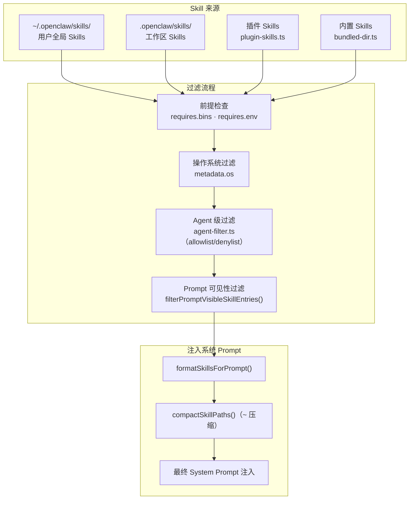

# 第 7 章：Skills 系统

> **核心结论**：Skills 是 OpenClaw 最轻量的用户扩展机制——一个 Markdown 文件即是一个 Skill，运行时被加载并注入系统 Prompt；`~` 路径压缩使每次对话节省 400-600 tokens；Skill 还可以声明依赖（需要安装的 CLI 工具）、命令触发和工具调用策略。

---

## Skills 的完整数据模型

```typescript
// src/skills/types.ts（精简）
// Skill 的元数据（YAML frontmatter 中的字段）
export type OpenClawSkillMetadata = {
  always?: boolean;      // 是否总是加载（不需要 trigger）
  skillKey?: string;     // 全局唯一 ID（不指定时使用文件名）
  primaryEnv?: string;   // 主要环境变量（如 ANTHROPIC_API_KEY）
  emoji?: string;        // 显示用 emoji
  os?: string[];         // 支持的操作系统（["macos", "linux"]）
  requires?: {
    bins?: string[];     // 必须存在的可执行文件（如 ["git", "docker"]）
    anyBins?: string[];  // 任一存在即可
    env?: string[];      // 必须设置的环境变量
    config?: string[];   // 必须存在的配置 key
  };
  install?: SkillInstallSpec[];  // 依赖安装规范
};

// Skill 安装规范（支持多种包管理器）
export type SkillInstallSpec = {
  id?: string;
  kind: "brew" | "node" | "go" | "uv" | "download";
  label?: string;
  bins?: string[];
  os?: string[];
  formula?: string;      // Homebrew formula 名
  package?: string;      // npm/pnpm 包名
  module?: string;       // Python 模块名（uv install）
  url?: string;          // 直接下载 URL
};

// Skill 调用策略
export type SkillInvocationPolicy = {
  userInvocable: boolean;            // 用户是否可以主动触发
  disableModelInvocation: boolean;   // 禁止 AI 主动调用（仅用户触发）
};
```

---

## ~ 路径压缩：代码层面的详细解释

这是 Skills 系统中最精妙的优化，源码注释完整说明了原因：

```typescript
// src/skills/loading/workspace.ts
/**
 * Replace the user's home directory prefix with `~` in skill file paths
 * to reduce system prompt token usage. Models understand `~` expansion,
 * and the read tool resolves `~` to the home directory.
 *
 * Example: `/Users/alice/.bun/.../skills/github/SKILL.md`
 *       → `~/.bun/.../skills/github/SKILL.md`
 *
 * Saves ~5–6 tokens per skill path × N skills ≈ 400–600 tokens total.
 */
function resolveCompactHomePrefixes(): string[] {
  // 收集所有可能的 home 路径变体（包括符号链接解析后的真实路径）
  const homes = [resolveHomeDir(), resolveUserHomeDir(), resolveNativeUserHomeDir()].filter(Boolean);
  const resolvedHomes = homes.map((home) => path.resolve(home));
  // 通过 realpath 解析符号链接，确保覆盖 macOS 的 /private/var/... 路径变体
  const realHomes = resolvedHomes.map((home) => tryRealpath(home)).filter(Boolean);
  // 按路径长度降序排列：优先匹配最长前缀，防止短前缀错误截断
  return uniqueStrings([...resolvedHomes, ...realHomes]).toSorted((a, b) => b.length - a.length);
}
```

**为什么要收集多个 home 路径变体？**

macOS 上 `os.homedir()` 返回 `/Users/alice`，但 `realpath()` 可能返回 `/private/var/folders/.../Users/alice`（符号链接展开后的路径）。如果 Skill 文件路径使用了 realpath 形式，简单的字符串替换会失败。通过收集所有变体并按长度降序匹配，确保所有情况都能被压缩。

---

## Skill 的发现与过滤流程



---

## SkillEntry 和 SkillExposure

```typescript
// src/skills/types.ts（精简）
export type SkillExposure = {
  includeInRuntimeRegistry: boolean;       // 是否在 runtime 注册（影响可用性）
  includeInAvailableSkillsPrompt: boolean; // 是否显示在"可用 Skills"提示中
  userInvocable: boolean;                  // 用户是否可以手动触发
};

export type SkillEntry = {
  id: string;
  name: string;
  description?: string;
  content: string;         // Markdown 内容（注入 System Prompt 的正文）
  filePath: string;        // 原始文件路径（压缩前）
  metadata: OpenClawSkillMetadata;
  exposure: SkillExposure;
  invocationPolicy: SkillInvocationPolicy;
};
```

---

## Skill 命令系统

Skills 不仅可以影响 System Prompt，还可以注册为 Chat 命令（用户在对话中用 `/` 触发）：

```typescript
// src/skills/types.ts
export type SkillCommandSpec = {
  name: string;              // 命令名（不含 /）
  skillName: string;
  description: string;
  dispatch?: SkillCommandDispatchSpec;  // 可选：直接派发到工具
  promptTemplate?: string;   // 命令触发时注入的 Prompt 模板
};

// 直接工具派发：跳过 LLM，直接调用工具
export type SkillCommandDispatchSpec = {
  kind: "tool";
  toolName: string;
  argMode?: "raw";           // 将用户参数原样传给工具
};
```

**示例**：一个 Git Skill 可以注册 `/git-log` 命令，dispatch 到 `Bash` 工具，参数为 `git log --oneline`——用户输入 `/git-log`，直接执行 git 命令，不经过 LLM 决策。

---

## Skill 依赖安装

`SkillInstallSpec` 允许 Skill 声明依赖的外部工具，`openclaw doctor --fix` 或 `openclaw skill install` 可以自动安装：

```typescript
// 示例：一个 k8s Skill 的 frontmatter
/*
---
requires:
  bins: ["kubectl", "helm"]
install:
  - kind: brew
    formula: kubernetes-cli
    bins: ["kubectl"]
    os: ["macos"]
  - kind: node
    package: "@helm/helm-cli"
    bins: ["helm"]
---
*/
```

安装时会按 `kind` 选择对应的包管理器：`brew install kubernetes-cli`（macOS）或 `npm install -g @helm/helm-cli`。

---

## Skills 沙盒路径限制

在沙盒模式下，Skill 文件的路径访问受到限制：

```typescript
// src/skills/loading/workspace.ts
import { resolveSandboxPath } from "../../agents/sandbox-paths.js";
import { isPathInside } from "../../infra/path-guards.js";

// 沙盒模式下，只加载沙盒允许路径内的 Skills
function filterSkillsByAccessPolicy(
  skills: SkillEntry[],
  sandboxMode: SandboxMode,
  sandboxWorkdir: string,
): SkillEntry[] {
  if (sandboxMode === "none") { return skills; }
  const sandboxPath = resolveSandboxPath(sandboxMode, sandboxWorkdir);
  return skills.filter((skill) => isPathInside(skill.filePath, sandboxPath));
}
```

在 Docker 沙盒中，只有容器内部可见的 Skill 文件才会被注入 System Prompt——防止 Skill 文件泄露容器外部的路径信息。

---

## ClawHub Skill 生态

Skill 支持从 ClawHub（类似 Skill 的 App Store）安装：

```typescript
// src/skills/lifecycle/clawhub.ts
// ClawHub 安装流程：
// 1. openclaw skill install @clawhub/github-cli
// 2. 从 ClawHub 下载 Skill 压缩包
// 3. 解压到 ~/.openclaw/skills/
// 4. 自动安装 Skill 声明的依赖（requires.install）
// 5. 注册到 Skill 索引
```

安装后立即生效——下一次 Agent 执行时自动加载新 Skill，无需重启 Gateway。

---

## 小结

1. **Markdown 即 Skill**：YAML frontmatter 声明元数据（OS 限制、依赖、调用策略），正文作为 System Prompt 注入内容
2. **~ 路径压缩**：收集多个 home 路径变体（含符号链接），按长度降序匹配，每次对话节省 400-600 tokens
3. **多来源合并**：全局 Skills + 工作区 Skills + 插件 Skills + 内置 Skills，统一过滤后注入
4. **SkillCommandSpec**：Skill 可以注册 Chat 命令（`/git-log`），可以直接 dispatch 到工具，跳过 LLM
5. **沙盒路径限制**：Docker 沙盒模式下只注入容器内可见的 Skill 文件，防止路径信息泄露

## 延伸阅读

- [第 4 章：Agent 执行引擎](04-agent-engine.html)
- [第 9 章：会话与上下文管理](09-session-context.html)
