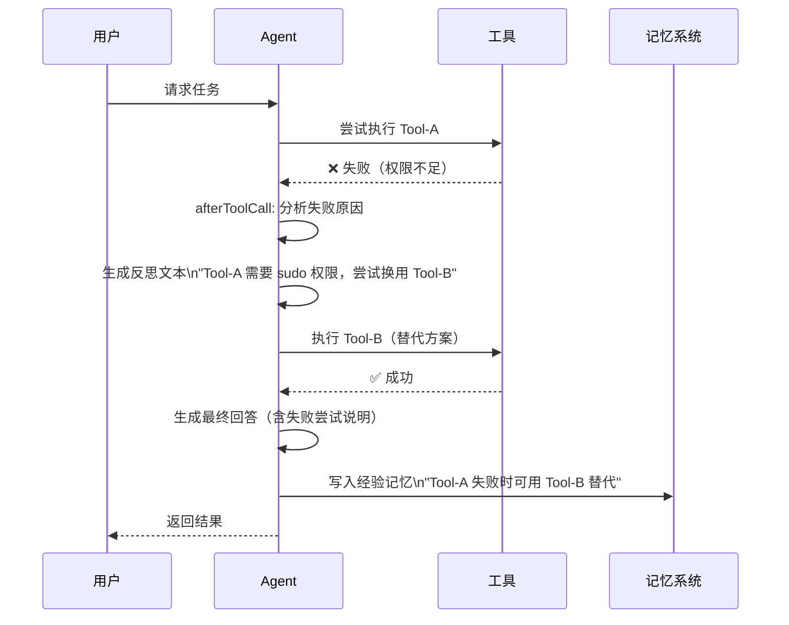
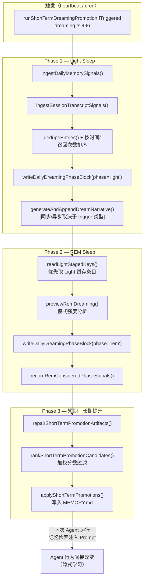
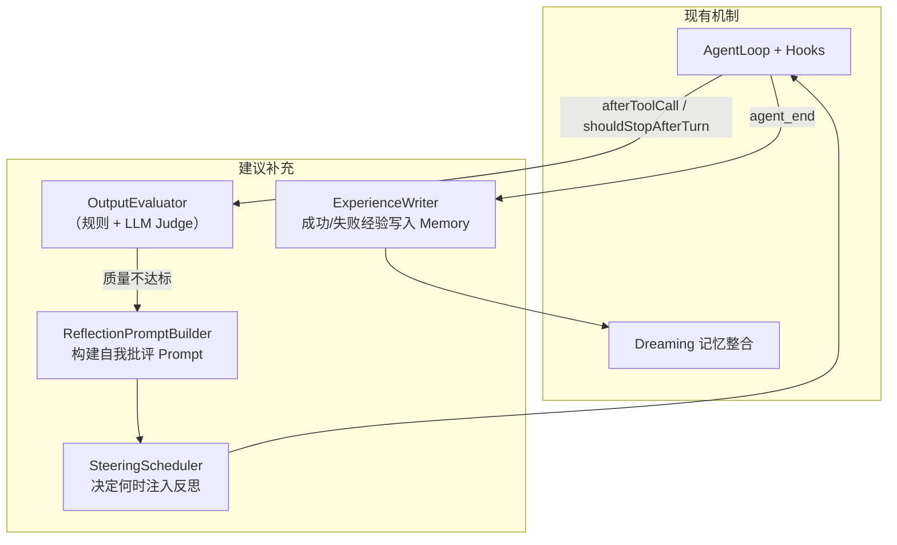

# Chapter 08 — Reflection & Learning Loop

> **核心结论**：OpenClaw 当前版本**没有内置 Reflection 机制**，但通过 Dreaming（记忆整合）、prepareNextTurn、beforeToolCall/afterToolCall 钩子和技能的渐进式更新，形成了隐式的学习回路。本章分析现有机制，并给出补充 Reflection 的工程方案。

---

## 当前状态分析

### 已有的"隐式 Reflection"机制

| 机制 | 文件 | 说明 |
|---|---|---|
| **Dreaming 整合** | `extensions/memory-core/src/dreaming.ts` | 事后对记忆进行 LLM 辅助整合，隐式包含"什么记忆值得保留" |
| **prepareNextTurn** | `packages/agent-core/src/types.ts:214` | 每轮后可以分析执行结果，调整下一轮的 model/context |
| **Compaction** | `packages/agent-core/src/harness/agent-harness.ts:806` | LLM 对历史对话生成摘要，隐式的"理解提炼" |
| **Shadow Trial** | `extensions/memory-core/src/dreaming-shadow-trial.ts` | 用历史查询评估整合质量，是隐式的记忆 Eval |

### 缺失的显式 Reflection 能力

1. ❌ **Self Critique**：Agent 无法主动评判自己的输出质量
2. ❌ **Retry with Reflection**：失败后无法携带分析结果重试
3. ❌ **Experience Accumulation**：成功/失败经验无法自动写入长期记忆
4. ❌ **Online Learning**：行为模式不会根据反馈动态调整

---

## 设计动机

Agent 系统中 Reflection 的价值：
1. **减少循环错误**：LLM 在工具调用失败后"携带错误原因重试"比"盲目重试"成功率高
2. **质量自检**：高风险场景（写代码、生成合同）中，Agent 自我审查可以减少人工校对需本量
3. **经验积累**：成功的解决路径被记忆，下次遇到类似问题可以直接参考

---

## 基于现有扩展点实现 Reflection

### 方案一：shouldStopAfterTurn + steer 自我批评

```typescript
// 在主循环外层实现自我批评循环
let reflectionCount = 0;
const MAX_REFLECTIONS = 2;

const config: AgentLoopConfig = {
  shouldStopAfterTurn: async ({ message, context }) => {
    // 如果已经完成了反思或超过最大次数，停止
    if (reflectionCount >= MAX_REFLECTIONS) return true;

    // 检查回答质量（可以是规则或另一个 LLM 调用）
    const quality = await evaluateQuality(message);
    if (quality.score < QUALITY_THRESHOLD) {
      // 注入反思提示，触发下一轮
      reflectionCount++;
      // 不停止，让循环继续
      return false;
    }
    return true;
  },
  getSteeringMessages: async () => {
    if (needsReflection) {
      return [{
        role: "user",
        content: [{
          type: "text",
          text: `请审查你的上一个回答，注意以下问题：\n${issues.join('\n')}\n\n请提供改进后的版本。`
        }],
        timestamp: Date.now(),
      }];
    }
    return [];
  }
};
```

### 方案二：afterToolCall 实现工具失败反思

```typescript
// 在工具失败后注入错误分析上下文
const config: AgentLoopConfig = {
  afterToolCall: async ({ toolCall, result, isError }) => {
    if (isError) {
      // 追加诊断信息到错误结果
      const diagnosis = await analyzError(toolCall, result);
      return {
        content: [
          ...result.content,
          {
            type: "text",
            text: `\n\n[自动诊断]\n${diagnosis}\n\n建议：${diagnosis.suggestion}`
          }
        ]
      };
    }
  }
};
```

### 方案三：Memory-based Learning Loop

```typescript
// 成功经验写入长期记忆
harness.subscribe(async (event) => {
  if (event.type === "agent_end") {
    const lastMessage = event.messages.at(-1);
    if (lastMessage?.role === "assistant" && !lastMessage.errorMessage) {
      // 提取成功解决的问题类型
      const problemType = await classifyProblem(event.messages);
      const solution = await extractSolution(event.messages);

      // 写入长期记忆
      await memoryManager.write({
        content: `成功解决 ${problemType} 类问题：${solution}`,
        metadata: { type: "experience", importance: 0.7 }
      });
    }
  }
});
```

---

## Retry with Reflection 完整流程



---

## Dreaming 三阶段源码精确解析

OpenClaw 的 Dreaming 系统模拟了人类睡眠记忆巩固的三个阶段，由 `extensions/memory-core/src/dreaming.ts` 和 `dreaming-phases.ts` 共同实现。

### 触发机制（dreaming.ts:496）

```typescript
// dreaming.ts:505 — 只响应 heartbeat 和 cron 触发
export async function runShortTermDreamingPromotionIfTriggered(params: {
  cleanedBody: string;
  trigger?: string;        // "heartbeat" | "cron"
  workspaceDir?: string;
  config: ShortTermPromotionDreamingConfig;
  // ...
}): Promise<{ handled: true; reason: string } | undefined> {
  if (params.trigger !== "heartbeat" && params.trigger !== "cron") {
    return undefined;
  }
  // 检查 system event token 是否注入到消息体中
  if (!includesSystemEventToken(params.cleanedBody, DREAMING_SYSTEM_EVENT_TEXT)) {
    return undefined;
  }
  // ...
  // cron 触发时叙事生成异步执行，heartbeat 触发时同步
  const detachNarratives = params.trigger === "cron";
```

### Phase 1 — Light Sleep（dreaming-phases.ts:1629）

Light 阶段是"浅睡"，负责**信号摄取和近期记忆排序**：

```typescript
async function runLightDreaming(params): Promise<void> {
  // 1. 摄取每日 MEMORY.md 文件中的记忆信号
  await ingestDailyMemorySignals({ workspaceDir, lookbackDays, limit, nowMs });

  // 2. 摄取 Session Transcript 中的对话信号
  await ingestSessionTranscriptSignals({ workspaceDir, cfg, lookbackDays, nowMs });

  // 3. 按最后召回时间 + 召回次数排序，去重
  const entries = dedupeEntries(
    recentEntries.toSorted((a, b) =>
      Date.parse(b.lastRecalledAt) - Date.parse(a.lastRecalledAt) || b.recallCount - a.recallCount
    ).slice(0, params.config.limit),
    params.config.dedupeSimilarity,
  );

  // 4. 写入当日 Dreaming Phase 块（phase: "light"）
  await writeDailyDreamingPhaseBlock({ workspaceDir, phase: "light", bodyLines, nowMs });

  // 5. 生成叙事日记（同步或异步取决于 detachNarratives）
  if (params.subagent && capped.length > 0) {
    await generateAndAppendDreamNarrative({ data: { phase: "light", snippets, themes } });
  }
}
```

摄取分数常量：
- `DAILY_INGESTION_SCORE = 0.62`（每日记忆文件的基础分数）
- `SESSION_INGESTION_SCORE = 0.58`（会话转录的基础分数）
- `SESSION_INGESTION_MAX_MESSAGES_PER_SWEEP = 240`（每次最多摄取的消息数）

### Phase 2 — REM Sleep（dreaming-phases.ts:1728）

REM 阶段优先处理 Light 阶段已暂存的记忆，形成 **Light→REM 流水线**：

```typescript
async function runRemDreaming(params): Promise<void> {
  // 1. 读取 Light 阶段已暂存的 key
  const lightKeys = await readLightStagedKeys({ workspaceDir, nowMs });

  // 2. 优先使用 Light 暂存条目（而非全量扫描），实现 Light→REM 流水线
  // dreaming-phases.ts:1762: "Prefer entries staged by light sleep so REM
  //   synthesises from the sequential light→REM pipeline instead of rescanning the full store."
  const stagedEntries = lightKeys.size > 0
    ? allEntries.filter(entry => lightKeys.has(entry.key))
    : [];
  const entries = stagedEntries.length > 0 ? stagedEntries : allEntries;

  // 3. 基于 minPatternStrength 进行模式强度分析
  const preview = previewRemDreaming({ entries, limit, minPatternStrength });

  // 4. 写入 REM 阶段块 + 记录 REM 考量信号
  await writeDailyDreamingPhaseBlock({ workspaceDir, phase: "rem", bodyLines: preview.bodyLines });
  await recordRemConsideredPhaseSignals({ workspaceDir, keys: stagedEntries.map(e => e.key) });
}
```

REM 触发的系统事件 token（dreaming-phases.ts:88）：
```
const REM_SLEEP_EVENT_TEXT = "__openclaw_memory_core_rem_sleep__"
```

### Phase 3 — 短期记忆促进（dreaming.ts:593）

最终阶段将高质量短期记忆**提升为长期记忆**（写入 `MEMORY.md`）：

```typescript
// 1. 修复召回产物中的格式问题
const repair = await repairShortTermPromotionArtifacts({ workspaceDir });

// 2. 按加权分数排名候选记忆
const candidates = await rankShortTermPromotionCandidates({
  workspaceDir,
  limit: params.config.limit,
  // 过滤阈值（配置参数）：
  // minScore         — 最低召回分数（0.0–1.0）
  // minRecallCount   — 最低被召回次数
  // minUniqueQueries — 最低触发的不同查询数
  // recencyHalfLifeDays — 时间衰减半衰期（天）
  // maxAgeDays       — 最大记忆年龄（天）
});

// 3. 执行提升：将候选写入 MEMORY.md 长期记忆
const applied = await applyShortTermPromotions({ workspaceDir, candidates });
```

### 完整 Dreaming 数据流图



## Dreaming 作为隐式学习循环

Dreaming 是 OpenClaw 最接近"学习"的机制。它模拟人类睡眠的三个阶段（Light→REM→Promotion）：通过摄取信号、模式分析、加权提升，Agent 的"知识库"随时间优化，下次执行时获得更高质量的记忆片段，**间接改变行为**——这是隐式 Reflection，而非显式自我评估。

---

## 与同类框架对比

| 框架 | Reflection 设计 | Self Critique | 经验积累 | 实现方式 |
|---|---|---|---|---|
| **OpenClaw** | 无内置，可通过钩子实现 | 无内置 | Dreaming（隐式） | 扩展点 |
| **Claude Code** | 无 | 无 | 无 | N/A |
| **OpenAI Codex** | 无 | 无 | 无 | N/A |
| **OpenHands** | 无 | 无 | 无 | N/A |
| **Archon** | 通过 LangGraph 循环实现 | 有（Supervisor 节点） | 无 | Graph 条件边 |
| **Reflexion (paper)** | 完整 Reflection 框架 | 有 | 有（Episodic Memory） | 研究框架 |

**Reflexion 论文方案**（Shinn et al., 2023）：
```
Attempt → Evaluate → Reflect（LLM 生成反思文本）→ Store in Memory → Retry
```
OpenClaw 可以通过钩子组合实现类似流程，但需要上层应用自行实现，不是开箱即用。

---

## 推荐的 Reflection 架构补充



实现路径：
1. 通过 `harness.on('tool_result')` 捕获工具失败
2. 通过 `harness.on('turn_end')` 评估每轮质量
3. 通过 `harness.steer()` 注入反思提示
4. 通过 Memory API 写入经验

---

## 企业实践建议

1. **不要在生产环境无限制启用 Reflection**：每次 Reflection 额外消耗 LLM token，需要设置最大反思次数（`MAX_REFLECTIONS = 2`）。
2. **规则 Reflection 优先**：能用确定性规则判断（语法错误、API 错误码）的，不用 LLM Judge，更快更便宜。
3. **记忆选择性写入**：只有高置信度的成功经验才写入长期记忆，避免"记忆污染"（错误经验被重复使用）。

---

## 面试题

**Q1：OpenClaw 为什么没有内置 Reflection？这是设计选择还是功能缺失？**

> **参考答案**：这是有意的设计选择。OpenClaw 的核心定位是个人 AI 助手（而非专注于复杂任务的自主 Agent），个人助手更关注响应速度和对话流畅性。Reflection 会引入额外的 LLM 调用，增加延迟和成本。同时，OpenClaw 提供了完整的扩展点（钩子 + 记忆），让有需求的应用层自行实现 Reflection，而不是强制所有场景都走反思路径。

**Q2：如何设计一个"工具失败后自动尝试替代方案"的 Reflection 机制？**

> **参考答案**：通过 `afterToolCall` 钩子：(1) 检测工具失败（isError = true）；(2) 分析错误原因（解析错误消息）；(3) 在返回的 content 中追加诊断建议；(4) LLM 在下一轮看到这个增强的错误信息后，自然地尝试替代方案。这是"给 LLM 更多信息"的 Reflection，而非"让 LLM 显式反思"，但效果类似。

**Q3：Dreaming 机制与 Reflection 的本质区别是什么？**

> **参考答案**：Reflection 是**同步的自我评估**（在任务执行中或执行后立即触发，结果用于本次或下次任务）。Dreaming 是**异步的记忆整合**（在空闲时期后台运行，结果影响未来任务的记忆检索，不影响当前或下次任务的直接行为）。Dreaming 更像是"睡眠中的记忆巩固"，而非"工作中的实时反思"。
