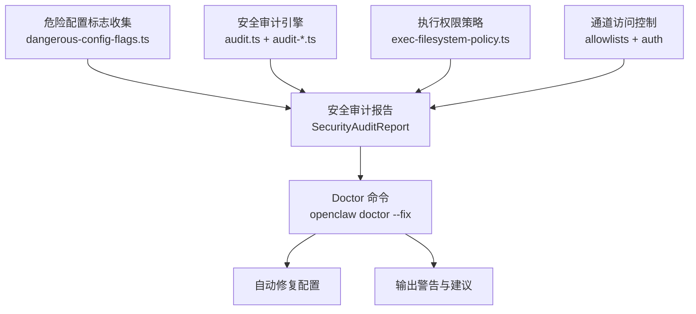

# 第 8 章：安全审计机制

## 本章信息

| | |
|--|--|
| **本章目标** | 理解 OpenClaw 的安全架构：审计体系、危险标志、执行策略和 Doctor 自愈系统 |
| **适合读者** | 关注安全设计、想了解 AI 助手安全防线的开发者和运维人员 |
| **前置知识** | 第 1 章 |
| **核心结论** | OpenClaw 的安全体系以"强默认值 + 显式旋钮"为原则，通过 audit-* 模块体系、危险配置标志收集、exec 权限策略和 Doctor 自动修复四层机制共同构建防线 |

---

## 核心结论

**OpenClaw 的安全体系不是"锁死能力"，而是"强默认值 + 显式操作旋钮"：通过 `src/security/` 中的审计模块体系检测危险配置，通过 `doctor --fix` 实现自动修复，通过白名单+沙盒控制执行边界。** 核心安全哲学来自 `VISION.md`：*"strong defaults without killing capability"*。

---

## 安全体系全景



---

## 审计模块体系

`src/security/` 目录下有大量 `audit-*.ts` 文件，每个文件负责检查系统的一个安全维度：

```
src/security/
├── audit.ts                        # 主入口：编排所有审计检查
├── audit.types.ts                  # 审计结果类型定义
├── audit-gateway-config.ts         # Gateway 配置审计
├── audit-gateway-exposure.ts       # Gateway 网络暴露检查
├── audit-gateway-auth.ts           # Gateway 认证配置审计
├── audit-channel.ts                # 通道配置审计
├── audit-exec-safe-bins.ts         # 安全执行二进制白名单审计
├── audit-exec-sandbox.ts           # 沙盒配置审计
├── audit-exec-surface.ts           # 执行面暴露审计
├── audit-plugins-trust.ts          # 插件信任审计
├── audit-model-hygiene.ts          # 模型使用卫生检查
├── audit-fs.ts                     # 文件系统权限检查
├── audit-deep-code-safety.ts       # 深度代码安全扫描
├── audit-deep-probe-findings.ts    # 深度探测发现
└── audit-trust-model.ts            # 信任模型验证
```

### 审计结果类型

```typescript
// 文件路径：src/security/audit.types.ts
export type SecurityAuditSeverity = "critical" | "high" | "medium" | "low" | "info";

export type SecurityAuditFinding = {
  id: string;                        // 唯一问题 ID（如 "gateway-auth-weak"）
  severity: SecurityAuditSeverity;
  title: string;
  description: string;
  remediation?: string;              // 修复建议
  suppressed?: boolean;              // 是否被用户静默
  location?: string;                 // 问题位置（文件路径或配置键）
};

export type SecurityAuditReport = {
  findings: SecurityAuditFinding[];
  summary: SecurityAuditSummary;
  suppressedFindings: SecurityAuditSuppressedFinding[];
};
```

### 审计主入口

```typescript
// 文件路径：src/security/audit.ts
export type SecurityAuditOptions = {
  config: OpenClawConfig;
  sourceConfig?: OpenClawConfig;
  env?: NodeJS.ProcessEnv;
  platform?: NodeJS.Platform;
  deep?: boolean;            // 是否执行深度检查（耗时较长）
};

// 审计流程：
// 1. collectGatewayConfigFindings   — Gateway 配置问题
// 2. collectChannelFindings         — 通道配置问题
// 3. collectExecFindings            — 执行权限问题
// 4. collectPluginFindings          — 插件安全问题
// 5. collectEnabledInsecureFlags    — 危险配置标志
// 6. (deep) collectDeepCodeSafetyFindings — 深度代码安全扫描
```

---

## 危险配置标志

`dangerous-config-flags.ts` 专门收集用户配置中启用的危险/不安全配置项：

```typescript
// 文件路径：src/security/dangerous-config-flags.ts
/**
 * Collect dangerous config flag findings across agents and runtime config.
 * Plugin flags use current metadata when requested, then fall back to
 * resolving manifest contracts.
 */
export function collectEnabledInsecureOrDangerousFlags(
  cfg: OpenClawConfig,
  options: { preferCurrentPluginMetadataSnapshot?: boolean } = {},
): string[] {
  const pluginEntries = cfg.plugins?.entries;
  if (!isRecord(pluginEntries)) {
    return collectEnabledInsecureOrDangerousFlagsFromContracts(cfg);
  }
  // 从插件 manifest 的 configContracts 中读取危险标志定义
  const configContracts = resolvePluginConfigContractsById({ config: cfg, ... });
  return collectEnabledInsecureOrDangerousFlagsFromContracts(cfg, {
    collectPluginConfigContractMatches,
    configContractsById: configContracts,
  });
}
```

### 危险标志分类

OpenClaw 将配置项分为两类：

| 分类 | 描述 |
|---|---|
| `insecure` | 会降低安全性但有时有合理用途（如禁用 SSL 验证） |
| `dangerous` | 高风险配置，只有明确知道风险时才应启用 |

插件通过 manifest 的 `configContracts` 声明哪些配置项属于危险标志：

```json5
// manifest.json（插件示例）
{
  "configContracts": {
    "agent.dangerouslyAllowAllExec": {
      "kind": "dangerous",
      "label": "允许执行所有命令（无沙盒）"
    }
  }
}
```

---

## 执行权限策略

OpenClaw 对 Agent 执行 Shell 命令有严格的权限控制：

```typescript
// 文件路径：src/security/exec-filesystem-policy.ts
// 检查配置中的执行权限策略是否存在"漂移"
// （即已批准的命令/路径与当前文件系统不符）
export function collectExecFilesystemPolicyDriftHits(
  approvals: ExecApprovalsFile,
  platform: NodeJS.Platform,
): PolicyDriftHit[] {
  // 对比已批准的可执行文件列表与文件系统实际状态
  // 检测：
  // 1. 已批准的可执行文件已被删除
  // 2. 文件权限发生变化（安全性下降）
  // 3. 文件内容哈希变化（可能被篡改）
}
```

### 执行批准流程

```typescript
// 文件路径：src/infra/exec-approvals.ts
export type ExecApproval = {
  commandPattern: string;   // 支持 glob 模式
  approved: boolean;
  approvedAt?: number;
  approvedBy?: "user" | "operator" | "admin";
};

export type ExecApprovalsFile = {
  approvals: ExecApproval[];
  defaultAsk: boolean;      // 未匹配命令是否默认询问
};
```

每次 Agent 执行 Bash 命令时，都会与这个批准文件对比。未批准的命令默认需要用户确认。

---

## Gateway 认证机制

```typescript
// 文件路径：src/gateway/auth.ts（结构推断）
export type GatewayAuthConfig = {
  mode: "token" | "password" | "none";
  token?: string;
  password?: string;
  // "none" 模式：仅允许 loopback 访问，警告用户风险
};
```

Gateway 默认使用 token 认证，禁止无认证运行（除非明确配置为 `mode: "none"` 且审计会产生警告）。

### Auth 审计

```typescript
// 文件路径：src/security/audit-gateway-http-auth.ts
// 检查项：
// 1. Gateway 是否使用了弱 token（长度过短、熵过低）
// 2. Gateway 是否在公网地址上运行但未启用认证
// 3. 是否使用了已知的弱密码
```

---

## Doctor 自愈系统

`openclaw doctor --fix` 是 OpenClaw 的"配置健康医生"，能自动检测并修复已知问题：

```typescript
// 文件路径：src/commands/doctor/shared/codex-route-warnings.ts
// 来自代码库中规模最大的 doctor 测试文件（4,192 行）
// 反映了 doctor 系统覆盖的问题类型之多
```

### Doctor 覆盖范围

根据 `src/commands/doctor/` 的目录结构，doctor 检查覆盖：

- 配置文件格式验证与迁移
- Gateway 认证配置修复
- 插件配置问题修复
- 通道配置问题修复
- 沙盒配置问题修复
- 会话数据完整性检查
- Secret 引用有效性验证

### 迁移机制

```
// 文件路径：src/commands/migrate/
// 从其他 Agent 系统导入状态时，也会经过 doctor 的迁移检查
```

OpenClaw 不维护长期的配置别名或兼容分支，当配置 schema 变化时，通过 `doctor --fix` 强制迁移到规范格式（来自 `VISION.md`）。

---

## 沙盒系统

```typescript
// 文件路径：src/agents/sandbox/config.ts
export type SandboxConfig = {
  mode: SandboxMode;
  // ...
};

export type SandboxMode =
  | "none"          // 无沙盒（不推荐）
  | "docker"        // Docker 容器隔离
  | "bwrap"         // Linux bubblewrap（轻量级沙盒）
  | "macOS-sandbox" // macOS 沙盒 Profile
  | "none-except-network"; // 允许网络但限制文件系统
```

Docker 沙盒在 `docker-compose.yml` 中有专门的配置：

```yaml
# 文件路径：docker-compose.yml
# OpenClaw 提供了 Docker Compose 配置用于沙盒化 Agent 执行
```

---

## 审计结果静默机制

用户可以在配置文件中静默特定的审计发现：

```typescript
// 文件路径：src/config/types.openclaw.ts
export type SecurityAuditSuppression = {
  id: string;           // 要静默的审计发现 ID
  reason?: string;      // 静默原因（记录存档）
  suppressedAt?: number;
};
```

静默记录会出现在审计报告的 `suppressedFindings` 字段中，确保安全决策有据可查。

---

## 小结

1. 安全哲学是"强默认值 + 显式旋钮"：默认拒绝，但提供明确的操作路径
2. `audit-*.ts` 模块体系覆盖 Gateway、通道、插件、执行权限等 14 个维度
3. 危险配置标志通过插件 manifest 的 `configContracts` 声明，统一收集报告
4. `doctor --fix` 是自愈系统，强制迁移配置到规范格式，不维护兼容别名
5. 每次执行 Shell 命令都需要通过批准文件检查，未批准命令默认询问用户

## 延伸阅读

- [第 1 章：项目概览与架构全景](01-architecture.html)
- [第 5 章：插件系统深解](05-plugin-system.html)
- [第 10 章：ACP、MCP 与语音](10-acp-mcp-voice.html)
