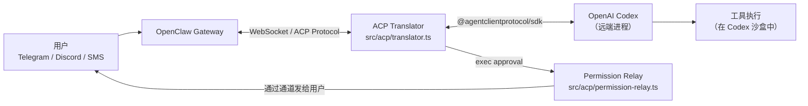
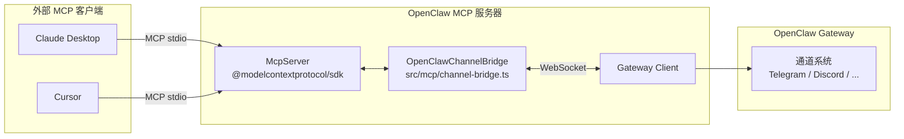
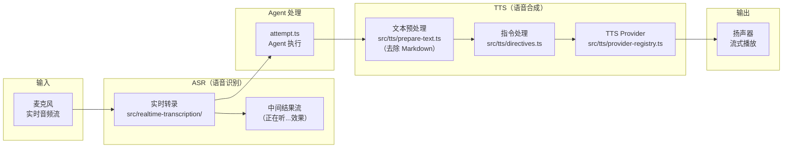

# 第 10 章：扩展发现——ACP、MCP 与语音

> **核心结论**：ACP 把 OpenClaw 变成任何 Agent 的通道前端（如 Codex 通过 Telegram 与用户交互）；MCP 把 OpenClaw 的通道能力暴露给外部 LLM 客户端；`OpenClawChannelBridge` 实现了 MCP 与 Gateway 之间的事件队列（上限 1,000），权限 TTL 1 小时；语音系统支持 TTS+ASR 完整链路。

---

## ACP：Agent Client Protocol

### 架构定位

ACP（Agent Client Protocol）解决的问题是：**如何让运行在其他进程/远端的 Agent 运行时（如 OpenAI Codex）复用 OpenClaw 的通道和会话系统？**



### ACP Translator：完整协议支持

ACP Translator 实现了 `@agentclientprotocol/sdk` 中定义的完整协议，包括：

```typescript
// src/acp/translator.ts 实现的 ACP 消息类型
import type {
  AuthenticateRequest, AuthenticateResponse,     // 认证握手
  InitializeRequest, InitializeResponse,         // 协议版本协商
  NewSessionRequest, NewSessionResponse,         // 创建新会话
  LoadSessionRequest, LoadSessionResponse,       // 加载历史会话
  ResumeSessionRequest, ResumeSessionResponse,   // 恢复会话
  ListSessionsRequest, ListSessionsResponse,     // 列出所有会话
  PromptRequest, PromptResponse,                 // 发送 Prompt，等待响应
  SetSessionConfigOptionRequest, SetSessionConfigOptionResponse, // 动态配置
  SetSessionModeRequest, SetSessionModeResponse, // 切换 Agent 模式
  CloseSessionRequest, CloseSessionResponse,     // 关闭会话
  CancelNotification,                            // 取消正在执行的 Prompt
} from "@agentclientprotocol/sdk";
```

### ACP 会话配置 ID

当外部 Agent（如 Codex）连接时，可以通过 `SetSessionConfigOption` 动态调整会话行为：

```typescript
// src/acp/config-meta.ts（被 translator.ts import 的常量）
export const ACP_ELEVATED_LEVEL_CONFIG_ID   = "...";  // 权限提升级别
export const ACP_FAST_MODE_CONFIG_ID        = "...";  // 快速模式（使用更小/更快的模型）
export const ACP_REASONING_LEVEL_CONFIG_ID  = "...";  // 推理深度
export const ACP_RESPONSE_USAGE_CONFIG_ID   = "...";  // token 用量统计粒度
export const ACP_THOUGHT_LEVEL_CONFIG_ID    = "...";  // 思考过程可见性
export const ACP_TIMEOUT_CONFIG_ID          = "...";  // 超时配置（模式）
export const ACP_TIMEOUT_SECONDS_CONFIG_ID  = "...";  // 超时秒数（具体值）
export const ACP_TRACE_LEVEL_CONFIG_ID      = "...";  // 追踪详细程度
export const ACP_VERBOSE_LEVEL_CONFIG_ID    = "...";  // 输出详细程度
```

这些 ID 使得 Codex 可以在同一 WebSocket 连接上动态切换 Agent 行为——例如在"快速模式"和"深度推理模式"之间切换，而不需要重建连接。

### 权限中继（Permission Relay）

当外部 Agent 需要执行危险操作（如执行 Shell 命令）时，权限请求会通过通道中继给用户：

```typescript
// src/acp/permission-relay.ts
// 将 Gateway 的 exec approval 请求格式化为 ACP 权限请求
export function buildAcpPermissionRequest(
  execApprovalDetails: GatewayExecApprovalDetails,
): PermissionRequest {
  // 构建包含操作描述、风险级别和批准选项的权限请求
  // 该请求通过 OpenClaw 通道（Telegram 消息等）发送给用户
}

// 将用户的批准/拒绝转换为 ACP 决定
export function resolveGatewayDecisionFromPermissionOutcome(
  outcome: PermissionOutcome,
): GatewayExecApprovalDecision {
  // "approved" → allow
  // "rejected" → deny
  // "timeout"  → deny（超时默认拒绝）
}
```

**实际效果**：用户在 Telegram 收到消息 "Codex 想要执行 `rm -rf /tmp/foo`，是否允许？"，回复 "是" 或 "否"，这个决定通过 Permission Relay 传递给 Codex 并继续执行。

### ACP 事件账本

```typescript
// src/acp/event-ledger.ts
export type AcpEventLedger = {
  append(event: AcpEvent): void;
  // 从指定序号开始重放（会话恢复时使用）
  replay(fromSeq?: number): AcpEventLedgerReplay;
};

// 内存实现（进程内缓存，非持久化）
export function createInMemoryAcpEventLedger(): AcpEventLedger;
```

事件账本记录所有 ACP 交互事件，支持在会话恢复时将错过的事件重发给重连的 Codex 实例——类似消息队列的"从偏移量消费"语义。

### ACP 速率限制

```typescript
// src/acp/translator.ts
import { createFixedWindowRateLimiter } from "../infra/fixed-window-rate-limit.js";
// ACP 连接有固定窗口速率限制，防止外部 Agent 以过高频率调用 Gateway
// 超出限制时，新请求被排队而不是丢弃
```

---

## MCP：Model Context Protocol

### 设计目标

MCP 让 OpenClaw 作为 **MCP 服务器**运行，将其通道能力暴露给支持 MCP 的外部 LLM 客户端（如 Claude Desktop、Cursor、VS Code 的 Copilot 等）。



### OpenClawChannelBridge：关键常量

```typescript
// src/mcp/channel-bridge.ts
// 事件队列容量上限
const QUEUE_LIMIT = 1_000;

// Claude 权限请求的 TTL（1 小时）
const PENDING_CLAUDE_PERMISSION_TTL_MS = 60 * 60 * 1_000;  // 3,600,000 ms

// 普通审批请求的 TTL（30 分钟）
const PENDING_APPROVAL_DEFAULT_TTL_MS = 30 * 60 * 1_000;

// 定期清理过期的待审批请求（每 5 分钟）
const PENDING_SWEEP_INTERVAL_MS = 5 * 60 * 1_000;

// Claude 权限回复的正则匹配格式（如 "yes ab3cd" 或 "no xy7kz"）
const CLAUDE_PERMISSION_REPLY_RE = /^(yes|no)\s+([a-km-z]{5})$/i;
```

**QUEUE_LIMIT = 1,000 的含义**：OpenClawChannelBridge 维护一个内存事件队列，存储 Gateway 推送的通道事件。如果 MCP 客户端消费速度慢，队列积压超过 1,000 条时，旧事件会被丢弃（类似循环缓冲区）。1,000 条通常足够——每条消息平均几百字节，约 1MB 内存。

**`CLAUDE_PERMISSION_REPLY_RE` 的设计**：用户通过 MCP 收到权限请求（含 5 位唯一码），回复 `yes ab3cd` 或 `no ab3cd` 来确认。5 位随机码防止用户意外触发权限批准（需要精确匹配），同时足够简短可以手动输入。字符集排除 `l`（`[a-km-z]`），避免与数字 `1` 混淆。

### Bridge 的状态机

```typescript
// src/mcp/channel-bridge.ts
export class OpenClawChannelBridge {
  private gateway: GatewayClient | null = null;
  private readonly queue: QueueEvent[] = [];           // 事件队列
  private readonly pendingWaiters = new Set<PendingWaiter>();    // 等待新事件的 MCP 工具调用
  private readonly pendingClaudePermissions = new Map<string, number>(); // 待审批权限的 TTL
  private readonly pendingApprovals = new Map<string, PendingApprovalEntry>();
  private cursor = 0;      // 已消费的事件序号（用于增量拉取）
  private ready = false;   // Gateway 连接就绪
  private closed = false;  // 已关闭
  // ...
}
```

Bridge 维护严格的状态机：`started → connecting → ready`（或 `error`）。MCP 工具调用在 Bridge 就绪前会等待（通过 `readyPromise`），连接断开后会自动重试初始连接。

### MCP 暴露的工具

```typescript
// src/mcp/channel-tools.ts（推断结构）
// 外部 LLM 通过 MCP 可以调用：
// send_message          — 向指定会话发送消息，触发 Agent 处理
// wait_for_event        — 等待新的通道事件（长轮询）
// list_sessions         — 列出 Gateway 管理的会话列表
// get_session_info      — 获取指定会话的状态和元数据
// get_chat_history      — 获取会话的对话历史
// approve_permission    — 批准待审批的权限请求
// reject_permission     — 拒绝待审批的权限请求
```

### 启动 MCP 服务器

```bash
# stdio 模式（Claude Desktop 集成）
openclaw mcp

# HTTP SSE 模式（浏览器/服务端访问）
openclaw mcp --http --port 8080
```

---

## 语音系统

### 完整链路



### TTS 文本预处理

在文本发送给 TTS 引擎前，需要去除 Markdown 格式：

```typescript
// src/tts/prepare-text.ts
// 处理规则：
// 1. 去除 **粗体**、*斜体*、`代码`、~~删除线~~ 等 Markdown 标记
// 2. 代码块 → "（代码省略）"（避免 TTS 逐字读出代码）
// 3. URL → 域名缩写（"docs.openclaw.ai 上的文档"）
// 4. 表格 → 描述性文本（"一个 3 行 4 列的表格"）
// 5. 保留自然的停顿标点（。，！？）
```

### TTS 指令系统

TTS 指令允许在文本中嵌入控制命令：

```typescript
// src/tts/directives.ts
// 支持的指令格式（嵌入在文本中）：
// [PAUSE=500]        — 暂停 500ms（用于句子间的自然停顿）
// [RATE=1.2]         — 调整语速（1.0 为标准速度）
// [VOICE=nova]       — 切换声音（在 OpenAI TTS Provider 中）
// [EMPHASIS=strong]  — 加强语气（对支持 SSML 的 TTS Provider）
```

**实际用途**：当 Agent 生成"警告：" 这类关键词时，可以在前面插入 `[PAUSE=300][RATE=0.9]`，让 TTS 读得更慢更清晰，增强用户对重要信息的感知。

### Talk 节点架构

```typescript
// src/gateway/server-talk-nodes.ts
// Talk 节点 = 运行在用户设备上的轻量级语音客户端
// 只负责：
//   1. 音频录制（麦克风 → PCM 流）
//   2. 音频播放（PCM 流 → 扬声器）
//   3. WebSocket 连接（与 Gateway 通信）
// 文字处理/Agent 执行/TTS 合成 = 全部在 Gateway 端

// 设备支持：iOS、Android、macOS
// 协议：WebSocket + 二进制音频帧（避免 Base64 编码开销）
```

这种架构（瘦客户端 + 厚服务端）有两个优势：
1. 设备端 App 极小，无需加载大型 AI 模型
2. 所有 AI 处理在服务端，响应速度不受设备性能限制

---

## 三种扩展能力的完整对比

| 维度 | ACP | MCP | 语音 |
|---|---|---|---|
| **方向** | 外部 Agent → OpenClaw | OpenClaw → 外部 LLM | 用户 ↔ AI 语音 |
| **协议** | Agent Client Protocol | Model Context Protocol | WebSocket + 音频流 |
| **传输** | WebSocket | stdio 或 HTTP SSE | WebSocket |
| **典型用例** | Telegram 对话 Codex | Claude Desktop 使用通道 | 语音对话 AI |
| **主要文件** | `src/acp/translator.ts` | `src/mcp/channel-bridge.ts` | `src/talk/` + `src/tts/` |
| **关键常量** | 9 个 CONFIG_ID | QUEUE_LIMIT=1000, TTL=3600s | PAUSE/RATE/VOICE 指令 |
| **安全机制** | 速率限制 + 权限中继 | 5位唯一码审批 + TTL | 设备→Gateway 双向认证 |

---

## ACP vs 直接 API 调用

为什么 Codex 要通过 ACP 而不是直接调用 OpenClaw 的 HTTP API？

| 维度 | ACP | 直接 HTTP API |
|---|---|---|
| 会话状态 | 协议层管理（LoadSession/ResumeSession） | 调用方自己管理 |
| 权限中继 | 内置（透明传达给用户） | 需要自己实现 |
| 事件推送 | WebSocket 实时推送 | 轮询或 SSE |
| 多 Agent 支持 | 协议层设计 | 需要自己路由 |
| OpenClaw 升级兼容 | 协议版本协商（Initialize） | 接口变更即崩溃 |

---

## 小结

1. **ACP Translator** 实现了完整的 ACP 协议状态机（11 种消息类型），通过 Permission Relay 让用户感知到 Codex 的权限请求
2. **9 个 ACP CONFIG_ID**：允许 Codex 在同一连接上动态调整 Agent 行为（快速模式、推理深度等）
3. **OpenClawChannelBridge** 的核心常量：QUEUE_LIMIT=1,000（防内存溢出），TTL=1hr（防权限请求永久挂起），5位码正则（防误触发）
4. **TTS 预处理 + 指令系统**：Markdown 剥除 + `[PAUSE/RATE/VOICE]` 控制，确保 TTS 输出自然流畅
5. **Talk 节点**：瘦客户端架构，音频采集/播放在设备，所有 AI 处理在 Gateway

## 延伸阅读

- [第 5 章：插件系统深解](05-plugin-system.html)
- [第 8 章：安全审计机制](08-security.html)
- [第 9 章：会话与上下文管理](09-session-context.html)
