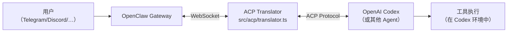

# 第 10 章：扩展发现——ACP、MCP 与语音

## 本章信息

| | |
|--|--|
| **本章目标** | 探索 OpenClaw 的三个高级扩展能力：Agent Control Plane、MCP 服务器和语音系统 |
| **适合读者** | 对多 Agent 协作、MCP 协议和语音 AI 感兴趣的开发者 |
| **前置知识** | 第 1 章、第 4 章、第 5 章 |
| **核心结论** | ACP 让 OpenClaw 可以作为其他 Agent（如 Codex）的前端交互界面；MCP 让外部 LLM 可以直接调用 OpenClaw 的通道能力；语音系统支持 TTS+ASR 的双向实时语音对话 |

---

## 核心结论

**OpenClaw 通过三个扩展维度超越了"单一聊天机器人"的范式：ACP（Agent Control Plane）将 OpenClaw 变成任何 Agent 的前端通道；MCP（Model Context Protocol）将 OpenClaw 的通道能力暴露给外部 LLM；语音系统实现了与 AI 助手的实时双向语音对话。**

---

## ACP：Agent Control Plane

### 设计目标

ACP（Agent Client Protocol）是 OpenClaw 与外部 Agent 运行时（如 OpenAI Codex）交互的标准化协议。它解决的问题是：**如何让一个运行在其他进程/远端的 AI Agent 使用 OpenClaw 的通道和会话系统？**



### ACP Translator 核心

```typescript
// 文件路径：src/acp/translator.ts
/**
 * Agent Client Protocol bridge that translates ACP sessions/prompts
 * to Gateway chat sessions.
 */
import type {
  AuthenticateRequest, AuthenticateResponse,
  InitializeRequest, InitializeResponse,
  NewSessionRequest, NewSessionResponse,
  PromptRequest, PromptResponse,
  ToolCallLocation, ToolKind,
} from "@agentclientprotocol/sdk";

import {
  ACP_TIMEOUT_CONFIG_ID,
  ACP_TRACE_LEVEL_CONFIG_ID,
  ACP_FAST_MODE_CONFIG_ID,
  ACP_REASONING_LEVEL_CONFIG_ID,
  buildSessionMetadata,
} from "...";
```

ACP Translator 实现了完整的 ACP 协议状态机，将外部 Agent 的请求翻译为 Gateway 内部的 chat 操作。

### ACP 支持的配置项

```typescript
// 文件路径：src/acp/translator.ts（常量）
const ACP_ELEVATED_LEVEL_CONFIG_ID = "...";    // 权限提升级别
const ACP_FAST_MODE_CONFIG_ID = "...";          // 快速模式（更小模型）
const ACP_REASONING_LEVEL_CONFIG_ID = "...";    // 推理深度
const ACP_RESPONSE_USAGE_CONFIG_ID = "...";     // 响应用量统计
const ACP_THOUGHT_LEVEL_CONFIG_ID = "...";      // 思考过程详细程度
const ACP_TIMEOUT_CONFIG_ID = "...";            // 超时配置
const ACP_TIMEOUT_SECONDS_CONFIG_ID = "...";    // 超时秒数
const ACP_TRACE_LEVEL_CONFIG_ID = "...";        // 追踪级别
const ACP_VERBOSE_LEVEL_CONFIG_ID = "...";      // 详细输出级别
```

这些配置 ID 对应 Codex 等 Agent 传入的会话配置参数，ACP Translator 将其映射到 Gateway 的运行时配置。

### 权限中继（Permission Relay）

ACP 层实现了权限请求的中继机制，使得外部 Agent 执行工具时的权限批准可以传达到 OpenClaw 用户：

```typescript
// 文件路径：src/acp/permission-relay.ts
export function buildAcpPermissionRequest(
  execApprovalDetails: GatewayExecApprovalDetails,
): PermissionRequest {
  // 将 Gateway 的 exec approval 请求格式化为 ACP 权限请求
  // 这个请求会通过通道发送给用户，等待用户批准
}

export function resolveGatewayDecisionFromPermissionOutcome(
  outcome: PermissionOutcome,
): GatewayExecApprovalDecision {
  // 将用户的批准/拒绝决定转换回 Gateway 格式
}
```

### 速率限制

```typescript
// 文件路径：src/acp/translator.ts
import {
  createFixedWindowRateLimiter,
  resolveFixedWindowRateLimitInteger,
} from "../infra/fixed-window-rate-limit.js";
// ACP 连接有独立的速率限制，防止外部 Agent 过载 Gateway
```

### 事件账本（Event Ledger）

```typescript
// 文件路径：src/acp/event-ledger.ts
export type AcpEventLedger = {
  append(event: AcpEvent): void;
  replay(fromSeq?: number): AcpEventLedgerReplay;
};

// 记录所有 ACP 事件，支持会话恢复时重放
export function createInMemoryAcpEventLedger(): AcpEventLedger {
  // 内存中的事件账本，用于会话内的事件追踪
}
```

---

## MCP：Model Context Protocol

### 设计目标

MCP 让 OpenClaw 可以作为 **MCP 服务器**运行，将其通道能力（发送/接收消息、管理会话等）暴露给任何支持 MCP 的 LLM 客户端（如 Claude Desktop、Cursor 等）。

### Channel Bridge

```typescript
// 文件路径：src/mcp/channel-server.ts
/**
 * MCP stdio server assembly for OpenClaw channel conversations.
 * Wires config, the Gateway bridge, protocol notifications, and
 * registered tools into a lifecycle that callers can either embed or serve.
 */
import { McpServer } from "@modelcontextprotocol/sdk/server/mcp.js";
import { StdioServerTransport } from "@modelcontextprotocol/sdk/server/stdio.js";
import { OpenClawChannelBridge } from "./channel-bridge.js";

export async function createOpenClawChannelMcpServer(
  opts: OpenClawMcpServeOptions = {},
): Promise<{
  server: McpServer;
  bridge: OpenClawChannelBridge;
  start: () => Promise<void>;
  close: () => Promise<void>;
}> {
  const cfg = await resolveMcpConfig(opts.config);
  const server = new McpServer(
    { name: "openclaw", version: VERSION },
    capabilities ? { capabilities } : undefined,
  );
  const bridge = new OpenClawChannelBridge(cfg, {
    gatewayUrl: opts.gatewayUrl,
    gatewayToken: opts.gatewayToken,
    claudeChannelMode: opts.claudeChannelMode ?? "auto",
  });
  bridge.setServer(server);

  // 处理 Claude 权限请求通知
  server.server.setNotificationHandler(ClaudePermissionRequestSchema, async ({ params }) => {
    await bridge.handleClaudePermissionRequest({ ... });
  });
  // ...
}
```

### MCP 暴露的工具

通过 MCP，外部 LLM 可以使用 OpenClaw 提供的工具：

```typescript
// 文件路径：src/mcp/channel-tools.ts
// 注册到 MCP 服务器的工具包括：
// - send_message     — 向指定通道发送消息
// - list_channels    — 列出可用的通道和会话
// - get_messages     — 获取指定会话的消息历史
// - create_session   — 创建新的 AI 对话会话
// - get_session_info — 获取会话状态和元数据
```

### Claude Channel Mode

```typescript
// 文件路径：src/mcp/channel-shared.ts
export type ClaudeChannelMode =
  | "auto"       // 自动检测（根据连接的客户端类型）
  | "claude"     // 针对 Claude Desktop 优化
  | "generic";   // 通用 MCP 客户端模式
```

### Gateway HTTP 端的 MCP

除了 stdio 模式，Gateway 还支持 HTTP 的 MCP：

```typescript
// 文件路径：src/gateway/mcp-http.ts
// GET  /mcp/         — MCP 协议 HTTP 端点
// POST /mcp/         — MCP 请求处理
// 支持 Server-Sent Events（SSE）流式响应
```

---

## 语音系统

OpenClaw 支持双向语音：**TTS（文本转语音）** 将 AI 回复转为语音播放，**ASR（自动语音识别）** 将用户语音转为文字输入。

### TTS（文本转语音）

```typescript
// 文件路径：src/tts/provider-registry.ts
// TTS Provider 注册表，支持多个 TTS 服务提供商
export type TtsProvider = {
  id: string;
  name: string;
  synthesize(text: string, options: TtsSynthesisOptions): Promise<AudioBuffer>;
};
```

```typescript
// 文件路径：src/tts/openai-compatible-speech-provider.ts
// OpenAI 兼容的 TTS Provider（支持 OpenAI TTS API 接口的服务）
export class OpenAICompatibleSpeechProvider implements TtsProvider {
  // 使用 /v1/audio/speech 接口
  // 支持多种声音模型
}
```

#### TTS 指令系统

```typescript
// 文件路径：src/tts/directives.ts
// TTS 指令允许在文本中嵌入控制命令：
// [PAUSE=500]       — 暂停 500ms
// [RATE=1.2]        — 调整语速
// [VOICE=nova]      — 切换声音
```

#### TTS 文本预处理

```typescript
// 文件路径：src/tts/prepare-text.ts
// 在发送给 TTS 引擎前预处理文本：
// - 去除 Markdown 格式（**粗体**、`代码` 等）
// - 将代码块替换为描述性文本
// - 处理 URL 和技术术语
```

### 语音对话（Talk）系统

```typescript
// 文件路径：src/talk/agent-consult-runtime.ts
/**
 * 语音顾问运行时 — 处理语音输入的 Agent 咨询会话
 */
export class AgentConsultRuntime {
  // 管理一次完整的语音对话会话：
  // 1. 接收实时音频流
  // 2. 通过 ASR 转录为文字
  // 3. 调用 Agent 处理
  // 4. TTS 合成回复语音
  // 5. 流式播放给用户
}
```

```typescript
// 文件路径：src/talk/agent-run-control.ts
// 控制语音 Agent 运行的生命周期：
// - 开始录音
// - 停止录音（触发 ASR）
// - 取消当前 Agent 运行
// - 中断 TTS 播放
```

### 实时转录

```typescript
// 文件路径：src/realtime-transcription/
// 使用实时 ASR 将语音流转换为文字
// 支持流式输出中间转录结果（用于显示"正在听..."效果）
```

### Talk 节点（Node）集成

OpenClaw 支持将语音能力部署到移动设备（iOS/Android/macOS）：

```typescript
// 文件路径：src/gateway/server-talk-nodes.ts
// Talk 节点是运行在用户设备上的轻量级语音客户端
// 通过 WebSocket 连接到 Gateway
// 负责音频录制和播放，文字处理在 Gateway 端进行
```

---

## 三种扩展能力的对比

| 维度 | ACP | MCP | 语音 |
|---|---|---|---|
| **方向** | 外部 Agent → OpenClaw | OpenClaw → 外部 LLM | 用户 ↔ AI 语音 |
| **协议** | Agent Client Protocol | Model Context Protocol | WebSocket + 音频流 |
| **典型用例** | 通过 Telegram 与 Codex 对话 | 让 Claude Desktop 使用 OpenClaw 通道 | 与 AI 进行语音对话 |
| **主要文件** | `src/acp/translator.ts` | `src/mcp/channel-server.ts` | `src/talk/` + `src/tts/` |
| **状态** | 正式支持 | 正式支持（`openclaw mcp`） | Beta（macOS/iOS/Android） |

---

## 小结

1. ACP 将 OpenClaw 变成了外部 Agent 的通道前端，实现了 Agent-as-a-service 模式
2. 权限中继让外部 Agent 执行工具时的权限请求可以通过通道传达给用户
3. MCP 服务器将 OpenClaw 的通道能力暴露为标准 MCP 工具，任何 MCP 客户端都可接入
4. 语音系统覆盖 TTS + ASR + 实时转录完整链路，TTS 指令系统支持细粒度控制
5. Talk 节点架构将音频处理下放到用户设备，网络传输和 AI 处理集中在 Gateway

## 延伸阅读

- [第 5 章：插件系统深解](05-plugin-system.html)
- [第 9 章：会话与上下文管理](09-session-context.html)
