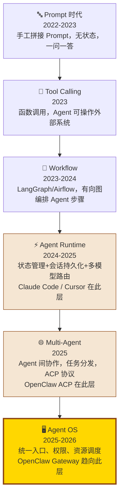

# 第 1 章：项目定位与技术演进

> **核心观点**：OpenClaw 不是 Agent Framework，而是 Agent Runtime Platform——它解决的不是"如何写 Agent 代码"，而是"Agent 代码运行在哪里、如何与世界交互"。

---

## 业务背景

### AI Agent 演进的三个阶段困境

**第一阶段：框架碎片化（2023-2024）**

LangChain、LlamaIndex、AutoGen 解决了"如何构建 Agent"的问题，却遗留了三个根本困境：

1. **交付渠道碎片化**：Agent 构建好了，用户怎么用？网页？API？每次都要单独开发前端
2. **运行时不稳定**：Agent 长期运行时的状态管理、异常恢复、资源控制缺乏统一标准
3. **企业化缺失**：安全审计、权限控制、多用户隔离——框架层几乎不考虑这些问题

**第二阶段：单点工具爆发（2024-2025）**

Claude Code 解决了"Coding AI"，Perplexity 解决了"Search AI"，Notion AI 解决了"Writing AI"。但这些工具都是垂直的孤岛——用户不得不在多个 AI 工具之间切换，上下文无法流动。

**第三阶段：Agent Platform 需求涌现（2025-2026）**

用户真正需要的是：**一个统一的 AI 助手，在我已有的通讯工具上回答我，理解我的历史上下文，能完成复杂任务，运行在我自己的设备上**。这正是 OpenClaw 的定位。

---

## 技术演进路线



**OpenClaw 的精确定位**：处于 Agent Runtime → Multi-Agent → Agent OS 的演进边界上。它不是单纯的 Framework（不告诉你怎么写 Agent），也不是完整的 Agent OS（还没有完整的资源调度和计费），但它比任何 Framework 都更接近"平台"的形态。

---

## 架构设计

### OpenClaw 的本质定义

用一句话定义：**OpenClaw = Agent Runtime + Channel OS + Plugin Platform**

```
┌─────────────────────────────────────────────────────────────────┐
│                    用户（任何通讯平台）                           │
│  Telegram  Discord  Slack  WhatsApp  iMessage  Web  IRC ...     │
└────────────────────┬────────────────────────────────────────────┘
                     │ 统一消息格式
┌────────────────────▼────────────────────────────────────────────┐
│                   Gateway（Agent OS 内核）                       │
│  认证 · 路由 · 速率限制 · 健康监控 · 配置热重载                  │
└────────────────────┬────────────────────────────────────────────┘
                     │
┌────────────────────▼────────────────────────────────────────────┐
│               Agent Runtime（执行内核）                          │
│  attempt.ts 5377行 · RuntimePlan · Context Engine               │
└──────┬──────────────────────────────────────────────────────────┘
       │
┌──────▼───────────────────────────────────────────────────────────┐
│              Plugin Platform（能力总线）                          │
│  Skills  Tools  Memory  LLM Providers  Channel Adapters         │
└─────────────────────────────────────────────────────────────────┘
```

### 三种框架的对比定位

| 维度 | Framework（LangGraph/AutoGen） | Tool（Claude Code） | Platform（OpenClaw） |
|---|---|---|---|
| **解决问题** | 如何构建 Agent 逻辑 | 特定场景的 AI 工具 | Agent 在哪里运行、如何交付 |
| **用户** | 开发者 | 最终用户 | 开发者 + 最终用户 |
| **多租户** | 不考虑 | 不考虑 | 核心设计目标 |
| **运行时** | 库，嵌入应用 | 独立进程 | 长期运行的服务 |
| **通道** | API 或自己实现 | 终端/IDE | 20+ 消息通道开箱即用 |
| **扩展方式** | 代码扩展 | 无扩展 | Plugin SDK |

---

## 设计思想

### 思想一：渠道与能力分离（Channel ≠ Capability）

OpenClaw 最深刻的设计决策是：**将"AI 能做什么"（Capability，通过 Skills/Tools/Plugins 实现）与"用户从哪里用"（Channel，通过 Gateway 实现）完全解耦**。

这类似于后端服务的"计算与 I/O 分离"——Core 业务逻辑不应该知道自己是在 Telegram 还是 Slack 上运行。

**工程意义**：新增一个通道（比如飞书）不需要改任何 Agent 逻辑；开发一个新 Skill 不需要了解任何通道细节。

### 思想二：以文件系统为 API（Filesystem as API）

Skills 以 Markdown 文件存在于文件系统，Memory 以 `MEMORY.md` 文件存在于工作区，Session 以 JSONL 文件存在于 `~/.openclaw/sessions/`。

这是 Unix 哲学的延伸：**一切皆文件**。用户可以用任何文本编辑器修改 Skill，用 git 管理 Skill 变更历史，用 rsync 同步 Skill 到多台机器。

### 思想三：强默认值 + 显式旋钮（Secure by Default）

来自 `VISION.md` 的设计哲学：*"strong defaults without killing capability"*。

默认拒绝所有未批准的 Shell 命令、默认要求 Gateway 认证、默认启用沙盒。但通过显式配置（`dangerouslyAllowAllExec`、`sandbox.mode = "none"` 等）用户可以解锁高权限操作——代价是安全审计会标记这些配置。

---

## 与其他方案对比

### Claude Code vs OpenClaw：工具 vs 平台

Claude Code 的核心设计假设：**单用户、本地文件系统、短生命周期对话**。它是一个面向开发者的编程助手工具，极致优化了"理解代码、编写代码、执行代码"这一条主路径。

OpenClaw 的核心设计假设：**多用户（通过多通道）、多设备、长期运行**。它假设 Agent 是你生活的一部分，而不是开发工作流里的一个工具。

### LangGraph vs OpenClaw：编排 vs 运行时

LangGraph 是**图编排框架**：你用 Python 定义 State、Node、Edge，LangGraph 按图执行。它非常适合有明确决策流程的任务（如客服流程、审批流程），但它不解决"Agent 如何与用户交互"、"Agent 如何长期运行"、"Agent 如何在多个平台上工作"。

OpenClaw 是 **Runtime Platform**：你声明 Skill（Markdown）、安装 Plugin（npm），Runtime 负责执行、状态管理、渠道交付。

### Hermes vs OpenClaw：记忆优先 vs 能力优先

Hermes Agent 将"长期记忆"和"自我反思"放在核心——它的目标是 AI 能从历史交互中学习，形成关于用户的持久知识。

OpenClaw 将"能力编排"和"渠道交付"放在核心——它的目标是 AI 能在你所在的地方帮你做事。

两者的记忆设计选择映射了根本性的产品哲学差异：Hermes 认为"记得你"更重要，OpenClaw 认为"能帮你"更重要。

---

## 企业级落地建议

**OpenClaw 适合作为企业 Agent 平台的"运行时底座"，但需要三类补强：**

1. **身份系统**：OpenClaw 的认证模型是单用户/单 Gateway 设计，企业需要接入 SSO/LDAP，并实现基于 RBAC 的多用户隔离
2. **可观测性**：缺少生产级的 Trace/Metric/Log 一体化，需要接入 OpenTelemetry
3. **集中化 Memory**：OpenClaw 的 Memory 是本地文件，企业需要统一的向量数据库 + 检索平台

---

## 优缺点分析

**优势**
- 通道支持开箱即用（20+ 个），不需要自己接入各平台 API
- 插件系统成熟，扩展成本低
- 安全设计考虑周全（沙盒、审计、白名单）
- 以文件系统为 API，运维友好

**局限**
- 单机部署模型，缺乏横向扩展（无 Redis 集群/消息队列）
- 用户体系简单（单 Gateway 模式），不适合多租户 SaaS
- LLM 费用可见性不足（缺乏成本追踪报表）
- 测试覆盖虽然 3625 个测试文件，但 E2E 测试依赖环境较重

**扩展性**：插件 API 边界清晰，扩展成本可控。但 Core 代码（尤其 `attempt.ts`）5000+ 行的单体函数是可维护性的隐患。

**维护成本**：pnpm monorepo + TypeScript，工程质量高。但 20+ 个通道插件各有其平台 API 变化风险，维护压力长期存在。
