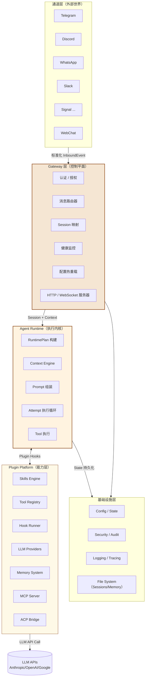
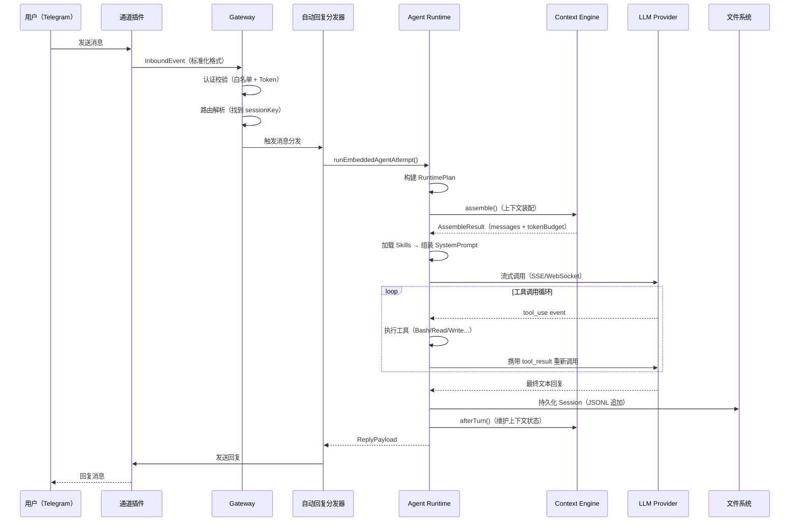
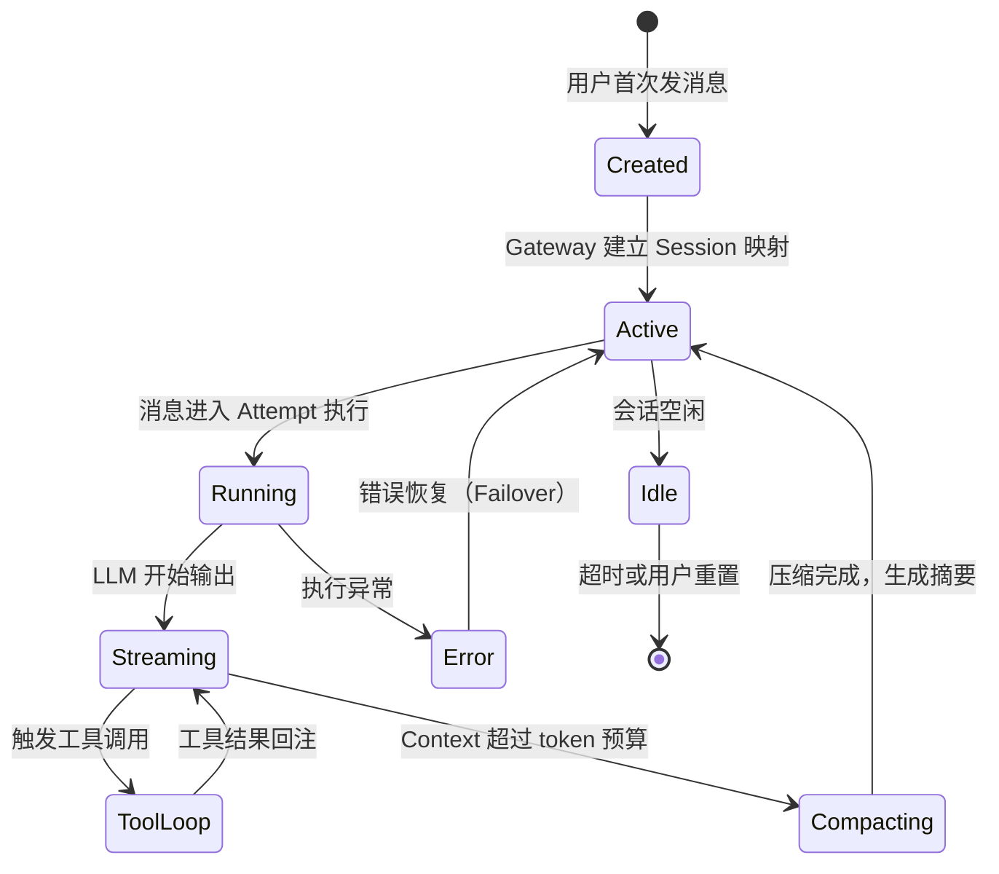

# 第 2 章：整体架构设计

> **核心观点**：OpenClaw 的架构是"反转的 MVC"——在传统 MVC 中，View 主动请求 Controller；在 OpenClaw 中，Channel（View）被动等待 Gateway（Controller）调度，Agent（Model）通过 Plugin 系统注入能力。

---

## 业务背景

设计一个多通道 AI 助手系统，最朴素的做法是：为每个通道写一个 Bot（TelegramBot、DiscordBot...），每个 Bot 内部调用 LLM API。这个方案在 1-2 个通道时可行，但面临以下问题：

- **代码重复**：业务逻辑（会话管理、安全校验、Tool 调用）在每个 Bot 里都要重写
- **状态不一致**：同一用户在 Telegram 和 Slack 的对话上下文无法共享
- **扩展困难**：增加新通道意味着完整重写一套 Bot 代码
- **运维分散**：每个 Bot 独立部署，配置、监控、更新各自为政

OpenClaw 的架构设计目标是：**让 AI 逻辑与通道完全解耦，同时通过统一的 Gateway 提供集中化的控制面**。

---

## 架构设计

### 系统全景架构图



### 请求生命周期

从用户发送一条消息，到收到 AI 回复，完整经历 10 个阶段：



### 上下文生命周期



---

## 核心源码

### 关键接口：AgentRuntimePlan

```typescript
// 文件路径：src/agents/runtime-plan/types.ts
// RuntimePlan 是"执行前查询计划"——在真正调用 LLM 之前，把所有决策预先计算好
export type AgentRuntimePlan = {
  // 选定的传输层（SSE 或 WebSocket）
  transport: AgentRuntimeTransport;     // "sse" | "websocket" | "auto"
  // 选定的 Prompt 模式
  promptMode: AgentRuntimePromptMode;   // "full" | "minimal" | "none"
  // 思考深度（模型推理级别）
  thinkingLevel?: AgentRuntimeThinkLevel; // "off" | "low" | "medium" | "high" | "max"
  // 失败原因分类（用于 Failover 决策）
  failoverReason?: AgentRuntimeFailoverReason;
  // Provider 级 Hook 句柄
  providerHandle?: ProviderRuntimePluginHandle;
};
```

**设计意义**：RuntimePlan 模式借鉴了数据库查询计划的思想——在执行之前预先计算最优路径。这使得 Failover（模型降级、传输切换）可以在 Plan 层决策，而不是在执行深处硬编码 if/else。

### 关键实现：Failover 分类器

```typescript
// 文件路径：src/agents/embedded-agent-runner/result-fallback-classifier.ts
// 将 LLM 调用失败原因分类，指导 Failover 策略
export type AgentRuntimeFailoverReason =
  | "auth"          | "auth_permanent"
  | "rate_limit"    | "overloaded"
  | "billing"       | "server_error"
  | "timeout"       | "model_not_found"
  | "format"        | "empty_response"
  | "unknown";
```

---

## 设计思想

### 为什么用"Attempt"而不是"Run"？

OpenClaw 将每次 LLM 调用单元命名为 **Attempt（尝试）**，而不是 Run 或 Call。这个命名揭示了一个重要设计哲学：**每次 Agent 执行都可能失败，需要重试、降级或恢复**。

Attempt 是事务性的：
- 它有明确的开始（获取写锁）和结束（释放写锁 + 持久化）
- 它有失败分类（`AgentRuntimeFailoverReason`），决定是否重试、切换模型
- 它有超时保护（`resolveAgentTimeoutMs`）

这与 Claude Code 的设计形成对比：Claude Code 的每次交互更像一次函数调用，而 OpenClaw 的 Attempt 更像一次数据库事务。

### 为什么 Gateway 是独立的层？

Gateway 不仅仅是消息路由器，它是整个系统的"控制平面"：

1. **统一认证**：不管用户从哪个通道来，都经过同一套认证逻辑
2. **速率限制**：防止单用户/单通道的请求风暴影响其他会话
3. **配置热重载**：Agent 行为可以在不重启 Gateway 的情况下更新
4. **健康监控**：持续探测每个通道的连接状态，自动重连

将这些功能放在 Gateway 层（而不是每个通道插件自己实现）是**横切关注点分离**的经典实践。

---

## 与其他方案对比

| 架构维度 | OpenClaw | LangGraph | AutoGen | Claude Code |
|---|---|---|---|---|
| **请求入口** | Gateway（统一控制面） | 直接调用 Python 函数 | ConversationGroup | CLI/API |
| **状态存储** | JSONL 文件系统 | 图状态（内存/可选持久化） | 内存 | 文件系统（workdir） |
| **执行模型** | Attempt 事务 | 图节点顺序执行 | 消息传递 | 函数调用循环 |
| **失败恢复** | Failover 分类器 + Provider 降级 | 图重试边 | 基本重试 | 无显式 Failover |
| **多用户** | 通过 sessionKey 隔离 | 不考虑 | 不考虑 | 不适用 |
| **可扩展性** | Plugin + Hook 系统 | Graph 扩展 | 代码扩展 | 无 |

---

## 企业级落地建议

**问题：OpenClaw 的 Gateway 是单点的**

当前的 Gateway 是单进程服务，没有内置的横向扩展支持。企业部署时需要：

1. **无状态化 Gateway**：将 Session 映射迁移到 Redis，使 Gateway 可以水平扩展
2. **消息队列解耦**：在 Gateway 和 Runtime 之间引入消息队列（Kafka/RabbitMQ），实现异步执行和削峰
3. **多 Gateway 协调**：通过一致性哈希保证同一用户的消息路由到同一 Runtime 实例（会话亲和性）

**推荐企业架构**：

```
用户 → API Gateway（Kong/Nginx）
        → OpenClaw Gateway 集群（3+节点，Session 状态存 Redis）
        → Kafka（消息队列，解耦执行）
        → Agent Runtime 池（按任务类型分组）
        → 共享 Memory 平台（向量数据库）
```

---

## 优缺点分析

**优势**：层次清晰，Gateway/Runtime/Plugin 三层分工明确，新通道接入不需要修改 Agent 逻辑

**局限**：单机部署模型，Gateway 是单点故障，缺乏分布式状态管理

**扩展性**：插件边界清晰，但 `attempt.ts` 的 5000+ 行单体函数是长期维护的隐患——需要拆分为更细粒度的协调器

**维护成本**：20+ 通道各有平台 API 变更风险，建议建立通道健康检测 + 自动化兼容测试
