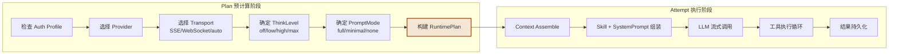
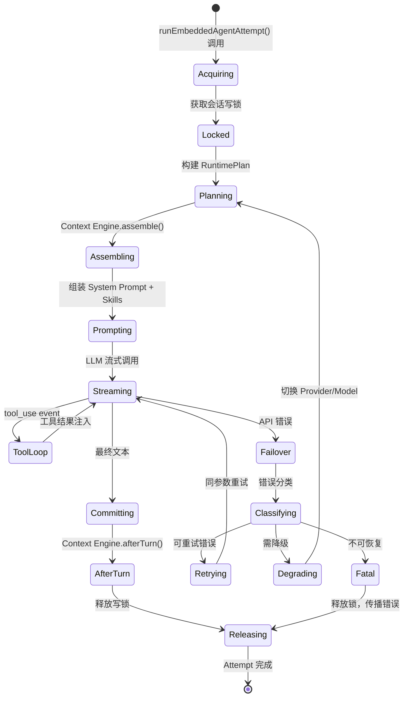

# 第 3 章：Agent Runtime 深度解析

> **核心观点**：OpenClaw 的 Agent Runtime 是一个"有状态事务执行器"——它不仅调用 LLM，还负责 Plan 预计算、Attempt 事务保护、Context 动态管理、Failover 分类降级，以及工具执行的完整生命周期。

---

## 业务背景

一个生产级的 AI Agent 面临的挑战远不止"发送 API 请求、接收回复"：

- **模型失败如何恢复？** 限速、账单超限、网络超时——每种失败的恢复策略不同
- **上下文超限如何处理？** 历史对话无限增长，必须有机制压缩而不丢失关键信息
- **工具调用如何隔离？** Agent 执行的 Shell 命令可能破坏用户系统
- **多轮对话如何持久化？** 服务重启后历史上下文不能丢失
- **子 Agent 如何与父 Agent 协调？** 防止子 Agent 回调修改父 Agent 的状态

这些问题的答案不在 LLM API 里，而在 Runtime 层的设计里。

---

## 架构设计

### RuntimePlan 预计算模式

OpenClaw 在调用 LLM 之前，先构建 `AgentRuntimePlan`——将所有执行决策集中在一个不可变的 Plan 对象中：



**为什么这样设计？**

传统 Agent 框架在执行过程中动态决定"用哪个 Provider""用 SSE 还是 WebSocket"。这会导致：
- 决策逻辑散落在执行路径的各个角落
- Failover 时很难在正确的时机切换参数
- 测试困难（无法提前验证执行计划）

Plan 预计算将所有决策前置，执行阶段只需"按计划行事"。

### Attempt 事务模型



### 执行失败分类与 Failover 策略

```typescript
// src/agents/embedded-agent-runner/result-fallback-classifier.ts
export type AgentRuntimeFailoverReason =
  | "auth"               // 认证失败 → 检查 API Key
  | "auth_permanent"     // 永久认证失败 → 不重试
  | "rate_limit"         // 速率限制 → 退避重试
  | "overloaded"         // 服务过载 → 切换 Provider
  | "billing"            // 账单超限 → 切换 Provider
  | "server_error"       // 服务器错误 → 重试
  | "timeout"            // 超时 → 重试或切换传输层
  | "model_not_found"    // 模型不存在 → 降级到备选模型
  | "format"             // 响应格式错误 → 降级 PromptMode
  | "empty_response"     // 空响应 → 重试
  | "unknown";           // 未知 → 保守策略：报错不重试
```

**这 11 种失败类型对应完全不同的恢复策略**：`rate_limit` 需要退避重试同一 Provider；`billing` 需要切换到备选 Provider；`model_not_found` 需要降级模型；`format` 可能需要降级 PromptMode。将失败"分类"成枚举值，是让 Failover 策略可配置的关键。

### 思考深度（ThinkLevel）控制

```typescript
// src/agents/runtime-plan/types.ts
export type AgentRuntimeThinkLevel =
  | "off"       // 禁用思考（最快，最省 token）
  | "minimal"   // 极简思考
  | "low"       // 浅思考
  | "medium"    // 中度思考
  | "high"      // 深度思考
  | "xhigh"     // 超深思考
  | "adaptive"  // 自适应（Runtime 根据任务复杂度动态选择）
  | "max";      // 最大思考（Sonnet Extended Thinking）
```

`adaptive` 模式是企业场景的关键能力：简单问答用 `off` 省成本，复杂代码生成自动升级到 `high`。

---

## 核心源码

### Context Engine 接口（可插拔设计）

Context Engine 是 OpenClaw 最精妙的设计之一——整个上下文管理是一个**可插拔的接口**：

```typescript
// src/context-engine/types.ts（精简版）
export interface ContextEngine {
  readonly info: ContextEngineInfo;
  
  // 会话初始化（可选）：导入历史上下文
  bootstrap?(params: { sessionId: string; sessionFile: string }): Promise<BootstrapResult>;
  
  // 消息摄入：每条消息都通过此方法进入引擎
  ingest(params: { sessionId: string; message: AgentMessage }): Promise<IngestResult>;
  
  // 上下文装配：核心方法，在 token 预算内返回最优消息集合
  assemble(params: {
    sessionId: string;
    messages: AgentMessage[];
    tokenBudget?: number;     // 可用 token 上限
    model?: string;           // 允许引擎按模型调整策略
    prompt?: string;          // 当前 prompt（支持检索型引擎）
  }): Promise<AssembleResult>;
  
  // 上下文压缩：触发摘要生成或修剪旧消息
  compact(params: {
    sessionId: string;
    tokenBudget?: number;
    force?: boolean;
    compactionTarget?: "budget" | "threshold";
    abortSignal?: AbortSignal;  // 支持取消
  }): Promise<CompactResult>;
  
  // 轮次结束后：引擎可在此做后台压缩决策
  afterTurn?(params: {
    messages: AgentMessage[];
    tokenBudget?: number;
  }): Promise<void>;
}
```

**设计关键**：`assemble()` 方法的签名透露了深层设计意图：
- `tokenBudget` 参数——引擎在预算内自主决定保留哪些消息
- `model` 参数——允许引擎为不同上下文窗口大小的模型调整策略
- `prompt` 参数——支持"检索型"引擎（RAG 引擎可以根据当前 prompt 检索最相关的历史）

### AssembleResult 的 promptAuthority 字段

```typescript
// src/context-engine/types.ts
export type AssembleResult = {
  messages: AgentMessage[];
  estimatedTokens: number;
  // 控制 token overflow 预检的权威来源
  promptAuthority?: "assembled" | "preassembly_may_overflow";
  // 引擎可以注入额外的 System Prompt 指令
  systemPromptAddition?: string;
  // 支持线程复用的持久化后端（减少冗余 token）
  contextProjection?: ContextEngineProjection;
};
```

`contextProjection` 是一个高级特性：支持"线程引导模式"（`thread_bootstrap`）的引擎可以注入一次上下文后复用同一后端线程，避免每轮重复发送大量 token。这在处理超长代码库分析时可以节省 30-50% 的 token 消耗。

---

## 设计思想

### 思想一：将决策前置（Pre-computation Pattern）

RuntimePlan 模式的本质是**将运行时决策提升到计划期**。这是数据库查询优化器的经典思路——先生成执行计划，再按计划执行，中途不临时决策。

好处：
1. 计划可以被序列化和记录（便于调试）
2. Failover 时可以完整替换计划，而不是打补丁
3. 测试时可以直接构造 Plan 而不需要启动完整的执行流程

### 思想二：Context Engine 作为策略接口

默认的 Context Engine 实现是基于滑动窗口的简单算法——保留最近 N 条消息在 token 预算内。但接口设计允许第三方插件实现更复杂的策略：

- **RAG 引擎**：将历史消息存入向量数据库，根据当前 prompt 检索最相关的记忆
- **摘要引擎**：定期将旧消息压缩成摘要，保持上下文连贯性
- **重要性引擎**：给每条消息打"重要性分数"，优先保留高重要性消息

这个接口的开放性是 OpenClaw 区别于大多数 Agent 框架的核心优势——上下文管理策略完全可定制。

---

## 与其他方案对比

| Runtime 特性 | OpenClaw | LangGraph | AutoGen | CrewAI |
|---|---|---|---|---|
| **执行单元** | Attempt（事务） | Graph 节点 | ConversationMessage | Task |
| **失败分类** | 11 种，按类型恢复 | 自定义重试逻辑 | 简单重试 | 简单重试 |
| **Context 管理** | 可插拔接口 | 手动管理 | 手动管理 | 手动管理 |
| **多模型支持** | Plan 层决策，运行时切换 | 节点级配置 | 对话组配置 | Agent 级配置 |
| **流式输出** | SSE/WebSocket 双传输 | 不内置 | 不内置 | 不内置 |
| **持久化** | JSONL 自动持久化 | 可选持久化 | 不内置 | 不内置 |
| **ThinkLevel** | 8 级自适应控制 | 无 | 无 | 无 |

---

## 企业级落地建议

**建议 1：为不同任务类型配置不同的 ThinkLevel**

```json
{
  "agents": {
    "customer-support": { "thinkingLevel": "low" },
    "code-review": { "thinkingLevel": "high" },
    "document-qa": { "thinkingLevel": "minimal" }
  }
}
```

**建议 2：实现企业级 Context Engine 插件**

标准的滑动窗口引擎对企业场景不够。建议实现一个：
- 接入企业知识库（Confluence/Notion）的 RAG 引擎
- 定期自动摘要的持久化引擎
- 基于用户权限过滤历史上下文的安全引擎

**建议 3：Failover 链配置**

```json
{
  "providers": {
    "primary": "anthropic/claude-opus-4",
    "fallback": ["openai/gpt-4.1", "google/gemini-2.5-pro"],
    "failoverTriggers": ["overloaded", "billing", "rate_limit"]
  }
}
```

---

## 优缺点分析

**优势**：RuntimePlan 预计算 + Attempt 事务保护，使 Agent 执行具备数据库级别的可靠性

**优势**：Context Engine 插件接口，上下文管理策略完全可替换——这是向量数据库接入的正确扩展点

**局限**：`attempt.ts` 超过 5000 行，是单体编排函数。虽然模块导入清晰，但核心逻辑高度耦合，难以独立测试各子阶段

**局限**：`adaptive` ThinkLevel 的具体决策算法不透明，难以调试为何某次选择了 `high` 而不是 `low`

**改进方向**：将 attempt.ts 拆分为 PlanPhase、AssemblePhase、StreamPhase、CommitPhase 四个独立的协调器，每个阶段可以独立测试和替换
