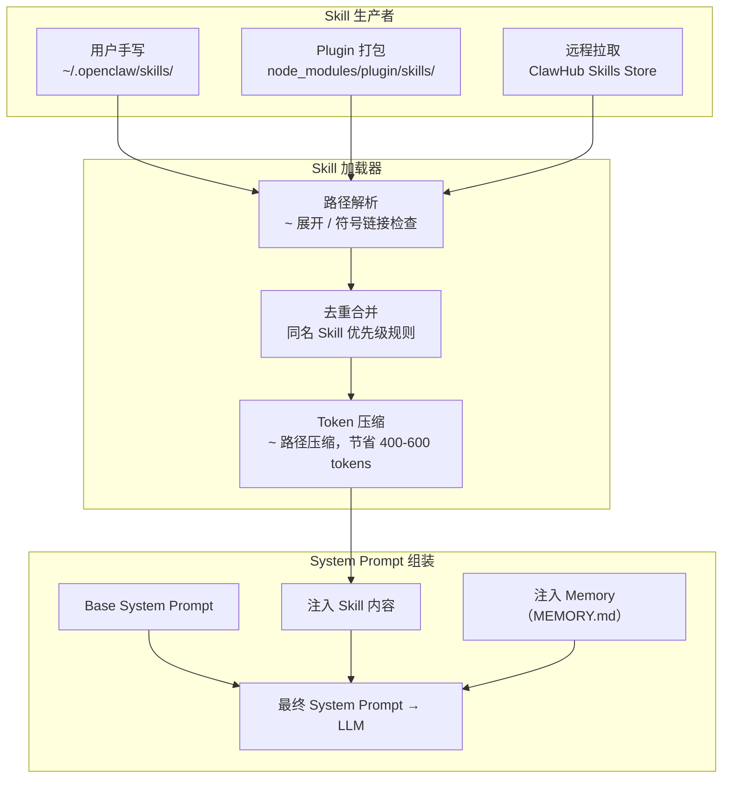

# 第 4 章：Skill Architecture 深度解析

> **核心观点**：Skill 是 OpenClaw 最重要的抽象创新——它把"告诉 AI 如何做事"从代码世界提升到了配置世界，使 Agent 行为可以被非工程师修改、通过 Git 版本控制、在不同部署间复用。

---

## 业务背景

### 传统 Agent 的"硬编码行为"困境

在传统 Agent 框架中，Agent 的行为逻辑通常以两种方式注入：

1. **System Prompt 硬编码**：直接在代码里拼接巨型 System Prompt 字符串
2. **代码化规则**：写 Python/TypeScript 函数实现"当遇到 X 情况时执行 Y 操作"

这两种方式都有根本缺陷：
- System Prompt 改一行字，需要重新部署代码
- 产品经理无法在不借助工程师的情况下调整 AI 的行为
- 不同的 Agent 有类似的行为（如"礼貌回复用户"），但无法复用
- 行为变更历史散落在代码 commit 里，难以追溯

### OpenClaw Skill 的解法

Skill 是一个**以 Markdown 文件为载体的行为声明单元**。每个 Skill 文件描述：
- Agent 在特定场景下应当怎么做
- 有哪些约束（不能做什么）
- 如何使用特定的工具

Skill 文件存在于文件系统中，可以用文本编辑器修改，可以用 Git 追踪历史，可以通过插件分发给多个 Agent。

---

## 架构设计

### Skill 在 Runtime 中的位置



### Skill vs Prompt vs Tool vs Workflow 的定位

这是架构师最需要厘清的边界：

```
┌──────────────────────────────────────────────────────────────────┐
│  声明"AI 的行为规范"    →  Skill（Markdown 文件）                 │
│  告诉 AI"可以做什么"    →  Tool（TypeScript 函数 + JSON Schema）  │
│  控制"做什么的顺序"     →  Workflow / Plan（Agent 自主决策）      │
│  存储"AI 记得什么"      →  Memory（MEMORY.md 文件）               │
└──────────────────────────────────────────────────────────────────┘
```

关键区别：
- **Skill 影响 System Prompt**，在调用 LLM 之前生效
- **Tool 影响可用函数**，在 LLM 生成 tool_use 之后生效
- **Skill 是静态的**（配置时确定），**Tool 是动态的**（执行时调用）

### ~ 路径压缩机制

OpenClaw 在把 Skill 内容注入 System Prompt 时，会对文件路径做 `~` 压缩：

```
/Users/alice/.openclaw/skills/code-review.md
→ ~/skills/code-review.md（节省 ~25 个字符）
```

对于一个有 20 个 Skill 的用户，这能节省 400-600 个 token/每次对话。看似微小的优化，在长期运行的 Agent 上积累成显著的成本节省。这个细节体现了 OpenClaw 对 token 经济性的精细设计意识。

---

## 核心源码

### Skills 系统核心文件

```bash
# Skill 加载器的关键路径
src/agents/skills/          # Skill 加载和解析
src/agents/system-prompt.types.ts   # System Prompt 组装类型
```

### Skill 的 Markdown 格式规范

一个典型的 Skill 文件：

```markdown
# Code Review Skill

## 行为规范
- 在 Review 代码时，总是先理解业务上下文，再看技术实现
- 优先指出安全漏洞和性能问题，其次是代码风格
- 使用 Read 工具阅读完整文件后再评论，禁止基于 diff 片段得出结论

## 约束
- 不要修改文件，只提供建议
- 不要对测试文件做风格评论
- 如果看到 .env 文件，立即停止并警告用户

## 工具使用
- 使用 `Bash` 执行 `git diff` 获取变更
- 使用 `Read` 工具阅读相关文件
- 禁止使用 `Write` 工具
```

Skill 的核心价值在于：**这个文件可以被产品经理、运营人员直接修改，无需工程师介入**。

### 系统提示类型

```typescript
// src/agents/system-prompt.types.ts
export type SystemPromptConfig = {
  basePrompt?: string;         // 基础 System Prompt
  skills?: SkillConfig[];      // 加载的 Skill 列表
  memoryFile?: string;         // MEMORY.md 路径
  contextAdditions?: string[]; // Context Engine 注入的额外指令
};
```

---

## 设计思想

### 思想一：声明式行为 vs 命令式代码

Skill 代表的是**声明式行为编程**——你描述"AI 应该怎样"，而不是编写"AI 执行哪些步骤"。

这类似于：
- CSS 是声明式的（描述样式），而不是命令式的（一行行绘制像素）
- SQL 是声明式的（描述要什么数据），而不是命令式的（一步步遍历数据库）

声明式的好处：**行为意图清晰，可读性高，非技术人员可以参与维护**。

### 思想二：Filesystem as Distribution（文件系统即分发机制）

Skill 文件可以通过多种方式分发：
- 直接放在 `~/.openclaw/skills/` 目录（个人使用）
- 打包在 npm 插件里（团队/企业分发）
- 从 ClawHub Skill Store 安装（社区共享）

这与 VSCode Extension 的分发模式高度相似——Skill 是"AI 行为的扩展包"。

### 思想三：Skill 的优先级与覆盖机制

当用户自定义 Skill 与插件提供的 Skill 同名时，用户的 Skill 优先生效。这是"本地覆盖远程"原则，保证用户永远对 Agent 行为有最终控制权。

---

## 与其他方案对比

| 行为配置机制 | OpenClaw Skill | Claude Code CLAUDE.md | LangGraph State | AutoGen SystemMessage |
|---|---|---|---|---|
| **存储格式** | Markdown 文件 | Markdown 文件 | Python 代码 | Python 字符串 |
| **非技术可编辑** | ✅ 是 | ✅ 是 | ❌ 否 | ❌ 否 |
| **Git 版本控制** | ✅ 天然支持 | ✅ 天然支持 | 需要代码 Git | 需要代码 Git |
| **组合/复用** | ✅ 多 Skill 叠加 | ✅ 多文件组织 | ❌ 无原生机制 | ❌ 无原生机制 |
| **Plugin 分发** | ✅ npm 插件打包 | ❌ 仅本地 | ❌ 需自建 | ❌ 需自建 |
| **Token 优化** | ✅ ~ 路径压缩 | ❌ 无 | N/A | N/A |
| **覆盖机制** | ✅ 用户优先于插件 | ❌ 无优先级 | N/A | N/A |

**Claude Code 的 CLAUDE.md 与 OpenClaw Skill 的本质区别**：CLAUDE.md 是单个会话/工作区级别的行为指令，而 Skill 是跨会话、可插件化、可分层覆盖的行为规范系统。两者设计目标不同——CLAUDE.md 针对开发工作区，Skill 针对长期运行的 Agent 平台。

---

## 企业级落地建议

**建议 1：建立企业 Skill 库**

```
企业 Skill 仓库（Git）
├── skills/
│   ├── base/              # 全员通用 Skill（公司行为规范）
│   │   ├── security.md    # 禁止输出密钥等安全 Skill
│   │   └── compliance.md  # 合规要求
│   ├── engineering/       # 工程团队专用
│   │   ├── code-review.md
│   │   └── architecture.md
│   └── product/           # 产品团队专用
│       └── user-research.md
```

**建议 2：通过 npm 内部包分发团队 Skill**

```json
// @company/openclaw-skills/package.json
{
  "name": "@company/openclaw-skills",
  "main": "index.js",
  "openclaw": {
    "skills": ["./skills/**/*.md"]
  }
}
```

**建议 3：为 Skill 建立变更审查流程**

Skill 文件修改会直接影响 AI 行为。建议：
- Skill 文件变更需要 PR 审批（至少两人）
- 生产环境的 Skill 变更前在测试环境验证
- 建立 Skill 变更与 AI 行为变化的对应关系记录

---

## 优缺点分析

**优势**：Markdown 格式极低门槛，非工程师可以独立维护 Agent 行为；Plugin 分发机制使 Skill 可以在组织内规模化复用

**优势**：`~` 路径压缩和 Skill 去重机制体现了对 token 经济性的精细设计

**局限**：Skill 是纯文本，无法表达复杂的条件逻辑（"当用户是 VIP 时使用这个行为规范"）——复杂条件逻辑仍然需要回到 Tool 或 Plugin 代码

**局限**：多个 Skill 可能产生冲突的指令（两个 Skill 都要求 AI 优先使用不同的工具）。当前没有内置的冲突检测机制

**改进方向**：引入 Skill 优先级数字（不只是"用户优先"），以及 Skill 冲突检测警告
