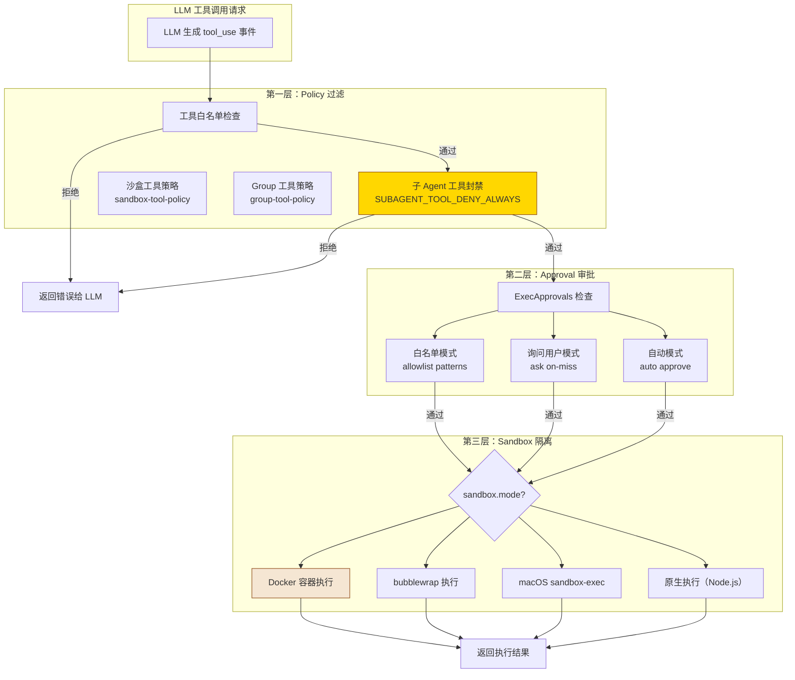

# 第 5 章：Tool Architecture 深度解析

> **核心观点**：OpenClaw 的 Tool 架构是一个"多层权限栅栏系统"——工具调用不是简单的函数执行，而是经过 Policy→Approval→Sandbox 三重门控的受管执行，保证 Agent 能力强大但不越界。

---

## 业务背景

Tool 调用是 Agent 的核心能力之一——让 AI 能够执行代码、读写文件、调用 API。但 Tool 调用也是最大的安全风险来源：

- **能力越界**：子 Agent 调用了应该只有父 Agent 才能用的工具
- **命令注入**：LLM 被诱导执行恶意 Shell 命令（Prompt Injection）
- **权限升级**：用户通过普通对话触发了本应需要管理员权限的操作
- **资源滥用**：Agent 在循环中反复调用 API，产生巨额费用或触发限速

OpenClaw 的 Tool 架构设计目标是：**让 Agent 有足够强大的工具能力，同时通过系统化的权限控制防止任何工具被滥用**。

---

## 架构设计

### 三层权限栅栏



### 子 Agent 工具硬封禁

```typescript
// src/agents/agent-tools.policy.ts
// 子 Agent 永远不能调用这些工具——防止子 Agent 修改 Gateway 状态或创建新会话
export const SUBAGENT_TOOL_DENY_ALWAYS = [
  "gateway",       // 禁止修改 Gateway 配置
  "agents_list",   // 禁止枚举其他 Agent
  "session_status", // 禁止读取全局 Session 状态
  "cron",          // 禁止创建定时任务
  "sessions_send", // 禁止向其他会话发送消息
];
```

**为什么是硬编码的常量而不是配置项？**

这是安全设计的刻意选择——如果这些工具可以被配置解锁，则 Prompt Injection 攻击可以通过修改配置来绕过限制。将其硬编码为常量，使得"子 Agent 拥有完整系统权限"在任何配置下都不可能发生。

### 执行模式分类

```typescript
// src/infra/exec-approvals.ts
// 执行宿主
export type ExecHost = "sandbox" | "gateway" | "node";

// 安全等级
export type ExecSecurity = "deny" | "allowlist" | "full";

// 询问策略
export type ExecAsk = "off" | "on-miss" | "always";

// 执行模式
export type ExecMode =
  | "deny"       // 拒绝所有执行
  | "allowlist"  // 仅允许白名单中的命令
  | "ask"        // 每次询问用户
  | "auto"       // 自动批准已知安全的命令
  | "full";      // 允许所有执行（危险！）
```

### 沙盒配置

```typescript
// src/agents/sandbox/config.ts
// Docker 沙盒的"危险旋钮"——显式命名让审计人员一眼看到风险点
export const DANGEROUS_SANDBOX_DOCKER_BOOLEAN_KEYS = [
  "dangerouslyAllowReservedContainerTargets",
  "dangerouslyAllowExternalBindSources",
  "dangerouslyAllowContainerNamespaceJoin",
] as const;
```

这个命名约定（`dangerously` 前缀）贯穿整个 OpenClaw 代码库——任何高风险配置都以 `dangerously` 开头，使代码审计工具可以用简单的字符串搜索找到所有潜在风险点。

---

## 核心源码

### Tool Policy 解析流程

```typescript
// src/agents/agent-tools.policy.ts（精简版）
export function resolveAgentToolPolicy(params: {
  isSubagent: boolean;
  sandboxMode: SandboxMode;
  groupPolicy?: GroupToolPolicy;
  userConfig: OpenClawConfig;
}): AgentToolPolicy {
  // 1. 基础策略：来自用户配置
  let policy = buildBasePolicy(params.userConfig);
  
  // 2. 沙盒修正：沙盒环境限制可用工具集
  if (params.sandboxMode !== "none") {
    policy = restrictForSandbox(policy, params.sandboxMode);
  }
  
  // 3. Group 覆盖：Group 级策略可以进一步限制
  if (params.groupPolicy) {
    policy = applyGroupPolicy(policy, params.groupPolicy);
  }
  
  // 4. 子 Agent 硬封禁：不可被覆盖
  if (params.isSubagent) {
    policy = denyTools(policy, SUBAGENT_TOOL_DENY_ALWAYS);
  }
  
  return policy;
}
```

**重要的设计决策**：子 Agent 硬封禁是**最后一步，且不可覆盖**。即使 Group Policy 试图允许这些工具，子 Agent 封禁也会强制拒绝。这是防御纵深设计（Defense in Depth）的体现。

### Tool 白名单模式

```typescript
// src/infra/exec-approvals.ts
export type ExecAllowlistPattern = {
  // 精确命令（如 "git status"）
  command?: string;
  // 正则表达式（如 "^git .*$"）
  pattern?: string;
  // 允许的工作目录（路径前缀）
  workdir?: string;
};
```

白名单模式适合企业场景：配置 `["git *", "npm test", "npm run lint"]`，Agent 可以自由运行这些命令，但任何其他命令都需要用户手动批准。

---

## 设计思想

### 思想一：Tool 安全的"不可绕过"原则

OpenClaw 的工具安全设计有一个核心原则：**关键安全限制必须是不可绕过的（non-bypassable）**。

`SUBAGENT_TOOL_DENY_ALWAYS` 是硬编码常量，不是配置项。沙盒 `dangerous*` 参数需要明确写在配置文件里，不能通过 LLM 动态开启。

这与 OWASP 的"安全设计"原则一致——安全机制本身不应该有"绕过开关"。

### 思想二：Fail-Closed vs Fail-Open

OpenClaw 的默认工具策略是 **Fail-Closed**——遇到未知/不确定情况时，拒绝执行而不是允许执行。

```
未知命令 + 白名单模式 → 拒绝（不是问用户）
子 Agent + 敏感工具 → 拒绝（不是降级执行）
沙盒失败 + 回退请求 → 拒绝（不是降级为原生执行）
```

对比其他 Agent 框架：许多框架遇到工具执行错误时会自动降级为直接执行——这种"方便但不安全"的设计在企业场景中是灾难。

### 思想三：危险旋钮需要显式命名

以 `dangerously` 开头的配置键是 OpenClaw 的安全设计惯例。这使得：
- 代码审计时，`grep "dangerously"` 即可找到所有高风险配置点
- 配置审查时，任何包含 `dangerously` 的配置文件都值得特别关注
- 新开发者看到代码时，立即意识到某段逻辑涉及高风险路径

---

## 与其他方案对比

| 工具安全维度 | OpenClaw | Claude Code | LangGraph | AutoGen |
|---|---|---|---|---|
| **子 Agent 工具封禁** | 硬编码不可绕过 | 基本隔离 | 需自行实现 | 无内置 |
| **Shell 命令白名单** | ExecAllowlist patterns | 用户审批 | 无 | 无 |
| **沙盒执行** | Docker/bubblewrap/macOS 三选一 | macOS sandbox | 无 | 无 |
| **执行审批模式** | 5 种模式（deny/allowlist/ask/auto/full） | 交互式批准 | 无 | 无 |
| **危险配置标识** | `dangerously` 前缀约定 | 无 | 无 | 无 |
| **MCP 工具支持** | ✅ MCP stdio server | ✅ MCP client | ❌ | ❌ |

---

## 企业级落地建议

**建议 1：分级工具权限矩阵**

为不同的 Agent 角色配置不同的工具权限：

```json
{
  "agents": {
    "analyst": {
      "tools": { "exec": { "mode": "allowlist", "patterns": ["python *", "jupyter *"] } }
    },
    "developer": {
      "tools": { "exec": { "mode": "auto" }, "sandbox": { "mode": "docker" } }
    },
    "admin": {
      "tools": { "exec": { "mode": "full" } }
    }
  }
}
```

**建议 2：生产环境强制沙盒**

生产环境的所有 Agent 应强制使用 Docker 沙盒，即使开发时使用了原生模式：

```json
{
  "sandbox": {
    "mode": "docker",
    "image": "company/openclaw-sandbox:latest",
    "volumeMounts": ["/data/readonly:/data:ro"]
  }
}
```

**建议 3：工具调用审计**

所有工具调用应记录到审计日志，包括：调用时间、调用工具名、参数（脱敏）、执行结果、是否被拒绝及原因。这对于满足 SOC2/ISO27001 审计要求至关重要。

---

## 优缺点分析

**优势**：三层权限栅栏（Policy→Approval→Sandbox）设计严密，`dangerously` 命名约定便于审计

**优势**：子 Agent 工具硬封禁完全阻止了权限升级攻击路径

**局限**：工具白名单配置是"模式匹配"而非"语义匹配"——`rm -rf /tmp/*` 可以匹配 `rm *` 模式，但语义上是危险的。需要补充语义安全检查层

**局限**：Docker 沙盒启动时间约 500ms-2s，对于需要快速响应的交互式 Agent 是性能瓶颈

**改进方向**：引入工具调用的语义风险评分系统，对高分命令自动升级到"需要用户审批"模式，无论当前执行模式是什么
