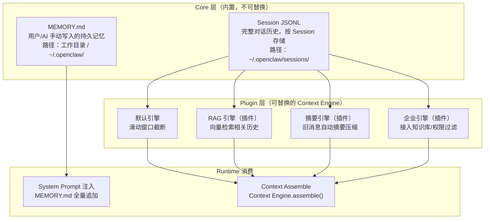
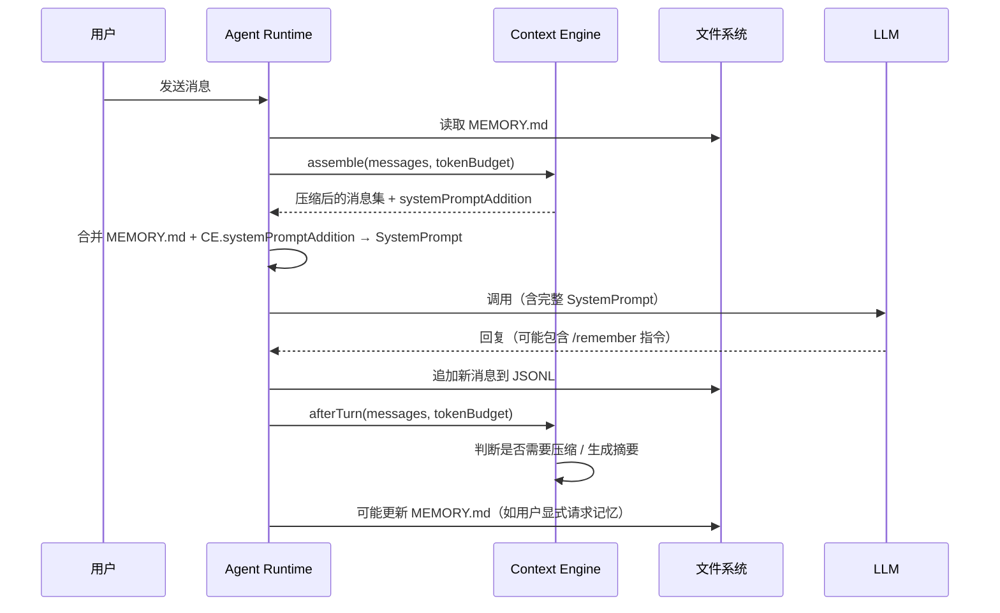

# 第 6 章：Memory Architecture 深度解析

> **核心观点**：OpenClaw 的 Memory 架构是一个"刻意简单的委托设计"——核心只提供文件系统级的 MEMORY.md，复杂记忆能力完全委托给 Context Engine 插件，避免在 Core 中绑定任何特定的记忆策略。

---

## 业务背景

AI Agent 的"记忆"是一个长期被误解的概念。常见的混淆有：

1. **会话历史 ≠ 记忆**：会话历史是同一对话的上下文，会话结束即消失
2. **向量数据库 ≠ 记忆**：向量检索是记忆的一种实现，而不是记忆本身
3. **记忆 ≠ 知识库**：记忆应该是关于"这个用户/这个任务"的个性化信息，而不是通用知识

从架构角度，AI Agent 的记忆系统需要回答三个问题：
- **记什么**：哪些信息值得跨会话持久化？
- **怎么存**：文件？数据库？向量？
- **怎么取**：全量加载？检索召回？摘要注入？

这三个问题的答案因场景而异，没有通用最优解。这正是 OpenClaw 选择将记忆实现委托给插件的原因。

---

## 架构设计

### 两层记忆架构



### MEMORY.md 的安全设计

```typescript
// src/memory/root-memory-files.ts
// 标准记忆文件名（当前版本）
export const CANONICAL_ROOT_MEMORY_FILENAME = "MEMORY.md";
// 向后兼容的旧文件名
export const LEGACY_ROOT_MEMORY_FILENAME = "memory.md";

// 安全修复目录（文件损坏时的备份恢复路径）
export const ROOT_MEMORY_REPAIR_RELATIVE_DIR = ".openclaw-repair/root-memory";
```

MEMORY.md 有一个关键的安全校验：**符号链接检测**。`resolveCanonicalRootMemoryFile()` 函数会检查路径是否为符号链接，如果是，拒绝使用。

**为什么要防止符号链接？** 这是路径穿越攻击（Path Traversal）的防御：攻击者可能创建指向 `/etc/passwd` 的符号链接 `MEMORY.md`，诱导 Agent 把系统文件作为记忆注入到 System Prompt，从而泄露敏感信息。

### Context Engine 的记忆生命周期



---

## 核心源码

### CompactResult 结构

```typescript
// src/context-engine/types.ts
export type CompactResult = {
  ok: boolean;
  compacted: boolean;
  reason?: string;
  result?: {
    summary?: string;          // 生成的摘要文本（如果有）
    firstKeptEntryId?: string; // 压缩后保留的第一条消息 ID
    tokensBefore: number;      // 压缩前的 token 数
    tokensAfter?: number;      // 压缩后的 token 数
    details?: unknown;         // 引擎特定的额外信息
    sessionId?: string;        // 压缩后的新 Session ID（如果产生了会话分叉）
    sessionFile?: string;      // 压缩后的新 Session 文件路径
  };
};
```

`CompactResult` 揭示了一个微妙设计：压缩操作可能产生一个**新的 Session**（`sessionId` 和 `sessionFile`）。这是因为 JSONL 会话文件是追加写入的，压缩后的历史无法"修改"已有 JSONL 文件——只能开启一个新 Session，用摘要替代旧的历史消息。

### 子 Agent 的记忆隔离

```typescript
// src/context-engine/types.ts
export type SubagentSpawnPreparation = {
  rollback: () => void | Promise<void>;
};

// ContextEngine 接口中的子 Agent 准备方法
prepareSubagentSpawn?(params: {
  parentSessionKey: string;
  childSessionKey: string;
  contextMode?: "isolated" | "fork";  // isolated：隔离，fork：继承父 Agent 上下文
  parentSessionId?: string;
  childSessionId?: string;
  ttlMs?: number;                      // 子 Agent 的 TTL（超时自动销毁）
}): Promise<SubagentSpawnPreparation | undefined>;
```

`contextMode: "fork"` 允许子 Agent 继承父 Agent 的部分上下文。例如，"帮我分析这段代码，然后委托给子 Agent 生成测试"——子 Agent 需要看到那段代码，但不需要看到整个父 Agent 的历史。

---

## 设计思想

### 思想一：记忆的"可插拔接口"哲学

OpenClaw Core 对记忆的唯一假设是：**存在一个可以查询的上下文装配器**。至于这个装配器如何存储、如何检索、如何压缩——完全由 Context Engine 插件决定。

这与 React 的 Hooks 设计哲学类似：Core 提供 `useContext`，具体上下文内容由用户自定义。OpenClaw Core 提供 `contextEngine.assemble()`，具体记忆策略由插件决定。

### 思想二：MEMORY.md 的"人类可读"原则

MEMORY.md 的核心设计约束是：**人类必须能直接读写这个文件**。

这个看似简单的约束产生了深远影响：
- 格式必须是 Markdown，不能是二进制
- 内容必须是自然语言，不能是向量嵌入
- 结构不能过于复杂，否则用户不知道该怎么写

这与大多数"智能记忆系统"的设计方向相反（那些系统通常把记忆变成黑盒）。OpenClaw 认为：**用户对自己的 AI 助手的记忆内容有知情权和修改权**。

### 思想三：记忆安全的"最小化攻击面"原则

MEMORY.md 的符号链接防御、路径验证、修复目录设计都遵循同一个原则：**缩小攻击面**。AI 的记忆系统是高风险组件，因为它的内容会直接注入到 System Prompt。对 MEMORY.md 的任何修改都可能影响 AI 的行为。

OpenClaw 的防御策略：
1. 路径安全检查（防符号链接）
2. 文件大小限制（防 token 溢出）
3. 修复目录备份（防文件损坏）

---

## 与其他方案对比

| 记忆维度 | OpenClaw | Hermes Agent | LangGraph | Claude Code |
|---|---|---|---|---|
| **记忆格式** | MEMORY.md（Markdown） | 向量化记忆 + 结构化存储 | 图状态（内存） | CLAUDE.md（Markdown） |
| **持久化** | 文件系统 | 数据库 | 可选 | 文件系统 |
| **人类可读** | ✅ 直接编辑 | ❌ 黑盒 | ❌ 代码 | ✅ 直接编辑 |
| **跨会话** | ✅ 持久 | ✅ 持久 | 需自行实现 | ✅ 持久（工作区级） |
| **检索** | 全量注入 | 向量召回 | 手动管理 | 全量注入 |
| **可插拔** | ✅ Context Engine 接口 | ❌ 内置 | ❌ 内置 | ❌ 无 |
| **安全防护** | 符号链接检测 + 路径验证 | 依赖数据库安全 | 无 | 无 |

**Hermes 与 OpenClaw 的记忆哲学差异**：Hermes 相信"AI 应该自主决定记住什么、忘记什么"，将记忆系统设计为半自主的智能体；OpenClaw 相信"用户应该控制 AI 的记忆内容"，将记忆设计为用户可直接干预的文件。两种哲学各有其应用场景。

---

## 企业级落地建议

**建议 1：实现企业级 Context Engine 插件**

对于企业场景，默认的滑动窗口引擎远远不够。建议开发一个企业 RAG 引擎：

```typescript
// 企业 Context Engine 插件示例架构
class EnterpriseContextEngine implements ContextEngine {
  private vectorStore: VectorStore;
  private permissionChecker: PermissionChecker;
  
  async assemble(params) {
    // 1. 从向量数据库检索相关历史
    const relevant = await this.vectorStore.search(params.prompt, {
      sessionKey: params.sessionKey,
      limit: 20,
      minScore: 0.7,
    });
    
    // 2. 权限过滤（确保用户只看到有权访问的历史）
    const filtered = await this.permissionChecker.filter(relevant);
    
    // 3. 结合最近消息和检索结果，在 token 预算内返回
    return this.buildResult(filtered, params.tokenBudget);
  }
}
```

**建议 2：MEMORY.md 的分级管理**

企业环境下的 MEMORY.md 应有分级：
- `~/.openclaw/MEMORY.md`：个人级，用户自己写
- `/company/memories/MEMORY.md`：部门级，通过权限控制谁能修改
- `/projects/<project>/MEMORY.md`：项目级，随代码仓库版本控制

**建议 3：记忆审计**

MEMORY.md 的变更应记录审计日志。当 AI 被要求记住某些信息时，记录：谁要求的、什么时候、记住了什么。这对于事后追溯 AI 行为异常至关重要。

---

## 优缺点分析

**优势**：MEMORY.md 的人类可读设计使用户对 AI 记忆有完整的知情权和控制权；符号链接防御等安全设计体现了对注入攻击的防御意识

**优势**：Context Engine 插件接口设计开放，企业可以接入任意记忆后端（Redis/Elasticsearch/PostgreSQL/向量数据库）

**局限**：默认的全量注入 MEMORY.md 对于内容较多的用户会消耗大量 token，没有内置的智能摘要或检索机制

**局限**：多 Agent 场景下的共享记忆（多个 Agent 都需要访问同一 MEMORY.md）缺乏并发写入保护

**改进方向**：在 Core 层增加 MEMORY.md 自动分段（按重要性/时间/类别），Context Engine 可以按需只注入相关段落，而不是每次全量注入
