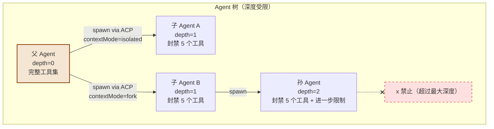
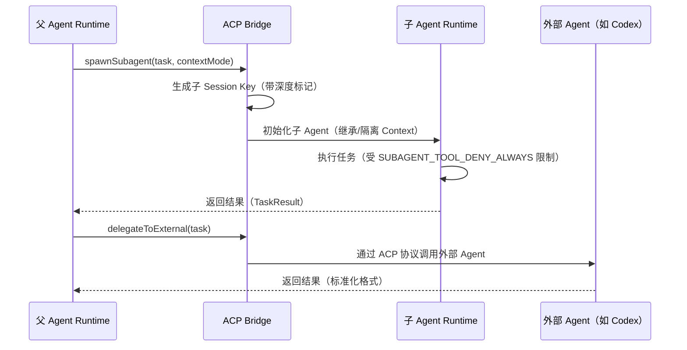

# 第 7 章：Multi-Agent Architecture 深度解析

> **核心观点**：OpenClaw 的多 Agent 架构是"父子树模型"而非"对等网格"——Agent 通过 ACP 协议派生子 Agent，形成有向无环图，每个节点有明确的权限边界和生命周期，避免了多 Agent 系统中最常见的"权限传播爆炸"问题。

---

## 业务背景

### 单 Agent 的天花板

单个 Agent 的能力上限受限于两个瓶颈：

1. **上下文窗口**：复杂任务（分析整个代码库、处理多份文档）超过模型上下文上限
2. **串行执行**：单 Agent 一次只做一件事，无法并行处理多个子任务

为突破这两个瓶颈，Multi-Agent 架构应运而生：将大任务分解，委托给多个子 Agent 并行处理。

### Multi-Agent 的典型陷阱

但 Multi-Agent 架构引入了新的复杂性：
- **权限传播**：父 Agent 有 A 权限，子 Agent 是否自动继承？
- **会话隔离**：子 Agent 的对话历史是否与父 Agent 混淆？
- **无限嵌套**：子 Agent 是否可以再派生孙 Agent？深度无限？
- **状态污染**：子 Agent 意外修改了父 Agent 依赖的状态

OpenClaw 对这些问题都有明确的架构答案。

---

## 架构设计

### 父子树模型



### ACP（Agent Control Plane）协议

ACP 是 OpenClaw 内部的子 Agent 通信协议，与外部 ACP 协议（Agent Communication Protocol）不同：



### 子 Agent 深度控制

```typescript
// src/agents/subagent-depth.ts（精简版）
// 从 Session Key 解析子 Agent 的嵌套深度
export function getSubagentDepthFromSessionStore(
  sessionKey: string | undefined | null,
  opts?: { cfg?: OpenClawConfig; store?: Record<string, SessionDepthEntry> }
): number {
  // 通过递归读取 spawnedBy 链，计算当前 Agent 在树中的深度
  // 防止无限嵌套：当深度超过 maxSubagentDepth 时，拒绝继续派生
}
```

**为什么需要深度控制？**

没有深度限制的子 Agent 系统有"无限递归"风险：Agent A 派生 Agent B，B 派生 C，C 再派生 D...每层都消耗资源，一个恶意或出错的任务可以耗尽整个系统。深度限制是 Multi-Agent 系统的基本安全保障。

### 子 Agent 生命周期状态

```typescript
// src/agents/subagent-lifecycle-events.ts
// 子 Agent 结束原因
export type SubagentLifecycleEndedReason =
  | "subagent-complete"  // 正常完成
  | "subagent-error"     // 执行失败
  | "subagent-killed";   // 被父 Agent 或超时强制终止

// 子 Agent 执行结果
export type SubagentLifecycleEndedOutcome =
  | "ok"       // 成功
  | "error"    // 失败
  | "timeout"  // 超时
  | "killed";  // 被终止
```

### 上下文传播模式

```typescript
// src/context-engine/types.ts
// 子 Agent 上下文模式
export type ContextMode = "isolated" | "fork";

// isolated：子 Agent 从零开始，不继承任何父 Agent 上下文
// fork：子 Agent 继承父 Agent 的指定范围上下文（如当前任务相关的消息）

prepareSubagentSpawn?(params: {
  contextMode?: "isolated" | "fork";
  ttlMs?: number;  // 子 Agent 最长存活时间，超时自动销毁
}): Promise<SubagentSpawnPreparation | undefined>;
```

---

## 核心源码

### 子 Agent 注册管理

```typescript
// src/agents/subagent-registry-run-manager.ts（精简版）
// 子 Agent 注册表：管理所有活跃子 Agent 的状态
export class SubagentRunManager {
  private registry: Map<string, SubagentEntry>;
  
  // 注册新子 Agent
  register(sessionKey: string, agentHandle: AgentHandle): void;
  
  // 等待子 Agent 完成
  waitForCompletion(sessionKey: string, timeoutMs?: number): Promise<SubagentResult>;
  
  // 强制终止子 Agent
  kill(sessionKey: string, reason: string): Promise<void>;
  
  // 清理过期子 Agent
  sweep(): Promise<void>;
}
```

---

## 设计思想

### 思想一：树形而非网格

OpenClaw 选择了**树形（父→子）**而非**网格（对等通信）**的 Multi-Agent 拓扑。

树形结构的优势：
- **权限方向单一**：权限只能从父到子传递（且只能限制，不能扩大）
- **状态归属清晰**：每个 Agent 的状态归属明确，不会发生并发写入冲突
- **终止容易**：销毁父 Agent 会级联终止所有子 Agent（类似进程树）
- **审计简单**：任何子 Agent 的操作都可以追溯到最终发起者

对比 AutoGen 的网格通信：Agent A 可以给 Agent B 发消息，B 也可以给 C 发，C 再给 A 发——这种"任意通信"设计灵活但难以审计，且很容易产生循环通信死锁。

### 思想二："最小化权限继承"原则

子 Agent 不会自动继承父 Agent 的所有权限。相反，子 Agent 的默认权限是**父 Agent 权限的严格子集**——额外封禁了 5 个敏感工具（Gateway、会话管理、定时任务等）。

这遵循了安全设计中的"最小权限原则（Principle of Least Privilege）"：子 Agent 只应该拥有完成其被委托任务所必需的权限，不多一分。

### 思想三：TTL（生命周期限制）是安全保障

子 Agent 有可选的 `ttlMs` 参数。未完成的子 Agent 超过 TTL 后自动销毁。

**这不是性能优化，是安全保障**：如果一个子 Agent 任务意外陷入死循环，或者 LLM 被诱导进入无限工具调用循环，TTL 确保它不会永远运行、消耗无限资源。

---

## 与其他方案对比

| Multi-Agent 维度 | OpenClaw | LangGraph Multi-Agent | AutoGen | CrewAI |
|---|---|---|---|---|
| **拓扑结构** | 父子树（有向无环图） | 图节点间任意路由 | 任意通信网格 | 层级 Crew 结构 |
| **权限继承** | 严格限制，只能减少 | 由节点配置决定 | 无约束 | 无内置机制 |
| **深度限制** | 内置深度检测 | 无 | 无 | 无 |
| **上下文传播** | isolated / fork 两种模式 | 图状态共享 | 消息历史共享 | 任务上下文 |
| **生命周期** | TTL + 父 Agent 控制 | 图执行完成 | 对话结束 | 任务完成 |
| **外部 Agent** | ACP 协议桥接（Codex 等） | 无 | 内置跨 Agent | 无 |
| **审计** | 完整子 Agent 树日志 | 节点执行日志 | 消息日志 | 任务日志 |

---

## 企业级落地建议

**建议 1：为不同任务类型设计专用子 Agent**

```json
{
  "subagents": {
    "code-analyzer": {
      "tools": ["Read", "Bash"],
      "maxDepth": 1,
      "ttlMs": 120000
    },
    "web-researcher": {
      "tools": ["WebFetch", "WebSearch"],
      "maxDepth": 1,
      "sandbox": { "mode": "docker" }
    }
  }
}
```

**建议 2：多 Agent 任务编排模式**

```
用户请求："分析我们的代码库并生成改进报告"
↓
父 Agent（协调者）
├── 子 Agent A：分析 security 目录（isolated）
├── 子 Agent B：分析 performance 目录（isolated）
├── 子 Agent C：检查 dependencies 是否过时（isolated）
└── 父 Agent：汇总三个子 Agent 的结果，生成报告
```

**建议 3：子 Agent 资源配额**

企业部署应为子 Agent 配置资源配额，防止单一任务消耗过多资源：
- 最大并发子 Agent 数（防止爆发式生成）
- 每个子 Agent 的最大 token 消耗
- 子 Agent 的最大执行深度（通常 2-3 层即可）

---

## 优缺点分析

**优势**：树形父子模型 + 深度限制 + TTL，从架构层面防止了 Multi-Agent 系统中最常见的资源滥用和权限升级问题

**优势**：ACP 协议支持外部 Agent（如 OpenAI Codex）接入，具备开放的 Multi-Agent 生态接入能力

**局限**：当前的 Multi-Agent 协调是"命令式"的——父 Agent 需要明确调用子 Agent。缺少"目标驱动"的自动任务分解能力（即 Agent 自主决定何时需要生成子 Agent）

**局限**：子 Agent 之间不能直接通信（必须通过父 Agent 中继）。对于需要子 Agent 间协作的场景（如 A 生成代码、B 同时测试代码）效率较低

**改进方向**：引入"任务总线"模式——子 Agent 可以向总线发布结果，其他子 Agent 可以订阅，无需通过父 Agent 中继。同时保持父 Agent 作为最终决策者和权限守门人
