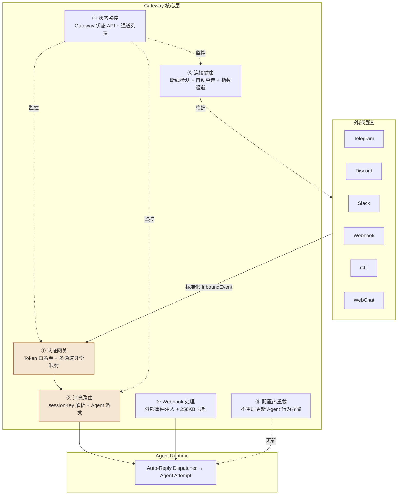
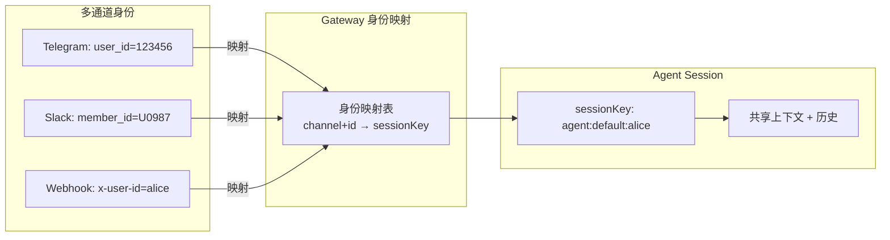
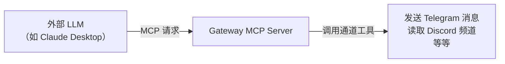

# 第 8 章：Gateway Architecture 深度解析

> **核心观点**：Gateway 不是 OpenClaw 的"入口"，而是它的"神经系统"——所有通道的消息、所有 Agent 的调度、所有 Webhook 的触发，都经过 Gateway 这个唯一的控制面流动，使 AI 能力与通道的绑定完全解耦。

---

## 业务背景

设想一个用户同时用 Telegram 和 Slack 与 AI 助手对话。从技术角度，这至少需要解决：

1. **身份统一**：Telegram 的 user_id 和 Slack 的 member_id 如何映射到同一个 Agent 会话
2. **消息格式统一**：Telegram 消息体和 Slack 消息体格式完全不同
3. **状态共享**：两个通道的上下文需要共享，还是隔离？
4. **路由规则**：某些通道发来的消息触发 Agent A，其他触发 Agent B
5. **安全统一**：每个通道的认证方式不同，如何统一鉴权
6. **连接管理**：Telegram 是长轮询，Discord 是 WebSocket，Slack 是事件订阅——如何统一管理断线重连

Gateway 层的设计目标是：将上述所有问题集中在一处解决，让 Agent Runtime 层完全不需要知道这些细节。

---

## 架构设计

### Gateway 的六大职责



### Webhook 系统设计

```typescript
// src/gateway/hooks.ts
export type HooksConfigResolved = {
  // Webhook 监听路径（默认 "/hooks"）
  basePath: string;
  // 验证 Token
  token?: string;
  // 最大请求体大小（默认 256KB）
  maxBodyBytes: number;
  // 路径映射规则（外部事件 → Agent 会话）
  mappings: HookMapping[];
  // Agent 级默认策略
  agentPolicy?: HookAgentPolicy;
  // 会话级默认策略
  sessionPolicy?: HookSessionPolicy;
};

// 单条 Webhook 映射规则
export type HookMapping = {
  path: string;           // 监听的 URL 路径（如 "/hooks/github"）
  sessionKey?: string;    // 目标 Agent 会话 Key
  agentId?: string;       // 目标 Agent ID
  transform?: string;     // 事件格式转换脚本
};
```

**256KB 的限制为何是默认值？**

Webhook 携带的 GitHub PR review、Jira ticket 等事件平均约 5-50KB。256KB 足够容纳大型事件，同时防止恶意方发送超大请求消耗 Agent 的 token 预算（大于 256KB 的 payload 直接用 token 计算：约 64000+ tokens，足以消耗一次对话的全部 token 预算）。

### Gateway 的身份映射机制



**sessionKey 的作用**：将来自不同通道的同一用户（或不同用户）路由到正确的 Agent 会话。`agent:default:alice` 表示"默认 Agent、用户 alice"的会话。这个 Key 决定了哪些通道的消息共享同一个 Agent 上下文。

### MCP Server 模式

OpenClaw Gateway 还有一个独特能力：**将自身暴露为 MCP（Model Context Protocol）服务器**，允许外部 LLM 通过标准 MCP 协议调用 OpenClaw 的通道工具：



这使得 OpenClaw 不只是一个 AI 助手，还可以作为"AI 工具提供者"，向外部 AI 系统提供多通道操作能力。

---

## 核心源码

### 健康监控与重连

```typescript
// src/gateway/（通道健康检查逻辑）
// 每个通道维护一个连接状态机：
// CONNECTED → DISCONNECTED → RECONNECTING → CONNECTED
// 断线时使用指数退避算法：1s → 2s → 4s → 8s → 16s → max(60s)
```

### 配置热重载

OpenClaw Gateway 支持不重启服务的配置热重载。实现原理：
1. 监听配置文件变更（`fs.watch`）
2. 变更发生时，重新解析配置
3. 更新 Gateway 内存中的路由规则、安全策略等
4. 不影响已建立的 Agent 会话（正在进行的 Attempt 不受影响）

---

## 设计思想

### 思想一：Gateway 是"关注点分离"的集中实现

Gateway 集中处理了所有横切关注点（Cross-Cutting Concerns）：
- 认证（不需要每个通道各自实现）
- 日志（不需要每个通道各自记录）
- 速率限制（不需要每个通道各自限流）
- 健康监控（不需要每个通道各自监控）

这是"进化版的 API Gateway 模式"在 AI Agent 系统中的应用。

### 思想二：通道是"适配器"，不是"业务逻辑容器"

每个通道插件（Telegram、Discord、Slack...）只做三件事：
1. **建立连接**：连接到各自平台的 API（WebSocket/HTTP/轮询）
2. **格式转换**：将平台特有格式转换为 OpenClaw 的 InboundEvent 标准格式
3. **发送回复**：将 Agent 的 ReplyPayload 转换为平台格式并发送

通道插件不知道 Agent 是谁、不知道 Session 在哪、不知道 Skill 是什么。它们是纯粹的 I/O 适配器。

### 思想三：Webhook 是 Gateway 的"外部信号接收器"

Webhook 支持让 Gateway 不仅仅是被动的消息网关，还可以主动接收来自外部系统（GitHub、Jira、Grafana Alert、钉钉通知）的事件，并将这些事件注入到指定 Agent 会话。

这实现了一个重要的使用场景：**Agent 作为企业系统的自动响应者**——CI 失败时自动触发 Agent 分析原因，Jira 创建 Bug 时自动触发 Agent 定位代码。

---

## 与其他方案对比

| Gateway 维度 | OpenClaw | Claude Code | LangGraph | Hermes |
|---|---|---|---|---|
| **多通道** | 20+ 通道开箱 | 单通道（终端/IDE） | 无通道概念 | API 为主 |
| **统一认证** | Token + 白名单 | 无 | 无 | API Key |
| **Webhook 接收** | 内置 + 256KB 限制 | 无 | 无 | 无 |
| **MCP Server** | ✅ 可暴露为 MCP | ✅ 可接受 MCP | ❌ | ❌ |
| **配置热重载** | ✅ 无重启更新 | ❌ | ❌ | ❌ |
| **连接健康监控** | ✅ 指数退避重连 | N/A | N/A | N/A |
| **横向扩展** | ❌ 单进程 | N/A | N/A | ❌ |

---

## 企业级落地建议

**建议 1：Gateway 前置 API Management**

企业部署时，在 OpenClaw Gateway 前面增加一层 API Management（Kong/Nginx）：

```
互联网
  → API Management（Kong）
    → [TLS 终止 + DDoS 防护 + 全局限速]
  → OpenClaw Gateway 集群
    → [认证 + 路由 + Agent 派发]
  → Agent Runtime 池
```

**建议 2：多 Gateway 高可用**

当前的 Gateway 是单点。企业部署建议：
- 通过 Nginx upstream 负载均衡多个 Gateway 实例
- Session 映射迁移到 Redis Cluster（使 Gateway 无状态化）
- 使用一致性哈希确保同一用户的请求路由到同一 Runtime 实例

**建议 3：Webhook 安全加固**

Webhook 端点应增加：
- HMAC-SHA256 签名验证（防止伪造事件）
- IP 白名单（只接受已知来源）
- 请求幂等性处理（防止重复触发）

---

## 优缺点分析

**优势**：Gateway 是整个 AI 能力层的统一入口，认证/路由/监控集中管理，新增通道不影响任何核心逻辑

**优势**：Webhook 支持 + MCP Server 模式使 OpenClaw 既能被动接收消息，又能主动暴露工具能力，双向互动能力完整

**局限**：Gateway 是单进程架构，没有内置的横向扩展机制——这是企业大规模部署的最大障碍

**局限**：Gateway 和通道插件之间的接口缺少版本管理。当 Gateway 升级时，旧版本的通道插件可能因接口变化而断裂

**改进方向**：将 Gateway 的 Session 映射和路由状态迁移到 Redis，使 Gateway 本身无状态，配合 Nginx 实现水平扩展。同时为 Gateway↔Plugin 接口引入语义化版本约定
