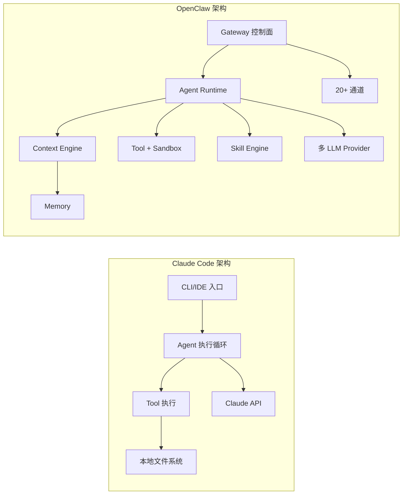

# 第 10 章：vs Claude Code 深度对比

> **核心观点**：OpenClaw 和 Claude Code 是同一代 AI Agent 工具的两个方向——Claude Code 用深度换取垂直场景的极致体验（coding），OpenClaw 用广度换取多场景的统一平台能力。两者的核心架构决策反映了两种截然不同的产品哲学。

---

## 业务背景

Claude Code（前身为 claude-engineer，现由 Anthropic 官方维护）和 OpenClaw 都是基于 Anthropic Claude API 构建的 AI Agent 工具，都支持 Tool Calling，都有文件系统操作能力。但从架构角度，它们的设计目标和取舍有着根本差异。

本章从以下六个维度进行系统性对比，目标是帮助架构师做出正确的选型决策：
1. 设计哲学与目标用户
2. Runtime 执行模型
3. 记忆与上下文管理
4. 工具系统与安全
5. 可扩展性与插件机制
6. 企业就绪度（Enterprise Readiness）

---

## 设计哲学对比

### Claude Code：极致的单一场景深度

Claude Code 的核心假设：
- **单用户**：一个开发者独自使用
- **本地文件系统**：主要操作本地代码仓库
- **短生命周期对话**：解决特定编程问题，完成即结束
- **人机协作**：每个重要决策都需要人类确认

这些假设使 Claude Code 能够在"AI 帮助编写代码"这个场景上做到极致优化：
- `CLAUDE.md` 让仓库维护者定义 AI 在这个代码库的行为规范
- `plan mode` 让 AI 在执行前展示完整计划
- `compact` 命令手动触发上下文压缩

### OpenClaw：多场景的统一平台

OpenClaw 的核心假设：
- **多用户/多通道**：Telegram、Slack、Discord...多个平台，多个用户
- **长期运行**：AI 助手不是一次性工具，是持续陪伴
- **主动响应**：不只等用户输入，还可以响应 Webhook 事件
- **可扩展平台**：能力可以通过插件无限扩展

---

## 架构对比矩阵



### 全维度对比表

| 对比维度 | Claude Code | OpenClaw | 优势方 |
|---|---|---|---|
| **核心场景** | 代码编写/修改/审查 | 多通道 AI 助手平台 | 各有侧重 |
| **目标用户** | 软件开发者 | 开发者 + 最终用户 + 企业 | OpenClaw 更广 |
| **对话通道** | 终端 + IDE + Web | 20+ 消息通道 | OpenClaw |
| **会话持久化** | JSONL（~/.claude/） | JSONL（~/.openclaw/） | 相当 |
| **上下文管理** | 内置压缩（`/compact`） | 可插拔 ContextEngine | OpenClaw 更灵活 |
| **记忆系统** | CLAUDE.md（工作区级） | MEMORY.md + ContextEngine | OpenClaw 更完整 |
| **工具安全** | 用户审批 + macOS sandbox | 3层栅栏 + 多沙盒 | OpenClaw |
| **多 LLM 支持** | 主要 Claude | 8+ Provider | OpenClaw |
| **Failover** | 无显式 Failover | 11 种分类 + 降级策略 | OpenClaw |
| **插件系统** | 无插件系统 | 40+ Hook + Plugin SDK | OpenClaw |
| **Skill/行为配置** | CLAUDE.md | Skill 系统（层级覆盖） | OpenClaw |
| **多 Agent** | Sub-agent（基础支持） | ACP 协议 + 树形父子 | OpenClaw |
| **MCP 协议** | MCP Client（消费工具） | MCP Client + MCP Server | OpenClaw |
| **企业就绪度** | 个人工具级别 | 平台级（但缺分布式） | OpenClaw |
| **代码质量** | 高（Anthropic 官方） | 高（pnpm + TypeScript ESM） | 相当 |
| **文档质量** | 好（官方文档） | 好（社区文档） | 相当 |
| **Coding 专精** | ★★★★★ | ★★★ | Claude Code |
| **Token 优化** | 良好（`/compact`）| 精细（~ 路径压缩等） | 相当 |

---

## 关键架构差异深析

### 差异 1：行为配置的范围

**Claude Code**：CLAUDE.md 是**工作区（Workspace）级**的行为配置。每个代码仓库有自己的 CLAUDE.md，定义 AI 在这个仓库里的行为规范。这对单一代码库场景极其自然。

**OpenClaw**：Skill 是**跨会话、可层级覆盖**的行为配置。同一个用户在 Telegram 和 Discord 的 AI 都使用相同的 Skill 集合。Skill 可以通过插件分发，在组织内统一管理。

**场景差异**：当你需要"在任何地方 AI 都遵守我们公司的安全规范"时，OpenClaw 的 Skill 系统更合适。当你需要"在这个代码库 AI 理解我们的特定约定"时，Claude Code 的 CLAUDE.md 更自然。

### 差异 2：工具安全的纵深

**Claude Code** 的工具安全是"人在回路"（Human-in-the-Loop）模型：危险操作弹出确认框。这在单用户、交互式场景下体验很好。

**OpenClaw** 的工具安全是"策略驱动"（Policy-Driven）模型：危险操作根据策略自动决策（拒绝/白名单/沙盒）。这在自动化、无人值守场景下更可靠。

### 差异 3：上下文管理策略

**Claude Code** 的上下文管理是显式的：用户通过 `/compact` 命令手动触发压缩，或 IDE 自动检测到接近上限时提示。这给了用户最大的控制权。

**OpenClaw** 的上下文管理是自动的：Context Engine 在每轮 `afterTurn()` 中自主决定是否需要压缩。这对于无人值守的长期运行 Agent 更友好。

---

## 选型建议

**选 Claude Code 的场景**：
- 个人开发者的日常编程助手
- 团队代码审查自动化
- 单一代码仓库的深度 AI 集成
- 需要与 Anthropic 官方紧密跟进最新能力

**选 OpenClaw 的场景**：
- 需要在多个消息平台上部署 AI 助手
- 企业级多用户 AI 平台
- 需要 AI 响应外部系统事件（Webhook）
- 需要多 LLM Provider 备份和自动 Failover
- 需要通过插件系统定制 AI 能力

**两者结合的场景（实际上是互补）**：
- 用 OpenClaw 作为日常消息通道的 AI 助手
- 用 Claude Code 作为 IDE 内的编程助手
- OpenClaw 的 ACP 协议可以调用 Claude Code 作为子 Agent

---

## 企业级落地建议

对于想要同时使用两者的企业，建议以下分工：

```
企业 AI 架构
├── OpenClaw（平台层）
│   ├── 统一消息通道（Slack/Teams/飞书）
│   ├── 企业 Webhook 响应（Jira/GitHub/Grafana）
│   ├── 多用户权限隔离
│   └── 企业 Skill 库管理
│
└── Claude Code（工具层）
    ├── 开发者 IDE 内的编程辅助
    ├── CI/CD 自动代码审查
    └── 作为 OpenClaw 的子 Agent 处理 coding 任务
```

---

## 优缺点分析

**Claude Code 的优势**：Anthropic 官方维护，与最新 Claude 模型特性（Extended Thinking、Computer Use）同步最快；代码助手场景优化极致；文档和社区支持好

**Claude Code 的局限**：单一场景限制，无插件系统，无多通道支持；工具安全依赖人工审批，不适合自动化场景

**OpenClaw 的优势**：多通道统一平台；插件生态；多 LLM Failover；企业级安全控制（相对）；可插拔 Context Engine

**OpenClaw 的局限**：代码辅助能力不如 Claude Code 专精；单机部署限制；Anthropic 官方不维护，需要跟踪上游变化
