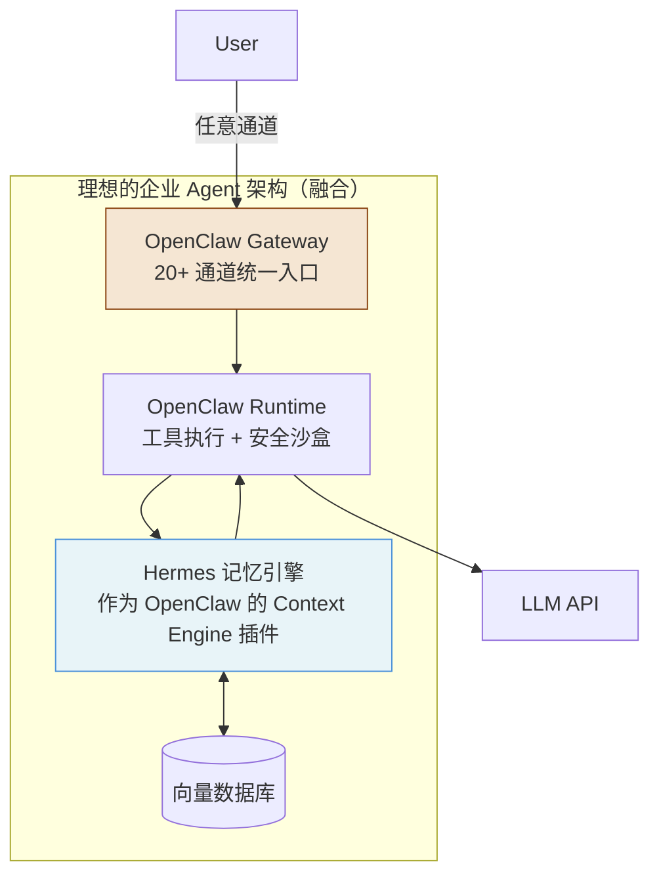

# 第 11 章：vs Hermes Agent 深度对比

> **核心观点**：OpenClaw 和 Hermes Agent 代表了 AI Agent 平台的两种根本哲学——OpenClaw 相信"能力比记忆更重要"，Hermes 相信"记住你比帮助你更重要"。这不是技术差异，而是产品愿景的分叉。

---

## 业务背景

Hermes Agent 是另一个开源个人 AI 助手项目，同样以"个人 AI 助手"为定位。从用户视角，两者看起来很相似：都可以通过消息通道与 AI 对话，都支持工具使用，都有持久化的"记忆"。

但当我们深入架构，会发现两者的设计重心截然不同：

- **Hermes 的核心问题**：*"AI 如何随时间了解你、记住你、从你的行为中学习？"*
- **OpenClaw 的核心问题**：*"AI 如何在你所在的任何地方帮你完成任何事？"*

这两个问题的差异，导致了两套完全不同的架构决策。

---

## 架构哲学对比

### Hermes 的"记忆优先"架构

Hermes 将记忆系统作为核心：
- 自动从对话中提取"记忆片段"（memory fragments）
- 将记忆向量化存储，支持语义检索
- 定期进行"反思"（reflection）：对已有记忆进行归纳、更新、遗忘
- 根据检索到的相关记忆动态调整 AI 的回复风格和内容

从技术上，Hermes 更接近**认知架构（Cognitive Architecture）**的研究方向——模拟人类记忆的短期/长期、遗忘曲线等特性。

### OpenClaw 的"能力优先"架构

OpenClaw 将通道适配和工具能力作为核心：
- 20+ 消息通道开箱即用
- 40+ Plugin 生命周期钩子
- 多 LLM Provider 自动 Failover
- 沙盒工具执行安全保护
- ACP 协议支持多 Agent 协作

记忆（MEMORY.md）是 OpenClaw 的**辅助功能**，而不是核心功能。

---

## 全维度对比矩阵

```mermaid
graph TB
    subgraph "Hermes 架构（记忆为中心）"
        H_IN[输入] --> H_EXT[记忆抽取]
        H_EXT --> H_VEC[向量存储]
        H_VEC --> H_RET[语义检索]
        H_RET --> H_REF[自主反思/归纳]
        H_REF --> H_LLM[LLM 回复]
        H_LLM --> H_OUT[输出]
    end

    subgraph "OpenClaw 架构（能力为中心）"
        O_CH[多通道 Gateway] --> O_RT[Runtime]
        O_RT --> O_PLAN[RuntimePlan]
        O_PLAN --> O_CE[Context Engine]
        O_CE --> O_LLM[LLM]
        O_LLM --> O_TOOL[Tool 执行]
        O_TOOL --> O_OUT[多通道输出]
    end
```



| 对比维度 | Hermes Agent | OpenClaw | 评注 |
|---|---|---|---|
| **核心价值** | AI 长期了解你 | AI 随时随地帮你 | 哲学差异 |
| **记忆存储** | 向量数据库（自动提取） | MEMORY.md（手动/AI 写入） | Hermes 更智能 |
| **记忆检索** | 语义检索（相关性排序） | 全量注入（无检索） | Hermes 更高效 |
| **自主反思** | ✅ 定期自动归纳记忆 | ❌ 无 | Hermes 独有 |
| **遗忘机制** | ✅ 时间衰减/重要性加权 | ❌ 无（需手动删 MEMORY.md） | Hermes 独有 |
| **用户透明度** | 低（AI 自主决策记什么） | 高（MEMORY.md 用户可见） | OpenClaw 更透明 |
| **多通道支持** | 较少（主要 Web/API） | 20+ 消息通道 | OpenClaw 更广 |
| **工具安全** | 基础（无多层栅栏） | 完整的三层安全 | OpenClaw 更安全 |
| **插件系统** | 较简单 | 40+ Hooks + Plugin SDK | OpenClaw 更完整 |
| **多 LLM** | 支持（但无 Failover） | 8+ Provider + Failover | OpenClaw 更可靠 |
| **企业部署** | 偏个人 | 企业特性更多 | OpenClaw 更适合 |

---

## 关键架构差异深析

### 差异 1：记忆的控制权归属

**Hermes 的立场**：AI 应该是记忆的主体——它读过的内容、做过的事情、观察到的用户行为，AI 自主决定哪些值得记住。用户不需要（也可能无法）精确控制 AI 记住什么。

**OpenClaw 的立场**：用户应该是记忆的主体——MEMORY.md 是用户的文件，用户可以直接读写。AI 不会"偷偷"记住任何东西，所有持久化的记忆都经过显式操作（用户执行 `/remember` 或 AI 被明确要求记忆）。

这个差异在实际使用中表现为：
- Hermes 的 AI 可能知道"你上周提到过换工作"（自动提取的记忆），但你不知道它记住了这件事
- OpenClaw 的 AI 只知道 MEMORY.md 里有的内容，你完全掌控它知道什么

**法规合规视角**：GDPR 等隐私法规要求用户对个人数据有知情权和删除权。OpenClaw 的 MEMORY.md 模型天然符合这些要求；Hermes 的自动提取模型需要额外的技术措施来满足"用户知道 AI 记住了什么"的要求。

### 差异 2：上下文的构建策略

**Hermes** 构建上下文的方式：
```
当前对话 + 检索到的相关历史记忆（向量相似度 > 阈值）
→ 动态拼接成 Prompt
```

**OpenClaw** 构建上下文的方式：
```
MEMORY.md 全量 + Context Engine.assemble()（窗口截断或插件策略）
→ 系统提示 + 对话历史
```

Hermes 的检索方式在长期使用后（记忆量大时）更高效：不需要每次注入全部记忆，只注入相关的。OpenClaw 的全量注入方式在记忆量小时更简单可靠。

### 差异 3：自主反思（Reflection）能力

Hermes 有一个独特能力：**定期对已有记忆进行"反思"**——
- 合并相似的记忆片段
- 生成更高层次的抽象记忆（"我注意到用户总是在下午提问"）
- 标记过时的记忆（某人的职位已经从"工程师"变成"架构师"）
- 遗忘低重要性记忆

这使 Hermes 的 AI 随时间变得越来越"了解"用户，而不仅仅是"记录"用户。

OpenClaw 目前没有这个能力。MEMORY.md 里的内容不会自动归纳、更新或遗忘——这需要用户手动维护，或者通过插件实现。

---

## 两者的互补性：可能的融合方向

OpenClaw 和 Hermes 的设计实际上是互补的，而不是竞争的：



通过 OpenClaw 的 Context Engine 插件接口，可以将 Hermes 的记忆引擎接入 OpenClaw——用 OpenClaw 的通道能力和工具安全，加上 Hermes 的智能记忆管理。

---

## 企业级落地建议

**场景 1：个人助手产品（偏向 Hermes）**

如果目标是"让 AI 成为用户的私人助理，随时间越来越了解用户"，Hermes 的记忆架构更合适。建议：
- 以 Hermes 记忆引擎为核心
- 通过 OpenClaw 的插件接口接入多通道
- 关键是：建立清晰的隐私策略，告知用户 AI 会记住什么

**场景 2：企业 Agent 平台（偏向 OpenClaw）**

如果目标是"为企业员工提供跨平台的 AI 助手服务，强调安全和可控"，OpenClaw 更合适。建议：
- 以 OpenClaw 为运行时底座
- 为不同部门配置不同的 Skill 集
- MEMORY.md 由团队维护，确保 AI 知道的内容符合企业数据政策

**场景 3：个人开发者（两者都可）**

- 需要 AI 深度了解你的工作习惯 → 考虑 Hermes
- 需要在多个消息平台使用同一个 AI → 选择 OpenClaw

---

## 优缺点分析

**Hermes 的优势**：自主记忆提取和反思能力使 AI 真正具备"认知"特征，长期使用体验持续改善

**Hermes 的局限**：记忆的不透明性（用户难以知道 AI 记住了什么）；向量数据库依赖增加了部署复杂度；多通道支持和工具安全相对薄弱

**OpenClaw 的优势**：记忆完全透明可控（MEMORY.md）；多通道和工具安全体系完整；插件生态扩展性强

**OpenClaw 的局限**：没有智能记忆系统（不会自动学习用户习惯）；MEMORY.md 全量注入随内容增长而低效；长期使用不会主动"更了解"用户

**融合路径**：将 Hermes 的记忆引擎实现为 OpenClaw 的 Context Engine 插件，是目前两个项目最自然的融合方式
