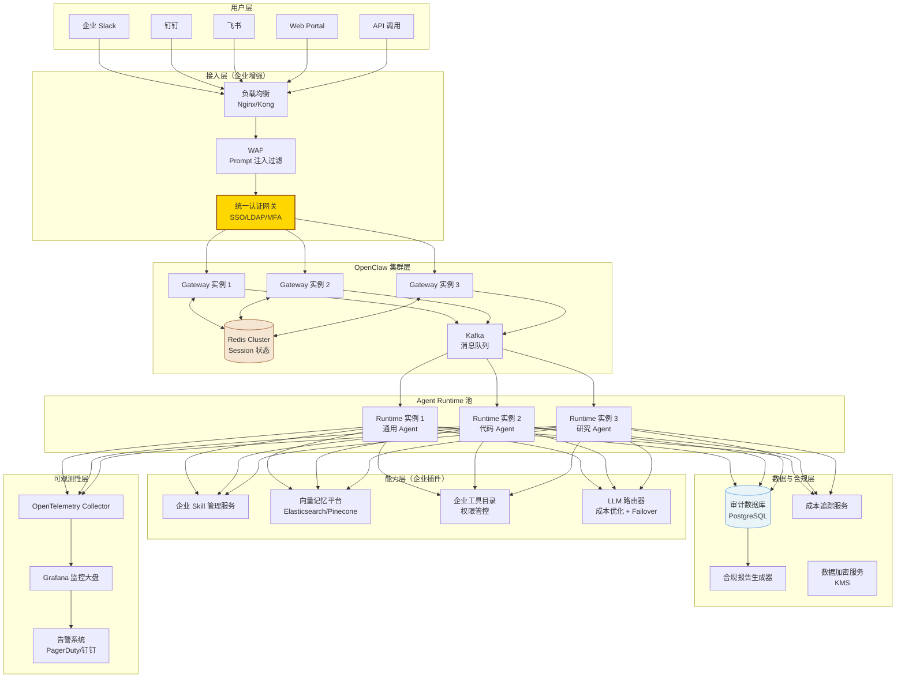
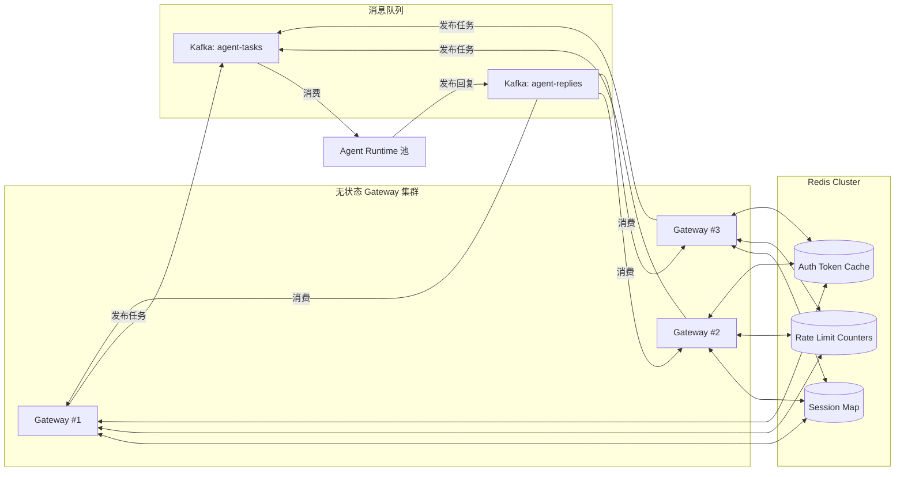
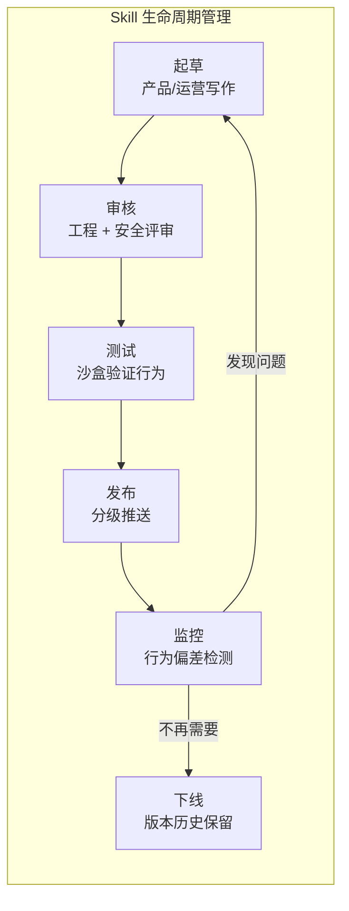

# 第 12 章：企业级 Agent 平台设计

> **核心观点**：OpenClaw 是企业级 Agent 平台的优秀运行时底座，但直接落地需要在身份认证、横向扩展、可观测性、合规审计四个维度补强，才能满足企业级 SLA 和治理要求。

---

## 业务背景

2025-2026 年，企业 AI 落地进入"从 PoC 到生产"的关键阶段。企业在 Agent 落地时面临的核心挑战不是"AI 能不能用"，而是：

1. **身份治理**：哪些员工可以用哪些 AI 能力？权限如何与 HR 系统、AD 目录同步？
2. **数据安全**：员工和 AI 的对话内容涉及商业秘密，如何存储、谁可以审查？
3. **成本控制**：LLM API 费用如何分摊到业务部门？如何防止无谓的 token 浪费？
4. **可靠性**：AI 服务出现故障时，如何快速定位？SLA 如何保证？
5. **合规性**：如何满足 GDPR、等保三级、网络安全法等合规要求？

OpenClaw 的架构在以上五个维度都有基础支持，但需要企业级增强。

---

## 架构设计

### 企业级 OpenClaw 平台参考架构



---

## 四大关键补强

### 补强 1：企业身份与权限体系

**现状**：OpenClaw 的认证是简单的 Token + 用户名白名单，没有与企业 LDAP/AD 集成的能力，不支持 RBAC（基于角色的访问控制）。

**企业需要**：

```typescript
// 企业认证插件设计
export class EnterpriseAuthPlugin implements OpenClawPlugin {
  async onAuthRequest(event: AuthEvent): Promise<AuthResult> {
    // 1. 验证企业 SSO Token（飞书/钉钉/AD）
    const identity = await this.ssoClient.verify(event.token);
    
    // 2. 查询 RBAC 权限
    const roles = await this.rbacService.getUserRoles(identity.userId);
    
    // 3. 转换为 OpenClaw 权限配置
    return {
      userId: identity.userId,
      agentPolicy: this.mapRolesToAgentPolicy(roles),
      toolPolicy: this.mapRolesToToolPolicy(roles),
    };
  }
}
```

**RBAC 设计建议**：

| 角色 | Agent 能力 | 工具权限 | LLM 配额 |
|---|---|---|---|
| 普通员工 | 通用助手 | 只读工具 + 受限 Shell | 每日 50k tokens |
| 工程师 | 通用 + 代码助手 | 完整工具 + Docker 沙盒 | 每日 200k tokens |
| 管理员 | 完整 Agent 能力 | 完整工具 | 无限制 |
| 安全审计员 | 只读所有会话 | 无 | 审计专用 |

### 补强 2：横向扩展架构

**现状**：OpenClaw Gateway 是单进程，Session 状态在内存中。无法水平扩展。

**企业方案**：



**关键设计决策**：
- Session Map 迁移到 Redis：使 Gateway 无状态，可以随负载增减实例
- Kafka 解耦 Gateway 和 Runtime：Gateway 不直接调用 Runtime，而是发布任务到队列
- 会话亲和性：通过 Kafka 分区键（sessionKey）确保同一用户的消息由同一 Runtime 消费

### 补强 3：企业级可观测性

**现状**：OpenClaw 缺少 OpenTelemetry 标准输出，没有内置的 Trace ID 传播，日志格式不结构化。

**企业方案**：

```
OpenTelemetry 标准化后，每次 Agent 执行产生完整的 Trace：

Trace: agent-attempt-xxx
├── Span: gateway-auth (5ms)
├── Span: message-routing (2ms)
├── Span: runtime-plan-build (10ms)
├── Span: context-assemble (50ms)
├── Span: llm-call-1 (1200ms)
│   ├── Attribute: model=claude-opus-4
│   ├── Attribute: tokens_input=3400
│   └── Attribute: tokens_output=580
├── Span: tool-bash (800ms)
│   ├── Attribute: command="git log"
│   └── Attribute: sandbox=docker
└── Span: llm-call-2 (900ms)

总计：3s, 3980 input tokens, 580 output tokens
成本：$0.042
```

**关键指标体系**：

| 指标类别 | 具体指标 | 告警阈值 |
|---|---|---|
| 可用性 | Agent 执行成功率 | < 99% 告警 |
| 延迟 | P95 响应时间 | > 10s 告警 |
| 错误 | LLM API 错误率 | > 5% 告警 |
| 成本 | 每小时 token 消耗 | > 预算 80% 告警 |
| 安全 | 工具调用被拒绝次数 | 突增 > 10倍 告警 |

### 补强 4：合规与审计

**企业要求**：所有 AI 对话内容需要审计日志，支持按员工、时间范围、关键词检索，保留 3 年。

**设计方案**：

```typescript
// 合规审计中间件
export class ComplianceAuditMiddleware implements OpenClawPlugin {
  async onAfterTurn(event: AfterTurnEvent): Promise<void> {
    const auditRecord = {
      timestamp: new Date().toISOString(),
      userId: event.userId,
      sessionId: event.sessionId,
      channel: event.channel,
      // 消息内容加密存储（KMS 管理密钥）
      messagesEncrypted: await this.kms.encrypt(
        JSON.stringify(event.messages)
      ),
      toolsUsed: event.toolResults.map(t => ({
        name: t.toolName,
        // 工具参数脱敏（命令中的密钥、路径等替换为 [REDACTED]）
        paramsSanitized: this.sanitize(t.params),
      })),
      llmProvider: event.runtimePlan.providerHandle?.providerId,
      tokensConsumed: event.tokensConsumed,
    };
    
    await this.auditDb.insert('agent_audit_logs', auditRecord);
  }
}
```

---

## 企业级 Skill 治理

在企业环境中，Skill 不再是个人配置文件，而是需要治理的企业资产：



---

## 成本控制设计

LLM API 费用是企业 Agent 平台的主要成本。建议建立三层成本控制：

**第一层：智能路由**（按任务复杂度选择模型）
```
简单问答 → Haiku（便宜 10x）
代码生成 → Sonnet（平衡）
复杂分析 → Opus（最强）
```

**第二层：上下文优化**（减少 token 消耗）
```
~ 路径压缩（已内置）
Skill 去重（已内置）
Context 摘要压缩（需 Context Engine 插件）
RAG 替代全量注入（需 Context Engine 插件）
```

**第三层：配额管理**（防止滥用）
```
每用户每日 token 限额
每部门每月费用预算
超额自动降级到小模型
极端异常自动暂停并告警
```

---

## 优缺点分析

**OpenClaw 作为企业平台底座的优势**：
- 通道适配层成熟（20+ 通道），省去了企业自建消息适配的工作
- Plugin 系统成熟，企业增强功能（认证、审计、记忆）可以以插件形式非侵入式接入
- 安全设计完整（工具栅栏、沙盒、审计），满足安全合规的基本要求
- TypeScript ESM，工程质量高，企业团队接手维护成本可控

**需要企业显著补强的方面**：
- 无状态化改造（Redis Session Map）——必须做
- OpenTelemetry 接入——必须做
- SSO/LDAP 认证集成——必须做
- 审计日志系统——必须做
- Kafka/消息队列——高并发场景需要

**企业落地工期估算**：
- 基础 PoC（单实例部署 + 1 个通道）：1-2 周
- 生产就绪（集群 + SSO + 审计）：2-3 个月
- 完整企业平台（Skill 治理 + 成本控制 + 全通道）：4-6 个月
