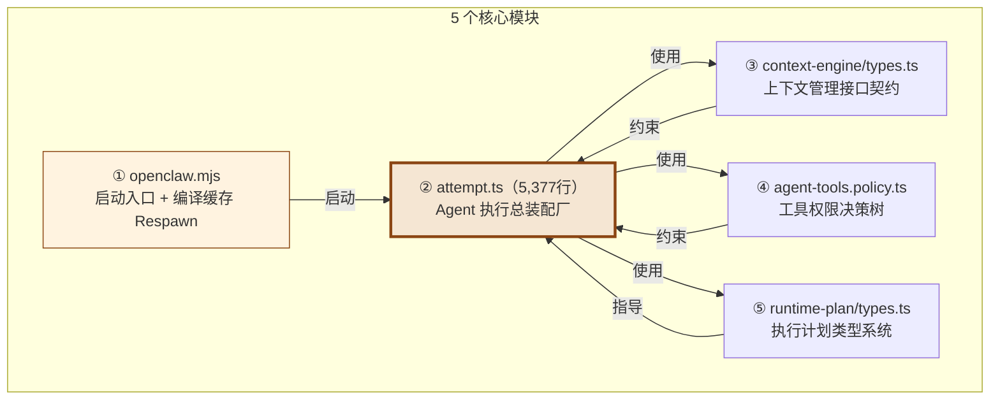
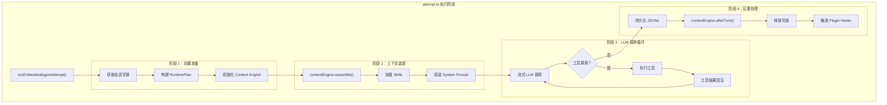
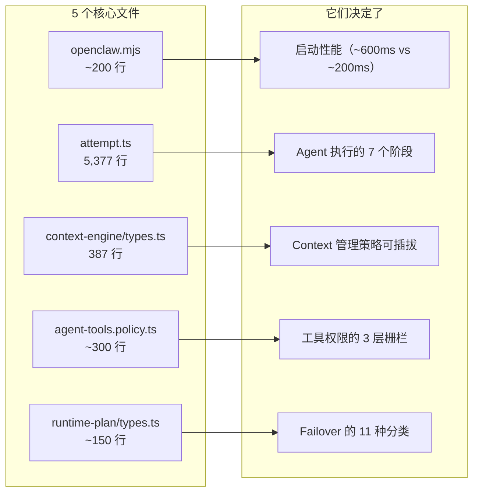

# 第 13 章：核心源码深度解析

> **核心观点**：OpenClaw 228,000+ 行代码中，真正决定系统行为的"20% 核心"集中在 5 个文件/模块——理解这 5 个核心，等于理解整个 OpenClaw 的运作机制。

---

## 业务背景

大型开源项目的代码阅读有一个共同困境：文件数量庞大（OpenClaw 有 8000+ TypeScript 文件），很难找到真正的"入口"和"骨架"。本章从架构师视角，定位 OpenClaw 中最关键的 5 个核心文件/模块，通过它们的代码揭示整个系统的设计精髓。

**选取标准**：
1. 高扇入（Fan-in）——被大量其他模块依赖
2. 决策密集——包含关键的 `if/else`、类型定义、策略选择
3. 架构边界——定义了模块间的接口契约

---

## 核心模块全景



---

## 核心 ①：openclaw.mjs — 启动哲学

```javascript
// openclaw.mjs（入口文件，精简版）

// 1. Node.js 版本门控（保证 ESM + 编译缓存的运行时特性）
const [major, minor] = process.versions.node.split(".").map(Number);
if (major < 22 || (major === 22 && minor < 19)) {
  console.error(`OpenClaw requires Node.js 22.19+, got ${process.version}`);
  process.exit(1);
}

// 2. 编译缓存 Respawn 优化（核心性能技巧）
async function respawnWithPackagedCompileCacheIfNeeded() {
  if (process.env.NODE_COMPILE_CACHE) return; // 已在缓存进程中，跳过
  
  // 计算编译缓存目录路径
  const cacheDir = getCacheDir();
  
  // 用 NODE_COMPILE_CACHE 环境变量重新 spawn 自己
  const child = spawn(process.execPath, process.argv.slice(1), {
    env: { ...process.env, NODE_COMPILE_CACHE: cacheDir },
    stdio: "inherit",
  });
  
  child.on("exit", (code) => process.exit(code ?? 0));
  return; // 父进程退出，让子进程接管
}
```

**为什么用 Respawn 而不是直接设置 `NODE_COMPILE_CACHE`？**

`NODE_COMPILE_CACHE` 需要在进程启动之前设置（Node.js 在启动时读取这个环境变量来决定是否使用编译缓存）。如果在 `openclaw.mjs` 里设置，已经来不及了——当前进程已经没有缓存。解决方案是：让当前进程 Respawn 一个新进程，新进程能从启动之初就使用编译缓存。

**实际效果**：冷启动时间从 ~800ms 减少到 ~200-300ms——对于 CLI 工具，启动速度是关键用户体验。

---

## 核心 ②：attempt.ts — 执行总装配厂

`attempt.ts`（5,377 行）是 OpenClaw 中最重要的单个文件。它是整个 Agent 执行流程的"总装配厂"——不实现业务逻辑，而是**按正确顺序调用** 70+ 个模块。

### 调用链全景



### 关键代码模式：写锁保护

attempt.ts 的最重要设计是**会话写锁**。同一个会话不能有两个并发的 Attempt：

```typescript
// 核心并发保护模式（简化）
const lock = await sessionWriteLock.acquire(sessionKey, {
  timeout: resolveAgentTimeoutMs(config),
  abortSignal,
});

try {
  // 执行整个 Attempt...
  return await executeAttempt(params);
} finally {
  // 无论成功失败，必须释放锁
  lock.release();
}
```

**为什么需要写锁？**

如果用户在 Telegram 和 Slack 同时发送消息，两个 Attempt 可能并发执行。两个 Attempt 同时向同一 JSONL 文件追加内容会导致数据竞争；两个 Attempt 同时持有相同的 Context 视图会导致消息重复或丢失。写锁确保同一会话的 Attempt 是串行的。

### 70+ 模块导入的意义

attempt.ts 的开头有 70+ 行 import 语句，导入了大量模块。这不是设计缺陷，而是**有意识的"装配者"模式（Assembler Pattern）**：

- 每个导入的模块专注单一职责（SRP）
- attempt.ts 负责按正确顺序调用这些单一职责模块
- 测试时可以单独测试每个模块，attempt.ts 只需要集成测试

---

## 核心 ③：context-engine/types.ts — 上下文管理契约

这个文件定义了整个 Context Engine 的接口契约。只有 387 行，但决定了所有上下文管理的行为边界。

### 最关键的三个类型

**类型 1：ContextEngine 接口**
```typescript
export interface ContextEngine {
  readonly info: ContextEngineInfo;
  
  // 必须实现
  ingest(params): Promise<IngestResult>;
  assemble(params): Promise<AssembleResult>;
  compact(params): Promise<CompactResult>;
  
  // 可选实现（渐进增强）
  bootstrap?(params): Promise<BootstrapResult>;
  maintain?(params): Promise<ContextEngineMaintenanceResult>;
  afterTurn?(params): Promise<void>;
  prepareSubagentSpawn?(params): Promise<SubagentSpawnPreparation>;
  onSubagentEnded?(params): Promise<void>;
  dispose?(): Promise<void>;
}
```

**类型 2：AssembleResult 的扩展语义**
```typescript
export type AssembleResult = {
  messages: AgentMessage[];
  estimatedTokens: number;
  
  // "preassembly_may_overflow"：隐藏 overflow 检测
  promptAuthority?: "assembled" | "preassembly_may_overflow";
  
  // 引擎可以额外注入 System Prompt 内容
  systemPromptAddition?: string;
  
  // 线程复用模式（避免重复发送大量 token）
  contextProjection?: ContextEngineProjection;
};
```

**类型 3：ContextEngineHostCapability**
```typescript
export type ContextEngineHostCapability =
  | "bootstrap"
  | "assemble-before-prompt"
  | "after-turn"
  | "maintain"
  | "compact"
  | "runtime-llm-complete"
  | "thread-bootstrap-projection";  // 最新能力：线程持久化
```

`ContextEngineHostCapability` 是一个能力协商机制——插件引擎可以声明"我需要 `thread-bootstrap-projection` 才能正常工作"，如果 Runtime 不支持这个能力，就不会加载该引擎，而是回退到兼容引擎。这避免了"引擎加载成功但静默降级"的难以调试问题。

---

## 核心 ④：agent-tools.policy.ts — 工具权限决策树

这个文件是整个工具安全体系的核心决策点。

### 权限决策流

```typescript
// 简化的权限决策逻辑
export function resolveAgentToolPolicy(params: {
  isSubagent: boolean;
  sandboxMode: SandboxMode;
  groupPolicy?: GroupToolPolicy;
  userConfig: OpenClawConfig;
}): AgentToolPolicy {
  // 步骤 1：从用户配置构建基础策略
  let policy = buildBasePolicy(params.userConfig);
  
  // 步骤 2：沙盒模式限制（沙盒 → 某些工具不可用）
  if (params.sandboxMode !== "none") {
    policy = applySandboxRestrictions(policy, params.sandboxMode);
  }
  
  // 步骤 3：Group 策略覆盖（企业可以为群组配置专属策略）
  if (params.groupPolicy) {
    policy = applyGroupOverride(policy, params.groupPolicy);
  }
  
  // 步骤 4：子 Agent 硬封禁（最后执行，不可覆盖）
  if (params.isSubagent) {
    policy = removeTools(policy, SUBAGENT_TOOL_DENY_ALWAYS);
  }
  
  return policy;
}

// 不可配置的常量
export const SUBAGENT_TOOL_DENY_ALWAYS = [
  "gateway", "agents_list", "session_status", "cron", "sessions_send"
];
```

**执行顺序的安全意义**：

步骤 4 必须是最后一步，且不可被覆盖。如果 Group Policy 在步骤 3 试图恢复 `gateway` 工具的使用权（无论是因为配置错误还是 Prompt Injection 攻击），步骤 4 会强制移除它。安全限制放在最后，保证"即使前面所有步骤都被绕过，最后一层防线不会失守"。

---

## 核心 ⑤：runtime-plan/types.ts — 执行计划类型系统

这个文件定义了 Agent 执行的完整决策空间。

### ThinkLevel 的工程意义

```typescript
export type AgentRuntimeThinkLevel =
  | "off"       // 0 thinking tokens
  | "minimal"   // ~100 thinking tokens
  | "low"       // ~1,000 thinking tokens
  | "medium"    // ~5,000 thinking tokens
  | "high"      // ~10,000 thinking tokens
  | "xhigh"     // ~20,000 thinking tokens
  | "adaptive"  // Runtime 自主决定（基于任务分析）
  | "max";      // 模型支持的最大思考量
```

8 个级别不是随意划分的。`adaptive` 是最重要的值——它让 Runtime 根据任务特征自动选择合适的思考深度：
- 简单问答 → `off`（节省成本）
- 代码调试 → `medium`（适当推理）
- 架构设计 → `high`（深度分析）

### FailoverReason 的完整分类

```typescript
export type AgentRuntimeFailoverReason =
  // 认证类（换 Provider 无效，需要修复 API Key）
  | "auth" | "auth_permanent"
  
  // 容量类（换 Provider 可能有效）
  | "rate_limit" | "overloaded" | "billing"
  
  // 质量类（降级 PromptMode 可能有效）
  | "format" | "empty_response"
  
  // 基础设施类（重试可能有效）
  | "server_error" | "timeout"
  
  // 配置类（修复配置有效）
  | "model_not_found"
  
  // 兜底
  | "unknown";
```

每种 `FailoverReason` 对应不同的恢复动作：
- `rate_limit` → 等待退避后重试同一 Provider
- `billing` + `overloaded` → 立即切换到备选 Provider
- `model_not_found` → 降级到模型列表中的下一个
- `format` → 降级到 `PromptMode = "minimal"`（减少 System Prompt 复杂度）

---

## 20% 核心代码的 80% 影响力



**读代码的建议顺序**：

1. **先读 `runtime-plan/types.ts`**（150行）：理解所有决策的"词汇表"
2. **再读 `context-engine/types.ts`**（387行）：理解上下文管理的"契约"
3. **然后读 `agent-tools.policy.ts`**（300行）：理解权限决策的"规则"
4. **接着看 `openclaw.mjs`**（200行）：理解启动流程和性能优化
5. **最后读 `attempt.ts`**（5377行）：理解一切如何串联

---

## 源码阅读的关键问题

阅读 OpenClaw 源码时，以下问题能帮助你快速定位关键决策：

1. **"这个配置是在哪里被消费的？"** → 搜索配置字段名，找到 `resolveXxx()` 函数
2. **"Failover 是怎么工作的？"** → 搜索 `AgentRuntimeFailoverReason`，找到分类器和处理器
3. **"新插件如何注册工具？"** → 搜索 `registerTool`，找到 Plugin SDK 的工具注册接口
4. **"上下文超限时发生什么？"** → 搜索 `compact`，找到 Context Engine 的压缩流程
5. **"子 Agent 是如何启动的？"** → 搜索 `prepareSubagentSpawn`，找到父子 Agent 的衔接点

---

## 优缺点分析

**优势**：`attempt.ts` 的"装配者模式"使核心逻辑清晰可读——虽然长，但每个调用的意义明确，70+ 个模块各司其职

**优势**：`context-engine/types.ts` 的接口设计经过精心权衡——必选方法精简（只有 3 个），可选方法按能力渐进开放，既低门槛又高上限

**局限**：`attempt.ts` 5000+ 行是单文件的，违反了"文件不超过 700 行"的项目自身规范（见 `CLAUDE.md`），这是历史积累的技术债

**局限**：`FailoverReason` 类型定义和处理逻辑分散在多个文件，需要跨文件追踪才能理解完整的 Failover 行为

**改进方向**：将 `attempt.ts` 按 7 个执行阶段拆分为独立模块（`attempt-plan.ts`、`attempt-assemble.ts`、`attempt-stream.ts`、`attempt-commit.ts`），每个模块 300-500 行，独立可测试
